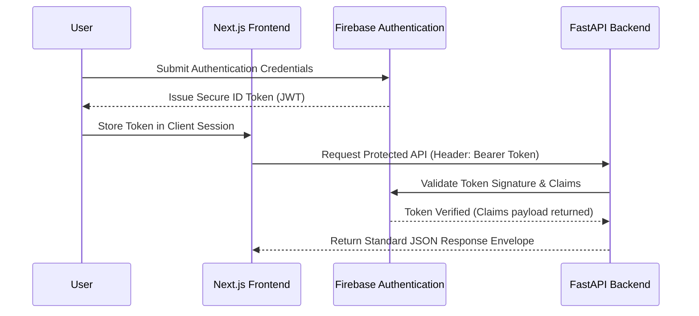

# API Specification

## AssetDNA: Unified API Specifications Baseline
* **Product Name:** AssetDNA
* **Document Version:** 1.0 (Final Baseline)
* **Document Status:** Draft – API Baseline
* **Audience:** Frontend Engineers, Backend Engineers, AI Engineers, QA Engineers, Technical Leads

---

## 1. API Overview

### 1.1 Purpose
The AssetDNA API provides a unified interface for retrieving industrial asset information, operational history, supporting documentation, and AI-generated insights. It serves as the single communication layer between the Next.js frontend and the FastAPI backend while abstracting all underlying database, storage, and AI infrastructure.

The API is designed to support the primary user workflow defined in the PRD:
1. Search for an asset.
2. Open the asset profile.
3. Investigate operational history.
4. Review supporting evidence.
5. Generate explainable AI insights.

### 1.2 Scope

#### In Scope (MVP functionality)
* **Asset Discovery:** Search and lookup of assets.
* **Unified Profile:** Core specifications, active status, and summary references.
* **Chronological Timeline:** Retrieval of timeline events (inspections, repairs, changes, and incidents).
* **Domain History Details:** Access to maintenance records, inspection sheets, and engineering changes.
* **Knowledge Metadata:** Lookup of associated OEM manuals, SOPs, and reports.
* **AI Copilot Assistance:** Generation of lifecycle narratives, session summaries, and answers to target asset questions.
* **Evidence Attribution:** Tracing of AI claims directly back to files.

#### Out of Scope (Deferred to future enterprise versions)
* User registration and authentication administration (fully outsourced to Firebase Auth).
* Write operations for assets, timeline logs, and manuals (MVP is read-only).
* Enterprise permissions, live IoT feeds, predictive maintenance triggers, and workflow automations.

### 1.3 System Responsibilities

#### FastAPI Backend (Orchestration & Logic)
* Verifies incoming Firebase ID Tokens (JWT).
* Validates request payloads and query parameters.
* Orchestrates Firestore and Pinecone vector database queries.
* Assembles contextual prompts for Gemini LLM queries.
* Inspects and validates AI-generated document references.
* Serializes responses into standard API envelopes.

#### Firebase Infrastructure (Identity & Persistence)
* **Authentication:** Issues and validates user session tokens.
* **Firestore:** Houses structured asset metrics, logs, links, and cached AI outputs.
* **Cloud Storage:** Hosts binary PDFs (manuals, drawing files, SOPs).

#### Gemini AI (Contextual Reasoning)
* Synthesizes lifecycle narratives based on provided database context.
* Formulates answers to specific user questions.
* Generates summaries for manual inspection sessions.
* *Note: Gemini never queries databases directly; all retrieval is coordinated by the backend API.*

### 1.4 Architectural Conventions
* **RESTful Design:** Standard resource-oriented collection structures.
* **Statelessness:** No session states are saved on backend servers. Every request includes verification headers.
* **Payload Exchange:** Strictly exchanges data in JSON format (`Content-Type: application/json`).
* **API Versioning:** Version indicators are embedded directly in the URI (current: `/v1/`).
* **Time Format:** Standardizes all timestamp fields using ISO 8601 UTC formats (e.g., `2026-01-15T09:30:00Z`).

### 1.5 Base URL
* **Local Development Base URL:** `http://localhost:8000/api/v1`
* **Production Base URL:** `https://api.assetdna.app/api/v1`

### 1.6 Traceability and Decoupling

| Reference Document | API Integration Policy |
| :--- | :--- |
| **Product Requirements (PRD)** | Implements the complete search-to-evidence investigation workflow. |
| **Technical Requirements (TRD)** | Decouples frontend components from infrastructure services using a stateless backend gateway. |
| **Database Design (DDS)** | Exposes Firestore data structures via REST resource contracts without revealing collection names. |

---

## 2. API Standards & Conventions

### 2.1 Authentication
Authentication is managed via **Firebase Authentication**. Clients include the Firebase ID Token (JWT) in the headers of all API requests:

```http
Authorization: Bearer <firebase_id_token>
```

### 2.2 Standard Headers

| Header Name | Required | Purpose |
| :--- | :--- | :--- |
| **Authorization** | Yes | Bearer token format containing the Firebase ID Token. |
| **Content-Type** | Yes (POST requests) | Request media type (must be `application/json`). |
| **Accept** | Yes | Expected response format (`application/json`). |
| **X-Request-ID** | No | Client-generated UUID for tracing logs. |

### 2.3 URL & Resource Naming Conventions
* Resources use plural nouns (e.g., `/assets`, `/documents`, `/evidence`).
* Resource names are lowercase and use kebab-case where necessary.
* Resource nesting indicates ownership hierarchies:

```mermaid
flowchart TD
    Root[/api/v1] --> Assets[/assets]
    Root --> Evidence[/evidence]
    Root --> Docs[/documents]
    Root --> Users[/users]

    Assets --> AssetID[/{assetId}]
    AssetID --> Timeline[/timeline]
    AssetID --> Maint[/maintenance]
    AssetID --> Insp[/inspections]
    AssetID --> EC[/engineering-changes]
    AssetID --> DocsRef[/documents]
    AssetID --> EvRef[/evidence]
    AssetID --> Summary[/summary]
    AssetID --> Ask[/questions]
    AssetID --> Invest[/investigation-summary]

    Users --> Me[/me]
```

### 2.4 Pagination, Filtering, and Sorting
* **Pagination:** Large arrays (timeline records, documents list) support offset-based pagination via query parameters: `?page=1&pageSize=20` (max limit: 100).
* **Filtering:** Resource endpoints accept filters via query parameters (e.g., `?eventType=maintenance`).
* **Sorting:** Order parameters sort timeline events and lists: `?sortBy=eventDate&sortOrder=desc`.

---

## 3. Authentication Flow

### 3.1 Sequence Flow



### 3.2 Backend Token Verification
On every API request, the backend:
1. Validates the format of the `Authorization` header.
2. Verifies the token signature against Firebase public certificates.
3. Rejects requests with expired or revoked tokens, returning `401 Unauthorized`.
4. Decodes claims to resolve the user's `uid` and email before processing request logic.

### 3.3 Current User Profile Endpoint
* **Method:** GET
* **Endpoint:** `/api/v1/users/me`
* **Access:** Required Authentication

#### Example Request
```http
GET /api/v1/users/me HTTP/1.1
Authorization: Bearer <firebase_id_token>
Accept: application/json
```

#### Example Response
```json
{
  "success": true,
  "data": {
    "uid": "firebase_uid_12345",
    "displayName": "Sarah Inspector",
    "email": "sarah.inspector@plant.com"
  },
  "meta": {
    "timestamp": "2026-01-15T09:30:00Z",
    "requestId": "req_123456",
    "version": "v1"
  }
}
```

---

## 4. Core Asset APIs

### 4.1 Global Asset Search
* **Method:** GET
* **Endpoint:** `/api/v1/assets`
* **Access:** Required Authentication

#### Query Parameters
* `query` (string, Required): Tag identifier or asset name keyword.
* `limit` (integer, Optional): Limits results array size (default: 20).

#### Example Request
```http
GET /api/v1/assets?query=P-101 HTTP/1.1
Authorization: Bearer <firebase_id_token>
```

#### Example Response
```json
{
  "success": true,
  "data": [
    {
      "assetId": "A7df93LmK2",
      "assetTag": "P-101",
      "assetName": "Cooling Water Pump",
      "assetType": "Pump",
      "location": "Plant A / Line 1",
      "status": "Running"
    }
  ],
  "meta": {
    "requestId": "req_search_001",
    "timestamp": "2026-01-15T09:30:05Z",
    "version": "v1"
  }
}
```

### 4.2 Asset Profile Header
* **Method:** GET
* **Endpoint:** `/api/v1/assets/{assetId}`
* **Access:** Required Authentication

#### Example Request
```http
GET /api/v1/assets/A7df93LmK2 HTTP/1.1
Authorization: Bearer <firebase_id_token>
```

#### Example Response
```json
{
  "success": true,
  "data": {
    "asset": {
      "assetId": "A7df93LmK2",
      "assetTag": "P-101",
      "assetName": "Cooling Water Pump",
      "assetType": "Pump",
      "manufacturer": "FlowTech",
      "model": "FT-250",
      "location": "Plant A / Line 1",
      "status": "Running"
    },
    "health": {
      "status": "Healthy"
    },
    "summary": {
      "summaryId": "SUM-001",
      "generatedAt": "2026-01-15T09:30:00Z"
    },
    "statistics": {
      "maintenanceCount": 12,
      "inspectionCount": 8,
      "documentCount": 15
    }
  },
  "meta": {
    "requestId": "req_profile_002",
    "timestamp": "2026-01-15T09:30:10Z",
    "version": "v1"
  }
}
```

### 4.3 Living Asset Timeline
* **Method:** GET
* **Endpoint:** `/api/v1/assets/{assetId}/timeline`
* **Access:** Required Authentication

#### Query Parameters
* `eventType` (string, Optional): Filter by event type (`maintenance`, `inspection`, `engineeringChange`, `incident`).
* `from` / `to` (string ISO, Optional): Filters timeline events by date range.
* `sortOrder` (string, Optional): Date order parameter (`asc` or `desc`).

#### Example Response
```json
{
  "success": true,
  "data": [
    {
      "eventId": "EV-203",
      "eventType": "maintenance",
      "title": "Bearing Replacement",
      "eventDate": "2026-01-15T09:30:00Z",
      "relatedRecordId": "MR-108"
    }
  ],
  "meta": {
    "requestId": "req_timeline_003",
    "timestamp": "2026-01-15T09:30:15Z",
    "version": "v1"
  }
}
```

### 4.4 Maintenance History Details
* **Method:** GET
* **Endpoint:** `/api/v1/assets/{assetId}/maintenance`
* **Access:** Required Authentication

#### Example Response
```json
{
  "success": true,
  "data": [
    {
      "maintenanceId": "MR-108",
      "workOrderId": "WO-442",
      "maintenanceType": "Corrective",
      "technician": "John Smith",
      "notes": "Drive-end bearing replaced.",
      "completedDate": "2026-01-15T09:30:00Z",
      "evidenceIds": ["EVD-001"]
    }
  ],
  "meta": {
    "requestId": "req_maint_004",
    "timestamp": "2026-01-15T09:30:20Z",
    "version": "v1"
  }
}
```

### 4.5 Inspection Records
* **Method:** GET
* **Endpoint:** `/api/v1/assets/{assetId}/inspections`
* **Access:** Required Authentication

#### Example Response
```json
{
  "success": true,
  "data": [
    {
      "inspectionId": "INS-204",
      "inspectionType": "Vibration Analysis",
      "inspector": "Sarah Lee",
      "status": "Completed",
      "findings": "Elevated vibration levels detected on drive-end bearing.",
      "inspectionDate": "2026-01-12T08:30:00Z",
      "evidenceIds": ["EVD-011"]
    }
  ],
  "meta": {
    "requestId": "req_inspect_005",
    "timestamp": "2026-01-15T09:30:25Z",
    "version": "v1"
  }
}
```

### 4.6 Engineering Changes
* **Method:** GET
* **Endpoint:** `/api/v1/assets/{assetId}/engineering-changes`
* **Access:** Required Authentication

#### Example Response
```json
{
  "success": true,
  "data": [
    {
      "changeId": "EC-014",
      "changeNumber": "EC-014",
      "title": "Pump Shaft Alignment Modification",
      "description": "Updated alignment procedure guidelines to reduce bearing friction.",
      "approvedBy": "Engineering Manager",
      "implementationDate": "2025-11-18T11:00:00Z",
      "evidenceIds": ["EVD-020"]
    }
  ],
  "meta": {
    "requestId": "req_ec_006",
    "timestamp": "2026-01-15T09:30:30Z",
    "version": "v1"
  }
}
```

---

## 5. AI APIs

### 5.1 Generate Asset Summary
* **Method:** POST
* **Endpoint:** `/api/v1/assets/{assetId}/summary`
* **Access:** Required Authentication

#### Request Body
```json
{
  "refresh": false
}
```

#### Example Response
```json
{
  "success": true,
  "data": {
    "summaryId": "SUM-001",
    "summary": "Pump P-101 has experienced three bearing failures over the past two years, typically following high-load operation. A shaft alignment procedure update (EC-014) resolved vibration levels, and subsequent logs indicate stable operation.",
    "generatedAt": "2026-01-15T09:30:00Z",
    "evidenceIds": ["EVD-011", "EVD-020"]
  },
  "meta": {
    "timestamp": "2026-01-15T09:30:35Z",
    "requestId": "req_summary_007",
    "version": "v1"
  }
}
```

### 5.2 Ask Asset-Specific Questions
* **Method:** POST
* **Endpoint:** `/api/v1/assets/{assetId}/questions`
* **Access:** Required Authentication

#### Request Body
```json
{
  "question": "When was the laser alignment method updated?"
}
```

#### Example Response
```json
{
  "success": true,
  "data": {
    "answer": "The laser alignment guidelines were modified on November 18, 2025 under engineering change EC-014, following repeated drive-end bearing failures on Pump P-101.",
    "evidenceIds": ["EVD-020"]
  },
  "meta": {
    "timestamp": "2026-01-15T09:30:40Z",
    "requestId": "req_qna_008",
    "version": "v1"
  }
}
```

### 5.3 Generate Investigation Session Summary
* **Method:** POST
* **Endpoint:** `/api/v1/assets/{assetId}/investigation-summary`
* **Access:** Required Authentication

#### Request Body
```json
{
  "selectedEventIds": ["EV-203", "EV-221"]
}
```

#### Example Response
```json
{
  "success": true,
  "data": {
    "summary": "The selected timeline events indicate a vibration inspection alert was followed by a laser alignment adjustment on Pump P-101, reducing subsequent bearing wear indicators.",
    "evidenceIds": ["EVD-011", "EVD-020"]
  },
  "meta": {
    "timestamp": "2026-01-15T09:30:45Z",
    "requestId": "req_session_009",
    "version": "v1"
  }
}
```

### 5.4 Retrieve Supporting Evidence Detail
* **Method:** GET
* **Endpoint:** `/api/v1/evidence/{evidenceId}`
* **Access:** Required Authentication

#### Example Response
```json
{
  "success": true,
  "data": {
    "evidenceId": "EVD-020",
    "sourceType": "engineeringChanges",
    "sourceId": "EC-014",
    "documentId": "DOC-611",
    "excerpt": "laser alignment procedure modification approved to mitigate drive-end bearing friction failures."
  },
  "meta": {
    "timestamp": "2026-01-15T09:30:50Z",
    "requestId": "req_evidence_010",
    "version": "v1"
  }
}
```

---

## 6. Document APIs

### 6.1 Preview Document Metadata
* **Method:** GET
* **Endpoint:** `/api/v1/documents/{documentId}`
* **Access:** Required Authentication

#### Example Response
```json
{
  "success": true,
  "data": {
    "documentId": "DOC-611",
    "title": "Laser Alignment Procedure",
    "documentType": "SOP",
    "storagePath": "documents/assets/P-101/sop/laser_alignment_v2.pdf",
    "fileName": "laser_alignment_v2.pdf",
    "mimeType": "application/pdf",
    "uploadedAt": "2025-11-18T11:00:00Z"
  },
  "meta": {
    "timestamp": "2026-01-15T09:30:55Z",
    "requestId": "req_doc_011",
    "version": "v1"
  }
}
```

### 6.2 Secure Document Download
* **Method:** GET
* **Endpoint:** `/api/v1/documents/{documentId}/download`
* **Access:** Required Authentication
* **Behavior:** Backend returns a temporary Firebase Storage download link (with secure access token) or streams the file direct to authorization-cleared browsers.

---

## 7. Standard API Response Envelopes

### 7.1 Success Envelope
```json
{
  "success": true,
  "data": {},
  "meta": {
    "timestamp": "2026-01-15T09:30:00Z",
    "requestId": "req_trace_uuid",
    "version": "v1"
  }
}
```

### 7.2 Validation Error Envelope (HTTP 422)
```json
{
  "success": false,
  "error": {
    "code": "VALIDATION_ERROR",
    "message": "Invalid request parameter: assetId format is incorrect."
  },
  "meta": {
    "timestamp": "2026-01-15T09:30:00Z",
    "requestId": "req_trace_uuid",
    "version": "v1"
  }
}
```

### 7.3 Authentication Error Envelope (HTTP 401)
```json
{
  "success": false,
  "error": {
    "code": "UNAUTHORIZED",
    "message": "Invalid or expired authorization token."
  },
  "meta": {
    "timestamp": "2026-01-15T09:30:00Z",
    "requestId": "req_trace_uuid",
    "version": "v1"
  }
}
```

### 7.4 Failsafe Dependency Error Envelope (HTTP 503)
```json
{
  "success": false,
  "error": {
    "code": "DEPENDENCY_FAILURE",
    "message": "The AI summarization service is currently offline. Retrieving timeline details only."
  },
  "meta": {
    "timestamp": "2026-01-15T09:30:00Z",
    "requestId": "req_trace_uuid",
    "version": "v1"
  }
}
```

---

## 8. Non-Functional & Operations Guidelines

### 8.1 Performance Targets

| Request Action | Target Relevancy Response |
| :--- | :--- |
| **Asset Search** | < 1 second |
| **Asset Profile Headers** | < 2 seconds |
| **Chronological Timeline** | < 2 seconds |
| **Evidence Link Details** | < 1 second |
| **AI Summarization** | < 5 seconds |
| **AI Q&A Queries** | < 5 seconds |

### 8.2 Caching Strategy
* **Session Cache:** Caches search indices and core asset specifications.
* **LLM Summary Caching:** Reuses summary text until the underlying timeline logs are updated.
* **Browser Security:** Enforces `Cache-Control: private, no-store` headers on client-facing outputs.

### 8.3 Rate Limits

| Endpoint Category | Max Requests Allowed |
| :--- | :--- |
| **Asset Lookups** | 100 requests / minute / user |
| **Document/Timeline Fetch** | 60 requests / minute / user |
| **AI Prompt Generation** | 20 requests / minute / user |

---

## 9. Final API Readiness Assessment

| Deliverable Target | Status |
| :--- | :--- |
| **REST API Resource Layout** | ✅ Complete |
| **Firebase Auth Token Lifecycle** | ✅ Complete |
| **Core Asset Directory APIs** | ✅ Complete |
| **AI Summarization API Contracts**| ✅ Complete |
| **Secure Document Access** | ✅ Complete |
| **Error Handling Contracts** | ✅ Complete |
| **Performance Guidelines** | ✅ Complete |
| **PRD Traceability Mapping** | ✅ Complete |

---

## 10. Complete PRD Traceability Matrix

| PRD Feature Name | API Endpoint | Business Purpose |
| :--- | :--- | :--- |
| **Global Asset Search** | `GET /api/v1/assets` | Locate target industrial equipment. |
| **Asset Profile Header** | `GET /api/v1/assets/{assetId}` | Fetch master specifications and metrics. |
| **Living Asset Timeline**| `GET /api/v1/assets/{assetId}/timeline` | Retrieve sorted operational history events. |
| **Maintenance History** | `GET /api/v1/assets/{assetId}/maintenance` | Fetch detailed work order and repair reports. |
| **Inspection History** | `GET /api/v1/assets/{assetId}/inspections` | Fetch vibration, thermal, and visual log sheets. |
| **Engineering Changes**| `GET /api/v1/assets/{assetId}/engineering-changes` | Fetch modification logs and laser alignment guides. |
| **Document Directory** | `GET /api/v1/assets/{assetId}/documents` | Retrieve lists of manual and procedure files. |
| **Document Viewer** | `GET /api/v1/documents/{documentId}` | Preview document specifications. |
| **Document Download** | `GET /api/v1/documents/{documentId}/download` | Retrieve secure download links for raw PDFs. |
| **Evidence Panel** | `GET /api/v1/assets/{assetId}/evidence` | Load lists of evidence citations. |
| **Evidence Detail** | `GET /api/v1/evidence/{evidenceId}` | Fetch raw citation text passages. |
| **AI Summary** | `POST /api/v1/assets/{assetId}/summary` | Generate cached evidence-backed lifecycle summaries. |
| **AI Q&A Assistant** | `POST /api/v1/assets/{assetId}/questions` | Answer natural language queries about P-101. |
| **Session Summary** | `POST /api/v1/assets/{assetId}/investigation-summary`| Summarize current investigation findings. |
| **Active Profile** | `GET /api/v1/users/me` | Fetch authenticated inspector profile. |
