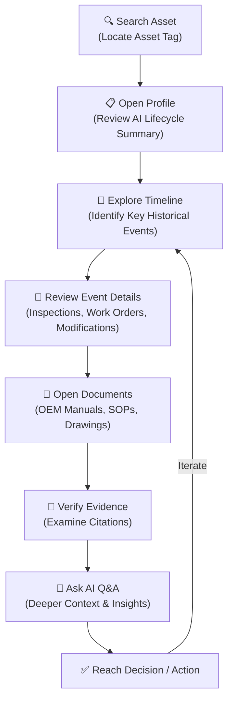
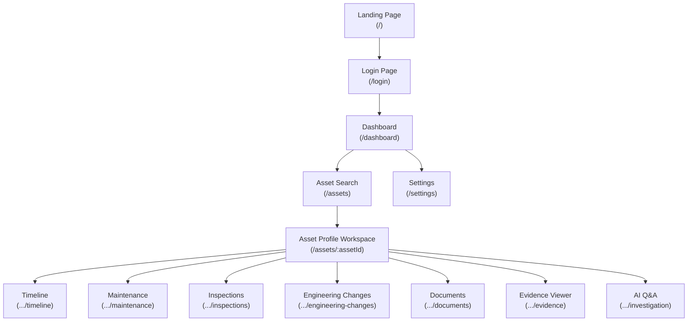
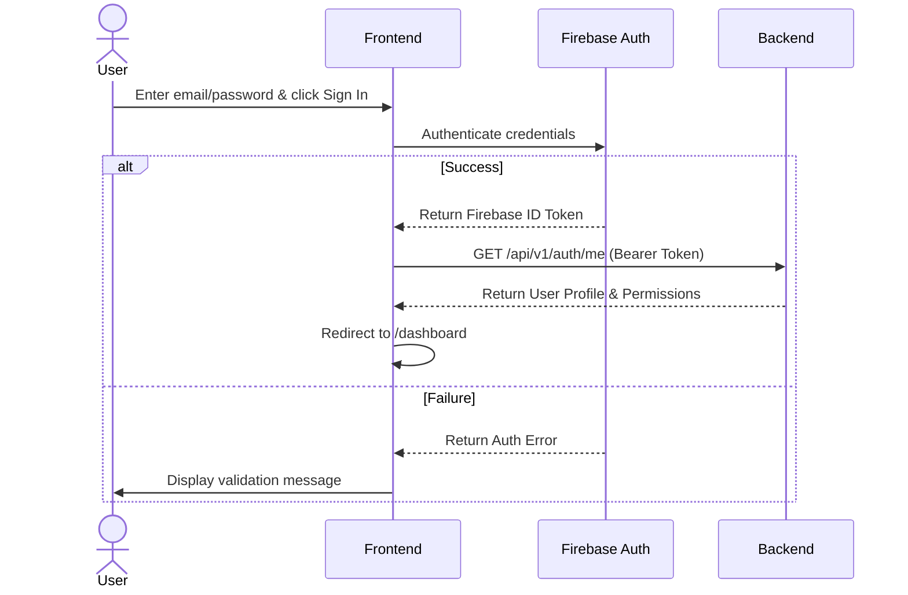
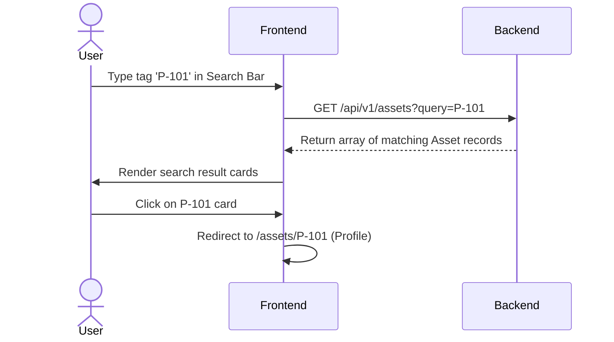
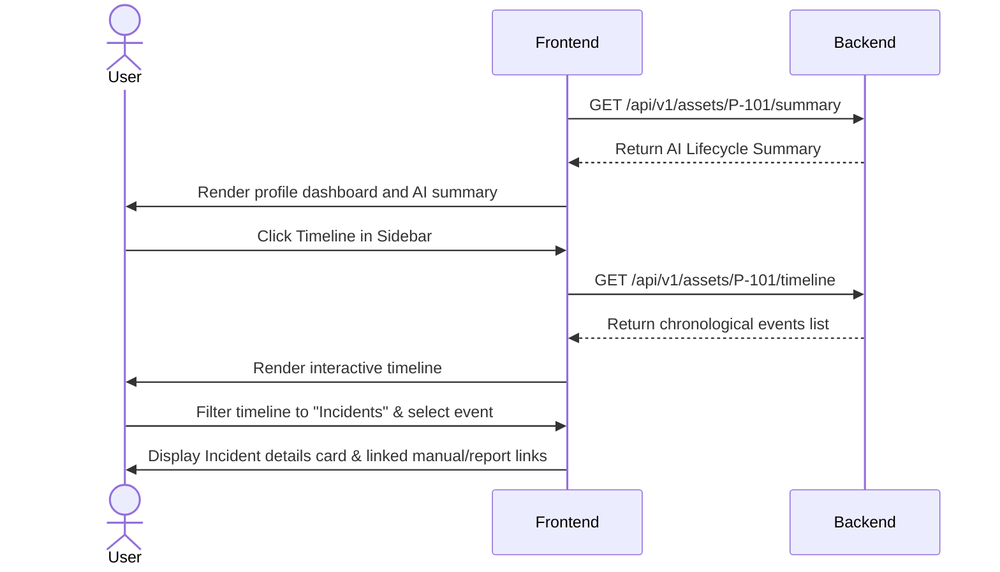
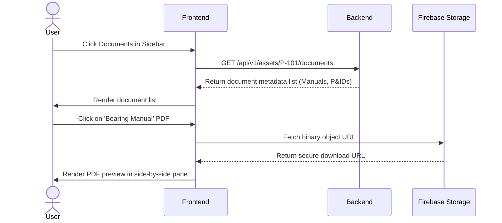
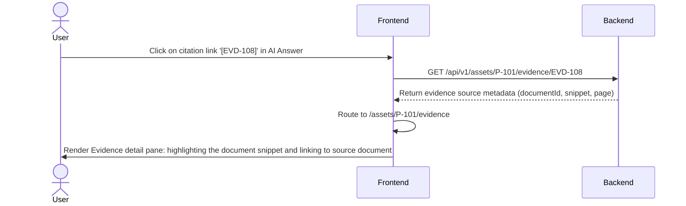
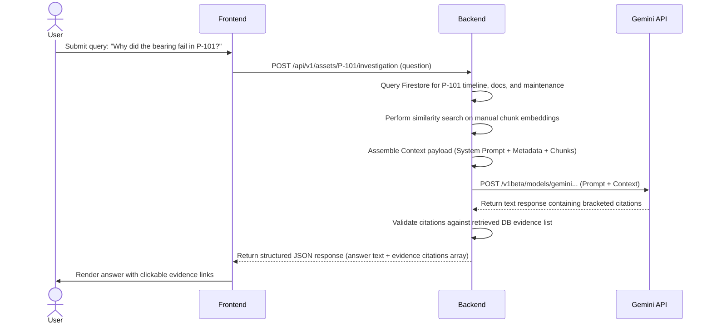
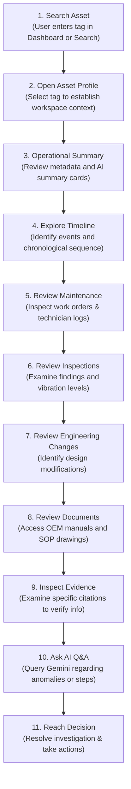
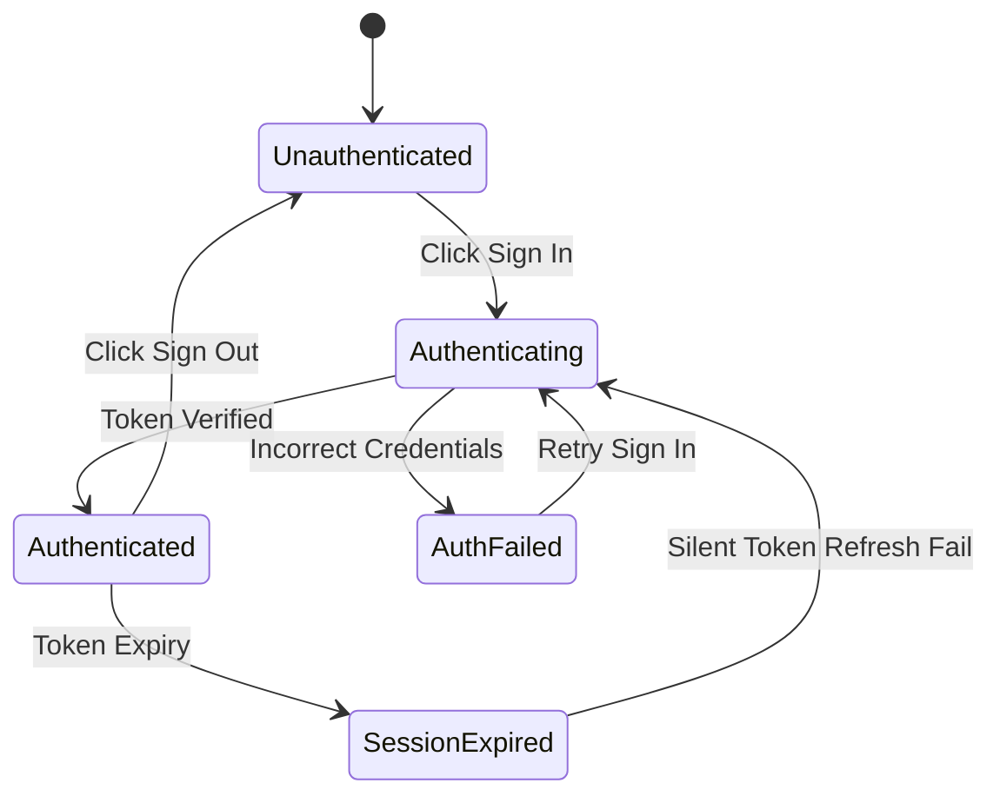

# Web Application Flow Specification — AssetDNA

| Field | Value |
|---|---|
| **Product Name** | AssetDNA |
| **Document Version** | 1.0 |
| **Document Status** | Final |
| **Audience** | Product Team, UX Designers, Frontend Engineers, Backend Engineers, QA Engineers |

> This document defines how users navigate through the AssetDNA web application. It serves as the bridge between the PRD and the UI/UX Design Specification by defining information architecture, navigation, application hierarchy, and user movement through the system. This specification intentionally focuses on **application flow** rather than visual design.

---

## Table of Contents

1. [Application Overview](#1-application-overview)
2. [Site Map](#2-site-map)
3. [Navigation Structure](#3-navigation-structure)
4. [Route Structure](#4-route-structure)
5. [User Flows](#5-user-flows)
6. [Page Specifications](#6-page-specifications)
7. [Investigation Workflow](#7-investigation-workflow)
8. [State Transitions](#8-state-transitions)
9. [Web Responsiveness](#9-web-responsiveness)
10. [Engineering Review](#10-engineering-review)

---

## 1. Application Overview

### 1.1 Purpose

AssetDNA is an **Asset Investigation Workspace** that enables industrial engineers to investigate an industrial asset by bringing together fragmented operational knowledge into a unified investigation experience. 

Unlike traditional enterprise systems where users navigate through modules (Maintenance, Documents, CMMS, etc.), AssetDNA organizes the experience around the **industrial asset**.

The application enables users to:
- Locate an industrial asset.
- Understand its operational history.
- Review maintenance and inspection records.
- Explore engineering changes.
- View supporting documentation.
- Ask AI-assisted questions.
- Verify every answer using operational evidence.

### 1.2 Primary User Goals

- **Maintenance Engineer:** Find an asset quickly, understand recent failures, review maintenance history, verify engineering changes, and reduce investigation time.
- **Reliability Engineer:** Analyze recurring failures, review historical inspections, understand engineering modifications, and identify operational patterns.
- **Plant Manager:** Obtain operational context quickly, review important historical events, understand asset health, and make informed decisions.

### 1.3 Investigation-First Philosophy

Traditional industrial software organizes navigation around functional, disconnected modules. AssetDNA instead centers every interaction and module around the individual industrial asset.

| Traditional System-Centric Model | AssetDNA Asset-Centric Model |
|---|---|
| **Functional Modules:** CMMS (Work Orders, Maintenance, Inventory), DMS (Manuals, Drawings), ERP (Procurement). | **Unified Workspace:** Industrial Asset → Timeline, Maintenance, Inspections, Engineering Changes, Documents, Evidence, AI. |
| **User Effort:** Manually query multiple databases, reconcile time records, and link files to reconstruct failures. | **User Effort:** View all contextual timelines, documents, and AI summaries organized chronologically under the asset profile. |

### 1.4 Primary Workflow

The entire application is optimized around a seamless, iterative investigation workflow.



### 1.5 Information Hierarchy

Information becomes progressively more detailed as the user moves deeper into an investigation:

```text
Application Dashboard
└── Asset Search
    └── Asset Profile Workspace
        ├── Overview & AI Summary
        ├── Chronological Timeline
        ├── Maintenance History Details
        ├── Inspection History Details
        ├── Engineering Changes Details
        ├── Contextual Document Viewer
        └── Interactive AI Investigation Q&A
```

### 1.6 Design Philosophy

- **Asset-First:** Users always begin with an asset, never with an abstract document folder.
- **Progressive Disclosure:** Information is revealed gradually (Search → Profile → Timeline → Event Detail → Evidence) to avoid cognitive overload.
- **Context Preservation:** The selected asset remains the active context throughout the session; navigating modules does not lose the active asset ID.
- **Minimal Navigation Depth:** No investigation task should require more than three clicks from the Asset Profile.
- **Explainability:** Evidence panel is always accessible within one click of any AI-generated response.

---

## 2. Site Map

### 2.1 Complete Site Hierarchy



### 2.2 Site Structure

| Scope | Page | Purpose | Access |
|---|---|---|---|
| **Public** | Landing Page (`/`) | Product introduction & landing gate | Public |
| **Public** | Login Page (`/login`) | Firebase Authentication entry point | Public |
| **Authenticated** | Dashboard (`/dashboard`) | Entry portal with recent activity and global search | Private |
| **Authenticated** | Asset Search (`/assets`) | Dynamic search list for assets by tag, name, or type | Private |
| **Authenticated** | Asset Profile (`/assets/{assetId}`) | Workspace hub with metadata and AI summary cards | Private |
| **Authenticated** | Timeline (`/.../timeline`) | Chronological interactive list of all events | Private |
| **Authenticated** | Maintenance (`/.../maintenance`) | Detailed maintenance history and work orders | Private |
| **Authenticated** | Inspections (`/.../inspections`) | Inspection reports, measurements, and logs | Private |
| **Authenticated** | Engineering Changes (`/.../engineering-changes`) | Design, layout, or parameter modifications | Private |
| **Authenticated** | Documents (`/.../documents`) | Native previewer for manuals, P&IDs, and reports | Private |
| **Authenticated** | Evidence Viewer (`/.../evidence`) | Deep-dive review of citations and logs | Private |
| **Authenticated** | AI Investigation (`/.../investigation`)| Contextual Q&A panel with citation highlights | Private |
| **Authenticated** | Settings (`/settings`) | User preferences, theme, profile details, and signout | Private |

### 2.3 Navigation Depth

- **Maximum Depth:** 5 levels (`Dashboard` → `Search` → `Profile` → `Timeline` → `Event Details` → `Evidence`).
- **Average Depth:** 3 levels.
- **Hub-and-Spoke Navigation:** The Asset Profile acts as the central hub; all investigation modules branch out as spokes.

### 2.4 Screen Dependencies

| Screen | Depends On / Requires | Back Target |
|---|---|---|
| Dashboard | Valid Login Session | Landing Page |
| Asset Search | Dashboard Context | Dashboard |
| Asset Profile | Active `assetId` from Search/Dashboard | Asset Search |
| Timeline | Active Asset Profile Context | Asset Profile |
| Maintenance | Active Asset Profile Context | Asset Profile |
| Inspections | Active Asset Profile Context | Asset Profile |
| Engineering Changes | Active Asset Profile Context | Asset Profile |
| Documents | Active Asset Profile Context | Asset Profile |
| Evidence Viewer | Triggered AI response or event link | Triggering Module (AI or Event) |
| AI Investigation | Active Asset Profile Context | Asset Profile |

---

## 3. Navigation Structure

### 3.1 Navigation Philosophy

Navigation is designed to minimize cognitive load. The user should always know: where they are, which asset they are investigating, how to return, and what related information is available.

### 3.2 Global Header (Top Navigation)

The header remains persistent across all authenticated routes:
- **Logo/Brand:** AssetDNA (navigates to Dashboard).
- **Global Search Box:** Immediate asset lookup by tag, name, or type.
- **Context Indicator:** Displays currently active asset tag and name (e.g., `Investigating: P-101 (Bearing Pump)`).
- **User Profile Menu:** Access settings, account info, and sign-out action.

### 3.3 Sidebar Navigation

The context sidebar appears only after an asset has been selected (`/assets/{assetId}/*`):
- Navigation items reflect the asset lifecycle: Overview, Timeline, Maintenance, Inspections, Engineering Changes, Documents, AI Investigation.
- Section-switching does not clear or lose the active asset ID.

### 3.4 Breadcrumbs

Displayed directly below the top header on inner routes:
- Example: `Dashboard` > `Assets` > `Pump P-101` > `Maintenance` > `Work Order #108`
- Provides immediate parent route navigation.

### 3.5 Navigation Rules

1. **Asset-First Entry:** The user must select an asset before access to timeline, maintenance, inspection, changes, or documents is granted.
2. **Context Persistence:** Selecting a sidebar item updates the active workspace panel but keeps the active asset context.
3. **One-Click Evidence:** All AI answers must provide clickable citations that navigate directly to the Evidence Viewer with the document segment highlighted.
4. **Explicit Exit:** Clicking "Assets" or "Dashboard" in the header exits the current asset context and clears the sidebar.

---

## 4. Route Structure

### 4.1 Route Detail Specifications

- **`/` (Landing Page):** Evaluates session. If logged in, redirects to `/dashboard`. Otherwise, displays marketing copy and a call-to-action button to `/login`.
- **`/login` (Login Page):** Firebase Auth interface. On success, redirects to `/dashboard`.
- **`/dashboard` (Dashboard):** Starting portal. Provides shortcuts to recently investigated assets, workspace statistics, and primary search box.
- **`/assets` (Asset Search):** Lists all matching assets based on search query parameter (e.g., `/assets?q=P-101`).
- **`/assets/{assetId}` (Asset Profile):** Hub page. Resolves asset metadata and requests the AI Lifecycle Summary.
- **`/assets/{assetId}/timeline` (Timeline):** Dynamic timeline interface showing combined chronological events. Supports filtering by event types (Maintenance, Inspection, Incident, Mod).
- **`/assets/{assetId}/maintenance` (Maintenance):** Displays historical corrective and preventative maintenance work orders.
- **`/assets/{assetId}/inspections` (Inspections):** Displays inspection report history, measurements (e.g. vibration records), and diagnostics.
- **`/assets/{assetId}/engineering-changes` (Engineering Changes):** Lists approved layout, specification, or configuration modifications.
- **`/assets/{assetId}/documents` (Documents):** Context-aware document list containing manuals, drawings, P&IDs, and certificates. Includes integrated PDF/image previewer.
- **`/assets/{assetId}/evidence` (Evidence):** Detailed view of extracted segments, manuals, or timestamps mapped to an AI summary or question.
- **`/assets/{assetId}/investigation` (AI Investigation):** Natural language workspace interface. Tracks session message thread and displays inline citations.
- **`/settings` (Settings):** User preferences, token management (if applicable), profile photo, and logout.

---

## 5. User Flows

### 5.1 Login Flow



### 5.2 Asset Search Flow



### 5.3 Asset Investigation Flow

This flow illustrates the user inspecting a problem via the profile, timeline, and AI workspace.



### 5.4 Document Exploration Flow



### 5.5 Evidence Review Flow



### 5.6 AI Question Flow



---

## 6. Page Specifications

### 6.1 Landing Page
- **Purpose:** Inform visitors and guide them to log in.
- **Primary User:** Non-authenticated visitor, corporate stakeholders.
- **Displayed Info:** One-line value proposition, elevator pitch, overview of capabilities, "Sign In" button.
- **Primary Actions:** Go to Sign In.
- **Data Sources / API Dependencies:** None.
- **States:** Standard landing page layout.

### 6.2 Login Page
- **Purpose:** User authentication.
- **Primary User:** Plant engineers, plant managers, operators.
- **Displayed Info:** Brand header, email/password form fields, "Sign In" button, password reset helper.
- **Primary Actions:** Submit login credentials.
- **Data Sources / API Dependencies:** Firebase Auth SDK.
- **States:** Form loading, validation errors (e.g., invalid password), redirecting success state.

### 6.3 Dashboard
- **Purpose:** Central navigation launchpad for investigations.
- **Primary User:** Maintenance Engineers, Reliability Engineers.
- **Displayed Info:** Quick search input, list of recently accessed assets, workspace stats card.
- **Primary Actions:** Search asset tag.
- **Secondary Actions:** Open global settings, sign out.
- **Data Sources / API Dependencies:** `GET /api/v1/auth/me`, User profile metadata.
- **States:** Dashboard loading skeleton, empty state (no recent assets), lookup error state.

### 6.4 Asset Search Page
- **Purpose:** Browse and locate assets.
- **Primary User:** Maintenance Engineers, Reliability Engineers.
- **Displayed Info:** Match results grid with Asset Tag, Name, Location, Status, and Equipment Type.
- **Primary Actions:** Select asset to open profile workspace.
- **Data Sources / API Dependencies:** `GET /api/v1/assets?query={q}`.
- **States:** Searching progress indicator, empty state ("No assets match search term"), search timeout error.

### 6.5 Asset Profile Workspace
- **Purpose:** Main hub for an asset investigation session.
- **Primary User:** All engineers and technicians.
- **Displayed Info:** Asset tags, status, specifications, location details, AI-generated Lifecycle Summary.
- **Primary Actions:** Navigate to timeline, ask question in AI panel.
- **Secondary Actions:** Navigate to maintenance logs, inspections, engineering changes, or documents.
- **Data Sources / API Dependencies:** `GET /api/v1/assets/{assetId}`, `GET /api/v1/assets/{assetId}/summary`.
- **States:** Skeleton load state, profile rendering success state, backend offline error state.

### 6.6 Timeline Page
- **Purpose:** Inspect asset operational history chronologically.
- **Primary User:** Maintenance and Reliability Engineers.
- **Displayed Info:** Chronological feed of events (Maintenance, Inspections, Changes, Incidents).
- **Primary Actions:** Click event to open side drawer details panel.
- **Secondary Actions:** Filter by type, toggle sort order (asc/desc), search text.
- **Data Sources / API Dependencies:** `GET /api/v1/assets/{assetId}/timeline`.
- **States:** Timeline skeleton loader, empty state ("No operational history found"), server error alert.

### 6.7 Maintenance Page
- **Purpose:** Detailed review of maintenance records.
- **Primary User:** Maintenance Engineers, Plant Technicians.
- **Displayed Info:** Work order history list, technician execution logs, parts replaced list.
- **Primary Actions:** Open work order details drawer.
- **Secondary Actions:** Open linked document references or evidence files.
- **Data Sources / API Dependencies:** `GET /api/v1/assets/{assetId}/maintenance`.
- **States:** Table loading skeletons, empty state, detail load errors.

### 6.8 Inspection Page
- **Purpose:** Detailed inspection logs and diagnostics review.
- **Primary User:** Reliability Engineers, Inspectors.
- **Displayed Info:** Inspection logs list, parameter values (e.g. vibration levels), observations, recommendations.
- **Primary Actions:** Open inspection details.
- **Secondary Actions:** Click linked report PDF to open preview.
- **Data Sources / API Dependencies:** `GET /api/v1/assets/{assetId}/inspections`.
- **States:** Skeleton logs, empty state (no inspections documented).

### 6.9 Engineering Changes Page
- **Purpose:** Review design modifications, additions, or replacements.
- **Primary User:** Reliability Engineers, Plant Managers.
- **Displayed Info:** List of change requests, date of execution, version, description, and safety sign-offs.
- **Primary Actions:** Open engineering change details card.
- **Data Sources / API Dependencies:** `GET /api/v1/assets/{assetId}/engineering-changes`.
- **States:** Cards load skeletons, empty state.

### 6.10 Documents Page
- **Purpose:** Preview manuals, drawings, SOPs, and certificates.
- **Primary User:** All engineers and technicians.
- **Displayed Info:** Dynamic file grid/list showing document type, name, revision index, size.
- **Primary Actions:** Open side-by-side preview panel.
- **Secondary Actions:** Secure download file link.
- **Data Sources / API Dependencies:** `GET /api/v1/assets/{assetId}/documents`.
- **States:** Grid skeleton loaders, empty list layout, missing blob link error.

### 6.11 Evidence Viewer Page
- **Purpose:** Review specific text chunks/drawings verifying AI responses.
- **Primary User:** Plant Engineers and managers validating AI work.
- **Displayed Info:** Source metadata (title, author, timestamp), parent document tag, exact highlighted snippet.
- **Primary Actions:** Open complete parent document at exact page.
- **Secondary Actions:** Return to AI Q&A panel.
- **Data Sources / API Dependencies:** `GET /api/v1/assets/{assetId}/evidence/{evidenceId}`.
- **States:** Evidence loading, missing reference error, successful evidence block highlight.

### 6.12 AI Investigation Workspace Page
- **Purpose:** Natural language query workspace for deep investigation.
- **Primary User:** Reliability and Maintenance Engineers.
- **Displayed Info:** Scrollable message thread, citation links within answers, context tags.
- **Primary Actions:** Submit search/question query.
- **Secondary Actions:** Click inline citation (e.g. `[EVD-12]`) to route to Evidence Viewer.
- **Data Sources / API Dependencies:** `POST /api/v1/assets/{assetId}/investigation`.
- **States:** Loading indicator (Gemini executing reasoning), default placeholder message, token limit warning.

### 6.13 Settings Page
- **Purpose:** User configuration.
- **Primary User:** Authenticated user.
- **Displayed Info:** Account username, location/site preferences, application version metrics, Sign Out button.
- **Primary Actions:** Update profile settings, execute Sign Out.
- **Data Sources / API Dependencies:** Auth status service.
- **States:** Profile updating success state, auth error state.

---

## 7. Investigation Workflow



---

## 8. State Transitions

### 8.1 Authentication States



| Authentication State | Description | App Action |
|---|---|---|
| **Unauthenticated** | User has no active Firebase session | Redirect route to `/login` |
| **Authenticating** | Firebase Auth processing token verification | Render loading spinner overlay |
| **Authenticated** | Session valid, token authenticated | Render routes, enable workspace sidebar |
| **AuthFailed** | Login error, credentials invalid | Render inline validation message |
| **SessionExpired** | Active token has expired | Perform silent refresh; redirect to `/login` if refresh fails |

### 8.2 UI States

- **Loading States:** Skeletons replace tables, lists, and summary cards. Global spinner displays for page routing.
- **Success States:** Panels fully loaded. Actionable items (buttons, links) are enabled.
- **Empty States:** Renders illustrated placeholder icons explaining the absence of records (e.g. "No inspections recorded for P-101") with action links.
- **Error States:**
  - *Network/Server Error:* Renders dismissible alert box with "Retry" action button.
  - *AI Error:* Alert box displaying *"The AI service is temporarily unavailable. Please browse timeline records manually."*
  - *Unauthorized:* Immediate route redirection to `/login`.

### 8.3 Session Recovery

If a network disconnect occurs or token expires:
1. Intended target workspace route is preserved in route memory (e.g. `/assets/P-101/timeline`).
2. User is redirected to `/login` if silent refresh fails.
3. Upon re-authentication, the user is directly routed back to the exact target path to avoid losing investigation state.

---

## 9. Web Responsiveness

AssetDNA is optimized as a responsive desktop-first web application. Native mobile app gestures and layout styles are avoided.

| UI Component | Desktop (≥ 1440px) | Laptop (1024-1439px) | Tablet (768-1023px) | Mobile (< 768px) |
|---|---|---|---|---|
| **Layout Column** | Multi-column side-by-side | Multi-column fluid width | Stacked panels | Single Column stack |
| **Sidebar Navigation** | Persistent expanded sidebar | Persistent expanded sidebar | Collapsible slide drawer | Collapsible hamburger drawer |
| **Document Viewer** | Parallel side-by-side splits | Parallel side-by-side splits | Modal previewer overlay | Full-screen previewer |
| **Data Tables** | Detailed tables (all columns) | Scrollable tables | Simplified card list | Simplified card list |
| **AI investigation Panel** | Docked side-panel | Docked side-panel | Toggleable drawer overlay | Full-width bottom drawer |

---

## 10. Engineering Review

### 10.1 Key Strengths

- **Direct Context Preservation:** The active asset is locked in the route template (`/assets/{assetId}/*`), preventing cross-asset document leakage.
- **Clean Separation of Concerns:** Frontend routes map cleanly to specific backend APIs without mixing retrieval logic.
- **Robust Exception Handling:** Silent token refresh and URL preservation prevent UX disruption during transient token failures.

### 10.2 UX Risks & Mitigations

| Risk | Description | Impact | Mitigation |
|---|---|---|---|
| **Timeline Overload** | Large historical record count slows rendering | High lag, scroll issues | Apply default lazy loading, server-side pagination, and type filters |
| **Document Exhaustion** | Hundreds of manuals/P&IDs associated with one asset | Difficult files navigation | Implement categorized folder views (Manuals, Drawings, Reports) and text search |
| **AI Diagnosis Expectation** | User assumes AI makes decisions | Operational trust risk | Explicit warning callouts in AI Investigation workspace emphasizing AI as an assistant, not a commander |

### 10.3 Frontend Performance Targets

- **Initial Load Time:** < 1.5 seconds.
- **Route Switch Latency:** < 200 ms.
- **AI Workspace Streaming/Response Delay:** < 5 seconds.
- **PDF Preview Render:** < 1 second.

### 10.4 Implementation Readiness

| Area | Status |
|---|---|
| Route Design | ✅ Complete |
| Site Map Definition | ✅ Complete |
| User Flows | ✅ Complete |
| Page Specification Details | ✅ Complete |
| State Management | ✅ Complete |
| Responsive Layout Design | ✅ Complete |
| Performance Metrics | ✅ Complete |
| Navigation Flow Summary | ✅ Complete |

---

> This **Web Application Flow Specification** is the authoritative reference for the AssetDNA frontend routing, layout hierarchy, and user interaction states. It is fully aligned with the **Product Blueprint**, **PRD**, **TRD**, **DDS**, **API Specification**, and **AI System Design Specification**. Any future layout or navigation alterations must preserve the asset-centric, progressive-disclosure navigation model defined in this document.
