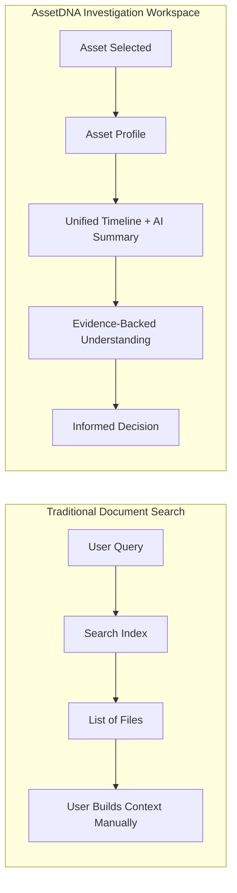
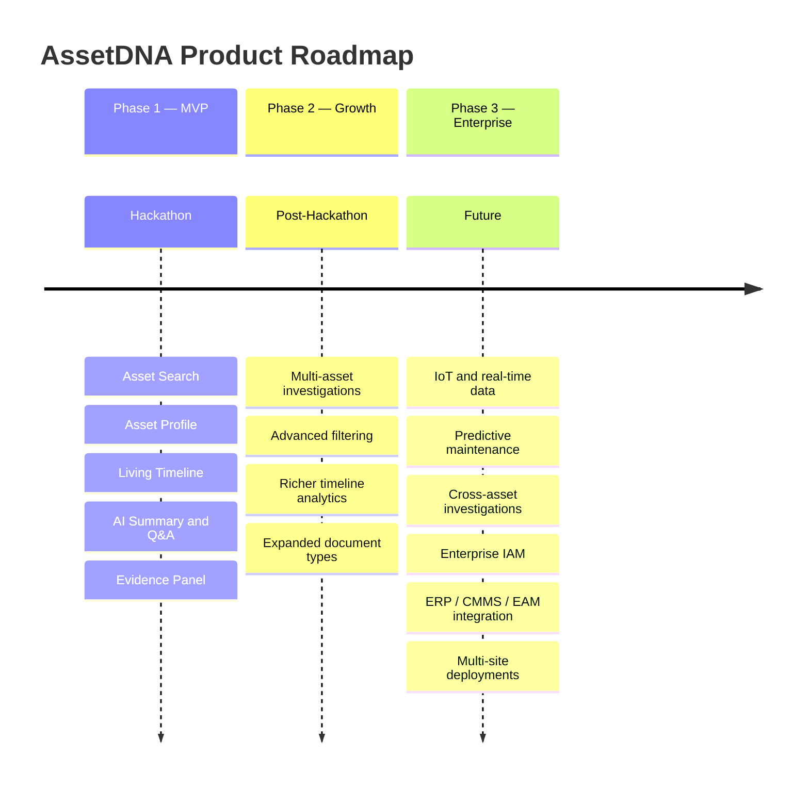
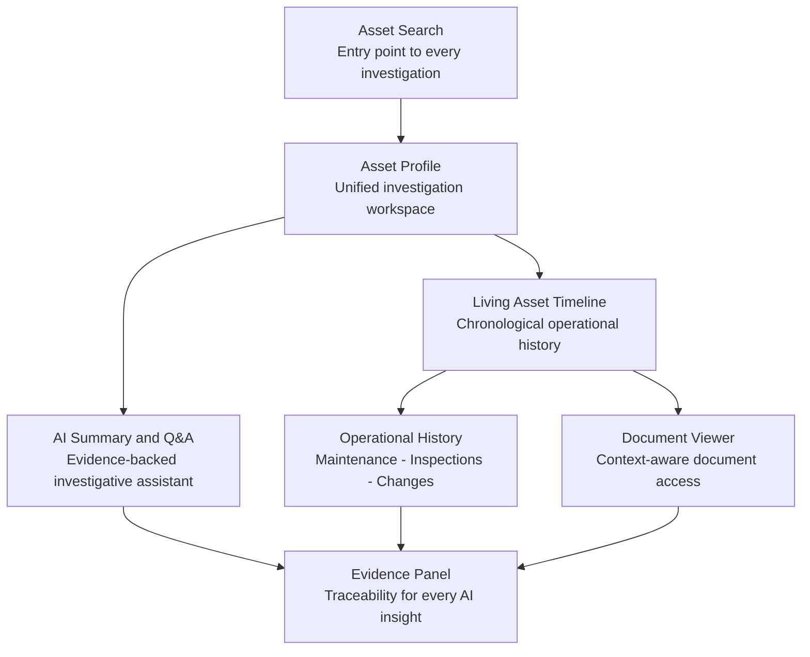
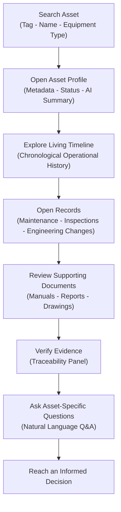

# Product Blueprint — AssetDNA

| Field | Value |
|---|---|
| **Product Name** | AssetDNA |
| **Document Version** | 1.0 |
| **Document Status** | Final |
| **Audience** | Executive Stakeholders, Product Managers, Engineering Leads, Designers, AI Engineers, Hackathon Judges |

> This Product Blueprint is the highest-level strategic document for AssetDNA. It consolidates the finalized PRD, TRD, DDS, and API Specification into a single product vision. It intentionally omits implementation details and focuses on product direction, business value, scope, and guiding philosophy.

---

## Table of Contents

1. [Executive Overview](#1-executive-overview)
2. [Problem Statement](#2-problem-statement)
3. [Product Vision](#3-product-vision)
4. [Core Value Proposition](#4-core-value-proposition)
5. [Target Users](#5-target-users)
6. [Product Scope](#6-product-scope)
7. [Core Capabilities](#7-core-capabilities)
8. [Guiding Principles](#8-guiding-principles)
9. [Success Criteria](#9-success-criteria)
10. [Constraints](#10-constraints)
11. [Risks](#11-risks)
12. [Product North Star](#12-product-north-star)
13. [Executive Product Summary](#13-executive-product-summary)

---

## 1. Executive Overview

### One-Line Value Proposition

> **AssetDNA transforms fragmented industrial knowledge into a unified, evidence-backed Asset Investigation Workspace that helps engineers understand an asset's complete operational history in minutes rather than hours.**

### Elevator Pitch

Industrial organizations accumulate decades of operational knowledge across maintenance systems, engineering documents, inspection reports, manuals, work orders, emails, and spreadsheets. Although this information exists, it is fragmented across disconnected systems, making investigations slow, inconsistent, and dependent on individual experience.

AssetDNA provides a unified **Asset Investigation Workspace** where engineers begin with an industrial asset—not a document repository—and immediately gain access to its complete operational history, supporting evidence, and AI-generated summaries grounded in verifiable records.

### Mission Statement

Enable industrial engineers to investigate assets faster, make evidence-based operational decisions, and preserve institutional knowledge by organizing fragmented operational information around the asset lifecycle.

### Vision Statement

To become the trusted operational intelligence layer for industrial organizations, where every asset has a complete, explainable, and continuously accessible digital knowledge history that supports maintenance, reliability, engineering, and operational decision-making.

---

## 2. Problem Statement

### Industrial Context

Industrial facilities generate enormous amounts of operational knowledge throughout the lifecycle of every asset. This information exists across:

- Maintenance records and work orders
- Inspection reports and findings
- Engineering drawings and P&ID diagrams
- OEM manuals and standard operating procedures
- Incident reports and engineering change documentation
- Audit reports, emails, and spreadsheets
- Enterprise software platforms (CMMS, ERP, EAM, SCADA)

### Current Challenges

| Challenge | Description |
|---|---|
| **Fragmented Information** | Operational knowledge is distributed across numerous systems with little integration |
| **Time-Consuming Investigations** | Engineers spend more time locating information than analyzing it |
| **Knowledge Silos** | Critical expertise resides with individuals rather than in structured organizational knowledge |
| **Limited Context** | Existing systems present individual records but rarely provide the complete operational history needed |
| **Explainability Gaps** | AI-assisted tools generate answers without clearly identifying supporting operational evidence |

### Why Existing Solutions Are Insufficient

Existing solutions are generally:

- **System-centric** rather than asset-centric
- **Document repositories** rather than investigation environments
- Focused on **record storage** rather than operational understanding
- Poor at **connecting historical events** across departments
- Limited in providing **evidence-backed** operational insights

As a result, engineers remain responsible for manually assembling context before making decisions.

---

## 3. Product Vision

### Long-Term Vision

AssetDNA envisions a future where every industrial asset possesses a continuously evolving operational knowledge history that is instantly accessible, understandable, and trustworthy. Rather than treating documents as isolated artifacts, the product organizes all operational knowledge around the lifecycle of the asset itself.

### Core Philosophy

| Belief | Implication |
|---|---|
| Assets are the center of industrial operations | The asset is always the starting point, never the document |
| Historical context is as important as current status | Timeline depth drives investigation quality |
| AI should accelerate investigation, not replace judgment | Gemini assists; engineers decide |
| Every operational insight must be explainable | No black-box outputs |
| Trust is established through evidence, not confidence scores | Every claim links to verifiable records |

### AssetDNA vs. Document Search

The asset—not the document—is the primary object within the product.

---

## 4. Core Value Proposition

| Dimension | Value Delivered |
|---|---|
| **Business** | Faster troubleshooting, improved knowledge retention, better maintenance decisions, reduced operational inefficiencies |
| **User** | Single investigation starting point, unified asset history, faster document access, clear evidence behind AI insights |
| **Technical** | Unified heterogeneous information, maintainable explainability, separation of infrastructure from workflows, future scalability |
| **AI** | Investigative assistant that summarizes history, answers questions, highlights evidence, and accelerates understanding—never an autonomous decision-maker |

---

## 5. Target Users

### User Prioritization

| Priority | Persona | Role |
|---|---|---|
| 1 | **Maintenance Engineer** | Diagnose failures, plan corrective actions, execute work orders |
| 2 | **Reliability Engineer** | Analyze recurring failures, conduct root cause investigations |
| 3 | **Plant Manager** | Monitor operational performance, support engineering decisions |
| 4 | Operations Manager | Coordinate production activities, monitor efficiency |
| 5 | Plant Operator | Operate equipment, report abnormalities |
| 6 | Quality Engineer | Investigate quality deviations, ensure process quality |
| 7 | Safety Officer | Investigate incidents, maintain safety compliance |
| 8 | Compliance Officer | Support audits, maintain regulatory documentation |
| 9 | Technician | Execute inspections, perform maintenance tasks |

### Primary User Profiles

#### Maintenance Engineer

| Aspect | Detail |
|---|---|
| **Responsibilities** | Diagnose equipment failures, review maintenance history, plan and execute corrective actions |
| **Pain Points** | Information scattered across systems, difficult historical investigations, time spent searching |
| **Expected Benefits** | Immediate access to asset history, faster investigations, evidence-backed understanding |

#### Reliability Engineer

| Aspect | Detail |
|---|---|
| **Responsibilities** | Analyze recurring failures, improve asset reliability, conduct root cause investigations |
| **Pain Points** | Fragmented historical records, incomplete operational timelines, limited cross-department visibility |
| **Expected Benefits** | Unified asset lifecycle view, faster trend identification, better reliability investigations |

#### Plant Manager

| Aspect | Detail |
|---|---|
| **Responsibilities** | Monitor operational performance, review maintenance outcomes, support engineering decisions |
| **Pain Points** | Lack of consolidated asset visibility, slow access to historical context, decision delays |
| **Expected Benefits** | Faster operational awareness, improved decision confidence, better cross-functional collaboration |

---

## 6. Product Scope

The scope of AssetDNA has been intentionally constrained to maximize quality, usability, and demonstration value within a hackathon timeline while preserving an enterprise product vision.

### 6.1 MVP Capabilities

| # | Capability | Description |
|---|---|---|
| 1 | **Asset Search** | Locate assets by tag, name, or equipment type — the primary entry point into every investigation |
| 2 | **Asset Profile** | Comprehensive workspace with metadata, operational status, key specifications, and AI summary |
| 3 | **Living Asset Timeline** | Chronological view of all operational events: maintenance, inspections, engineering changes, incidents |
| 4 | **Maintenance History** | Corrective/preventive maintenance records, work order completions, and technician notes |
| 5 | **Inspection History** | Inspection type, findings, recommendations, and supporting reports |
| 6 | **Engineering Change History** | Design changes, equipment upgrades, and approved engineering modifications |
| 7 | **Document Viewer** | OEM manuals, SOPs, inspection/maintenance reports, engineering/P&ID drawings, incident reports |
| 8 | **Evidence Panel** | Every AI insight linked to timeline events, documents, maintenance records, and inspection reports |
| 9 | **AI Asset Summary** | Evidence-backed lifecycle summary of failures, maintenance trends, and significant operational events |
| 10 | **Asset Question Answering** | Natural language queries grounded in verifiable operational history |

### 6.2 Explicitly Out of Scope (MVP)

| Category | Excluded Capabilities |
|---|---|
| **Operational Management** | Work order creation/assignment, maintenance scheduling, inventory management |
| **Live Industrial Connectivity** | SCADA, PLC, IoT sensors, live telemetry |
| **Predictive Analytics** | Remaining useful life, failure prediction, predictive maintenance |
| **Workflow Automation** | Notifications, approval workflows, maintenance automation |
| **Enterprise Administration** | Multi-tenancy, user administration, fine-grained RBAC |
| **Advanced Analytics** | KPI dashboards, fleet analytics, production optimization |
| **Data Ingestion** | Automated ingestion pipelines (MVP uses a curated demonstration dataset) |

### 6.3 Future Roadmap

---

## 7. Core Capabilities

| Capability | Purpose |
|---|---|
| **Asset Search** | Fast, asset-first entry point — users locate equipment, not files |
| **Asset Profile** | Central investigation workspace consolidating metadata, status, AI summary, and navigation |
| **Living Asset Timeline** | Backbone of the investigation — organizes all events chronologically across the asset lifecycle |
| **Investigation Workspace** | Combines timeline, records, documents, AI, and evidence into one environment |
| **Document Viewer** | Surfaces documents within operational context rather than as isolated files |
| **Evidence Linking** | Links every AI insight to operational records, enabling independent verification |
| **AI Asset Summary** | Condenses years of operational history into explainable, evidence-referenced narratives |
| **Asset Question Answering** | Natural language interaction grounded in verifiable operational history |

---

## 8. Guiding Principles

| # | Principle | Meaning |
|---|---|---|
| 1 | **Asset-First** | The asset—not the document—is the center of the experience |
| 2 | **Investigation Before Automation** | Improve investigations; never automate engineering judgment |
| 3 | **Evidence-Backed AI** | Every AI response must reference supporting operational evidence |
| 4 | **Explainability** | Every conclusion is understandable and independently verifiable |
| 5 | **Trust Through Traceability** | Users trust the product because they can inspect the evidence |
| 6 | **Simplicity** | A focused, intuitive workflow is preferable to many partially implemented features |
| 7 | **Enterprise Mindset** | Architectural decisions must support future enterprise evolution |
| 8 | **Hackathon Execution** | One polished investigation workflow over broad functional coverage |

---

## 9. Success Criteria

| Dimension | Success Indicators |
|---|---|
| **Business** | Reduced investigation effort; improved operational visibility; better knowledge accessibility |
| **User** | Engineers can find an asset, understand its history, locate evidence, ask questions, and complete investigations confidently |
| **Technical** | Responsive interactions; explainable AI outputs; reliable on free-tier infrastructure; follows approved architecture |
| **Hackathon** | Judges recognize the industrial problem, strong product thinking, enterprise-quality design, practical AI integration, well-scoped implementation |

---

## 10. Constraints

| Type | Constraint |
|---|---|
| **Frontend** | Next.js + Tailwind CSS + shadcn/ui |
| **Auth** | Firebase Authentication |
| **Database** | Firestore |
| **Storage** | Firebase Storage |
| **AI** | Gemini API |
| **Deployment** | Vercel |
| **Infrastructure** | Free-tier services only — no paid cloud infrastructure |
| **Data** | Curated demonstration dataset; no automated ingestion pipelines |
| **Scope** | Single polished investigation workflow; no expansion beyond approved MVP |
| **Timeline** | Designed for completion within a hackathon timeframe |

---

## 11. Risks

### 11.1 Product Risks

| Risk | Description | Impact | Mitigation |
|---|---|---|---|
| **Perceived as "Another AI Chatbot"** | Judges may see AssetDNA as a generic assistant, not an industrial investigation platform | Reduced perceived innovation, loss of strategic positioning | Lead every demo with Asset Profile + Timeline; emphasize evidence-backed reasoning |
| **Feature Creep** | Adding capabilities during development dilutes core workflow quality | Incomplete implementation, reduced demo quality | Strict adherence to approved MVP; depth over breadth |
| **Operational Management Expectations** | Industrial users may expect CMMS-like features (work orders, scheduling, live monitoring) | Incorrect product expectations | Clearly position as an **investigation workspace**, not a CMMS/ERP/SCADA replacement |

### 11.2 Technical Risks

| Risk | Description | Mitigation |
|---|---|---|
| **AI Response Latency** | Generating summaries may take longer than expected | Cache frequently used summaries; reuse existing AI outputs; indicate regeneration state |
| **AI Hallucinations** | Generative AI may produce unsupported statements | AI receives only backend-curated context; every response must reference evidence; system must explicitly communicate insufficient evidence |
| **Dataset Quality** | Demo dataset may not adequately represent real industrial scenarios | Curate realistic maintenance histories; ensure chronological consistency; include representative events |
| **Performance** | Large datasets may increase response times | Optimize around primary investigation workflows; load large resources independently |

### 11.3 Business Risks

| Risk | Description | Mitigation |
|---|---|---|
| **Adoption Resistance** | Industrial organizations rely on established workflows and existing enterprise systems | Position AssetDNA as a complementary investigation layer, not a replacement |
| **AI Trust Gap** | Engineers may hesitate to rely on AI-generated operational insights | Evidence-backed explanations are the core trust mechanism |
| **Knowledge Completeness** | Incomplete historical records may reduce investigation quality | Clearly distinguish between available evidence and missing information |

### 11.4 Hackathon Risks

| Risk | Description | Mitigation |
|---|---|---|
| **Demo Failure** | Slow responses, missing data, or AI service interruptions during live demo | Curated demo dataset; cached AI outputs; prepared fallback scenarios |
| **Scope Overload** | Showcasing too many features reduces demo clarity | Focus on one polished investigation story |

---

## 12. Product North Star

### 12.1 North Star Metric

> **Investigation Completion Time** — The reduction in time required for an engineer to understand the complete operational history of an industrial asset. A successful investigation should require **minutes, not hours**.

### 12.2 Core User Journey

Every screen, API, and database collection in AssetDNA supports this single journey.

### 12.3 Primary Demo Story

The recommended demonstration scenario uses a pump (**P-101**) experiencing recurring bearing failures:

| Step | Action |
|---|---|
| 1 | Introduce P-101 and the recurring bearing failure problem |
| 2 | Search for the asset by tag |
| 3 | Open the Asset Profile |
| 4 | Review the AI-generated lifecycle summary |
| 5 | Explore the Living Asset Timeline |
| 6 | Open the maintenance event where the bearing was replaced |
| 7 | View the related inspection report showing elevated vibration |
| 8 | Examine the engineering change that modified shaft alignment |
| 9 | Ask the AI why failures stopped after the modification |
| 10 | Show the supporting evidence linked to the answer |

This narrative demonstrates the **complete value proposition** within a single investigation.

### 12.4 Competitive Differentiators

| Differentiator | Description |
|---|---|
| **Asset-Centric Experience** | Users investigate equipment rather than searching documents |
| **Unified Operational Context** | Maintenance, inspections, engineering changes, and documents are presented as a single operational history |
| **Evidence-Backed AI** | Every AI-generated statement is traceable to supporting operational records |
| **Investigation-Focused Design** | The product optimizes understanding and decision-making rather than document management |

### 12.5 Judge Takeaway

> **"AssetDNA transforms scattered industrial knowledge into a single, explainable investigation experience centered on the asset."**

---

## 13. Executive Product Summary

| Category | Summary |
|---|---|
| **Product** | AssetDNA |
| **Category** | Asset Investigation Workspace |
| **Primary Users** | Maintenance Engineers, Reliability Engineers, Plant Managers |
| **Core Problem** | Fragmented industrial knowledge slows investigations and decision-making |
| **Primary Value** | Unified, evidence-backed operational understanding centered on the asset |
| **Core Workflow** | Search → Investigate → Understand → Verify → Decide |
| **AI Role** | Explainable investigation assistant |
| **Differentiator** | Asset-first, evidence-backed AI with unified operational context |
| **Technology Stack** | Next.js, Firebase Auth, Firestore, Firebase Storage, Gemini API, Tailwind CSS, shadcn/ui, Vercel |
| **Infrastructure** | Free-tier services only |
| **MVP Philosophy** | One polished investigation workflow over many unfinished features |
| **Long-Term Vision** | Trusted operational intelligence layer for industrial assets |

### Final Product Principles

Every future product decision must satisfy the following:

1. **Asset-first, never document-first.**
2. **Investigation before automation.**
3. **Every AI insight must be evidence-backed.**
4. **Explainability is mandatory.**
5. **Trust is built through traceability.**
6. **Optimize for investigation speed, not feature count.**
7. **Enterprise thinking with hackathon execution.**
8. **Prefer one exceptional workflow over many incomplete ones.**
9. **Maintain clear separation between product vision and implementation details.**
10. **Protect the simplicity and clarity of the MVP.**

### Blueprint Status

| Area | Status |
|---|---|
| Product Vision | ✅ Finalized |
| Problem Definition | ✅ Finalized |
| Value Proposition | ✅ Finalized |
| Target Users | ✅ Finalized |
| MVP Scope | ✅ Frozen |
| Product Principles | ✅ Finalized |
| Success Criteria | ✅ Finalized |
| Constraints | ✅ Finalized |
| Risks | ✅ Documented |
| Product North Star | ✅ Defined |
| Executive Product Snapshot | ✅ Complete |

---

> This **Product Blueprint** is the definitive strategic reference for **AssetDNA**. Together with the finalized **PRD**, **TRD**, **DDS**, and **API Specification**, it establishes a consistent product vision, frozen MVP scope, and unified direction for product, engineering, AI, frontend, backend, design, QA, and hackathon presentation activities. Any future enhancements should preserve the asset-centric, investigation-first philosophy defined in this blueprint while avoiding unnecessary expansion of the MVP.
