# Database Design Specification (DDS)

## AssetDNA: Database Architecture Baseline
* **Product Name:** AssetDNA
* **Document Version:** 1.0 (Final Baseline)
* **Document Status:** Draft – Database Architecture Baseline
* **Audience:** Backend Engineers, AI Engineers, Firebase Engineers, DevOps Engineers, Technical Mentors

---

## 1. Database Overview

### 1.1 Purpose
The Database Design Specification (DDS) defines how business information is organized within Firebase services to support the AssetDNA investigation workflow. It specifies:
* Firestore collections.
* Document hierarchies and models.
* Relationships and indexing.
* Data ownership.
* Firebase Storage organization.

It intentionally does not define APIs, Firestore Security Rules implementation code, Cloud Functions, or backend language-specific implementation patterns.

### 1.2 Why Firestore Was Chosen

| Database Requirement | Firestore Benefit |
| :--- | :--- |
| **Rapid Development** | No schema migrations or server setup required. |
| **Managed Infrastructure** | Serverless architecture with zero operational maintenance. |
| **Automatic Scaling** | Horizontally scales reads and writes out-of-the-box. |
| **Firebase Integration** | Native integration with Firebase Authentication and Storage. |
| **Flexible Schema** | Document-oriented architecture ideal for evolving formats. |
| **Cost Efficiency** | Generous free tier suitable for MVP development. |

### 1.3 Database Philosophy
AssetDNA is **Asset-Centric**. The database models all operational knowledge around physical assets rather than around isolated document repositories.

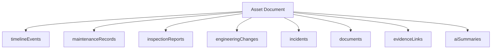

Every investigation begins with an Asset. Every stored record ultimately contributes to understanding that Asset.

### 1.4 Firestore Document Model
Firestore stores information as:

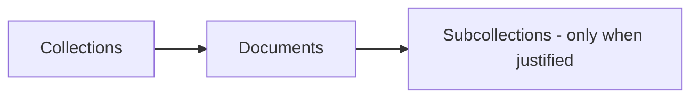

AssetDNA favors **top-level collections with document references** over deeply nested subcollections. This design provides:
* Simpler querying.
* Easier compound indexing.
* Reduced read complexity.
* Streamlined data service ownership.

### 1.5 Design Principles
* **Asset First:** All operational data points reference a parent `assetId`.
* **Read-Optimized:** Collection and document schemas are designed around high-frequency read workflows.
* **Minimal Nesting:** Maximum nesting is limited to `Collection/Document/Subcollection`. Anything deeper is avoided.
* **Controlled Denormalization:** Firestore favors duplication over expensive joins. Small, frequently accessed metadata (e.g., `assetTag` or `assetName`) is denormalized across related documents to improve read performance.
* **Immutable Operational Records:** Historical events are treated as immutable. Corrections or updates trigger new chronological logs rather than overwriting history.
* **AI Explainability:** AI summaries link directly to evidence identifiers, mapping text claims back to raw documents.

### 1.6 Hackathon Simplifications

| Enterprise Architecture | MVP Implementation |
| :--- | :--- |
| **Multi-tenancy** | Single organization |
| **Thousands of assets** | One representative asset (Pump P-101) |
| **Live operational feeds** | Static curated data |
| **Continuous ingestion** | Manual dataset preparation |
| **Multi-region replication** | Single Firebase project |

---

## 2. Data Modeling Principles

### 2.1 Collection Design Philosophy
Collections are designed around the primary read patterns identified in the PRD:
1. Search Asset by tag/name.
2. Load Unified Asset Profile.
3. Fetch chronological Living Asset Timeline.
4. Retrieve detailed maintenance records.
5. Retrieve detailed inspection reports.
6. Display associated manuals and drawings.
7. Expose evidence citations.
8. Fetch AI-generated summary blocks.

### 2.2 Document size limits
Firestore imposes a **1 MB limit** per document. To keep documents lightweight, large blobs (such as PDFs, P&IDs, and images) are stored in Firebase Storage, while Firestore holds only document metadata and storage paths.

### 2.3 Denormalization & Indexing Strategy
To avoid secondary joins during reads, commonly queried fields are denormalized. For example, every event in `timelineEvents` stores `assetId`, `assetTag`, and `assetName`, enabling timeline rendering in a single query.

#### Naming Conventions
* **Collections:** camelCase plural (e.g., `timelineEvents`, `maintenanceRecords`).
* **Fields:** camelCase (e.g., `assetId`, `eventDate`, `operationalStatus`).

#### Timestamp & ID Strategy
* **Unique IDs:** Every document receives an immutable unique identifier (e.g., `A7df93LmK2`).
* **Timestamps:** Standardized metadata fields (`createdAt`, `updatedAt`, `eventDate`) use the native Firestore Timestamp type to preserve timezone consistency and support chronological sorting.

---

## 3. Collection Architecture

### 3.1 Collection Matrix

| Collection | Purpose | Owner Service | Read Rate | Write Rate |
| :--- | :--- | :--- | :--- | :--- |
| **users** | User profiles and authentication details. | Auth Service | Low | Low |
| **assets** | Master asset specifications and state. | Asset Service | High | Low |
| **timelineEvents** | Unified operational history log. | Timeline Service | Very High | Medium |
| **maintenanceRecords** | Detailed corrective and preventive records. | Maintenance Service| Medium | Low |
| **inspectionReports** | Mechanical, vibration, and thermal logs. | Inspection Service | Medium | Low |
| **engineeringChanges** | Configuration modifications and design changes.| Engineering Service | Medium | Low |
| **documents** | File metadata and Storage paths. | Document Service | High | Low |
| **aiSummaries** | Cached LLM summaries. | AI Service | Medium | Medium |
| **evidenceLinks** | Mappings between AI claims and source files. | Evidence Service | High | Low |

### 3.2 Collection Relationships
All collections relate back to the parent `assets` collection via direct reference matching:

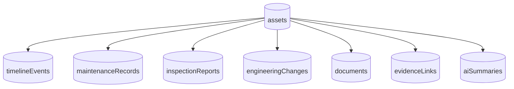

---

## 4. Asset Collection Design

### 4.1 Required Fields

| Field | Type | Required | Purpose |
| :--- | :--- | :--- | :--- |
| **assetId** | String | Yes | Unique internal identifier. |
| **assetTag** | String | Yes | Human-readable equipment tag (e.g., `P-101`). |
| **assetName** | String | Yes | Display name of the equipment. |
| **assetType** | String | Yes | Equipment classification (e.g., `Pump`). |
| **location** | String | Yes | Physical plant area or line locator. |
| **manufacturer** | String | Yes | Original Equipment Manufacturer (OEM). |
| **model** | String | Yes | Manufacturer model number. |
| **operationalStatus** | String | Yes | Current state (e.g., `Running`, `Offline`). |
| **createdAt** | Timestamp | Yes | Creation audit timestamp. |
| **updatedAt** | Timestamp | Yes | Modification audit timestamp. |

### 4.2 Optional Fields
* `installationDate` (Timestamp)
* `serialNumber` (String)
* `specifications` (Map of technical properties)
* `description` (String)

### 4.3 Validation Rules
* `assetTag` must be unique across the organization.
* `operationalStatus` must conform to predefined values (`Running`, `Standby`, `Maintenance`, `Offline`).

### 4.4 Example JSON Document
```json
{
  "assetId": "A7df93LmK2",
  "assetTag": "P-101",
  "assetName": "Cooling Water Pump",
  "assetType": "Pump",
  "location": "Plant A / Line 1",
  "manufacturer": "FlowTech",
  "model": "FT-250",
  "operationalStatus": "Running",
  "createdAt": "2026-01-01T08:00:00Z",
  "updatedAt": "2026-01-15T09:30:00Z"
}
```

---

## 5. Timeline Collection Design

### 5.1 Purpose
Represents the unified chronological history of an asset, supporting the interactive timeline interface.

### 5.2 Document Fields

| Field | Type | Required | Purpose |
| :--- | :--- | :--- | :--- |
| **eventId** | String | Yes | Unique event identifier. |
| **assetId** | String | Yes | References target asset. |
| **assetTag** | String | Yes | Denormalized tag name. |
| **eventType** | String | Yes | Event category (`maintenance`, `inspection`, `change`, `incident`). |
| **title** | String | Yes | Brief description of the event. |
| **description** | String | Yes | Detailed narrative of the event. |
| **eventDate** | Timestamp | Yes | Date the operational event occurred. |
| **relatedRecordId** | String | Yes | References detailed record (e.g., `MR-108`, `INS-204`). |

### 5.3 Example JSON Document
```json
{
  "eventId": "EV-203",
  "assetId": "A7df93LmK2",
  "assetTag": "P-101",
  "eventType": "maintenance",
  "title": "Bearing Replacement",
  "description": "Replaced drive-end bearing due to high vibration logs.",
  "eventDate": "2026-01-15T09:30:00Z",
  "relatedRecordId": "MR-108"
}
```

---

## 6. Detailed Domain Collections

### 6.1 Maintenance Collection Design
Stores detailed repair and preventive maintenance reports.

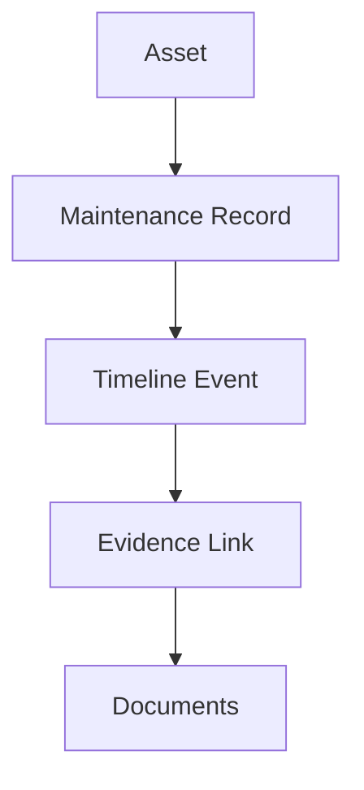

#### Document Fields
* `maintenanceId` (String): Unique identifier.
* `assetId` (String): References parent asset.
* `workOrderId` (String): Work order reference number.
* `maintenanceType` (String): Type (`Preventive`, `Corrective`, `Overhaul`).
* `technician` (String): Technician name.
* `notes` (String): Maintenance details.
* `completedDate` (Timestamp): Completion date.
* `evidenceIds` (Array of Strings): References related evidence.

#### Example JSON Document
```json
{
  "maintenanceId": "MR-108",
  "assetId": "A7df93LmK2",
  "workOrderId": "WO-442",
  "maintenanceType": "Corrective",
  "technician": "John Smith",
  "notes": "Drive-end bearing replaced. System aligned and vibration levels tested normal.",
  "completedDate": "2026-01-15T09:30:00Z",
  "evidenceIds": ["EVD-001", "EVD-002"]
}
```

### 6.2 Inspection Reports Collection Design
Stores periodic evaluations of equipment health.

#### Document Fields
* `inspectionId` (String): Unique identifier.
* `assetId` (String): References parent asset.
* `assetTag` (String): Denormalized tag name.
* `inspectionType` (String): Type (`Visual`, `Vibration`, `Thermal`, `Lubrication`).
* `inspectionDate` (Timestamp): Date of inspection.
* `inspector` (String): Inspector name.
* `status` (String): Status (`Completed`, `Pending`).
* `findings` (String): Summary of findings.
* `recommendations` (String): Next steps.
* `documentId` (String): References associated document metadata.
* `evidenceIds` (Array of Strings): Linked evidence references.

#### Example JSON Document
```json
{
  "inspectionId": "INS-204",
  "assetId": "A7df93LmK2",
  "assetTag": "P-101",
  "inspectionType": "Vibration",
  "inspectionDate": "2026-01-12T08:30:00Z",
  "inspector": "Sarah Lee",
  "status": "Completed",
  "findings": "Elevated vibration detected on drive-end bearing (vibration amplitude: 4.8 mm/s).",
  "recommendations": "Schedule bearing replacement as soon as practical.",
  "documentId": "DOC-502",
  "evidenceIds": ["EVD-011"]
}
```

### 6.3 Engineering Changes Collection Design
Tracks configuration modifications.

#### Example JSON Document
```json
{
  "changeId": "EC-014",
  "assetId": "A7df93LmK2",
  "assetTag": "P-101",
  "changeNumber": "EC-014",
  "title": "Pump Shaft Alignment Modification",
  "description": "Updated laser alignment tolerance procedure to mitigate repeated bearing wear.",
  "approvedBy": "Engineering Manager",
  "implementationDate": "2025-11-18T11:00:00Z",
  "reason": "Repeated premature bearing failures on P-101",
  "relatedDocuments": ["DOC-611"],
  "evidenceIds": ["EVD-020"]
}
```

---

## 7. Knowledge & Evidence Collections

### 7.1 Documents Collection Design
Stores document metadata; actual PDF files reside in Firebase Storage.

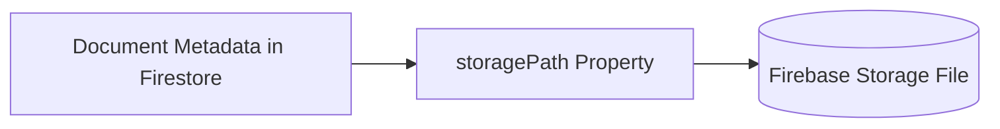

#### Document Fields
* `documentId` (String): Unique identifier.
* `assetId` (String): Parent asset reference.
* `assetTag` (String): Denormalized tag name.
* `documentType` (String): Type (`OEM Manual`, `SOP`, `Report`, `Drawing`).
* `title` (String): Title of document.
* `description` (String): Summary.
* `storagePath` (String): Path locator in Firebase Storage.
* `fileName` (String): Original filename.
* `mimeType` (String): File type (e.g., `application/pdf`).
* `uploadedBy` (String): Uploader name.
* `uploadedAt` (Timestamp): Upload timestamp.
* `version` (Integer): Document version number.
* `searchable` (Boolean): Flag to index for AI retrieval.

### 7.2 Evidence Links Collection Design
Maps AI-generated summaries to supporting source records.

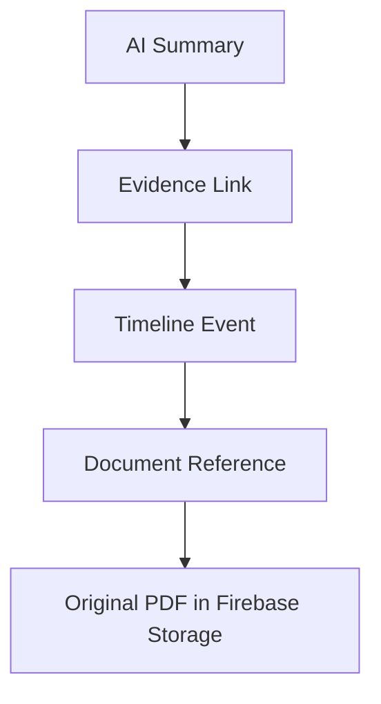

#### Document Fields
* `evidenceId` (String): Unique identifier.
* `assetId` (String): Parent asset reference.
* `sourceType` (String): Originating collection (`maintenanceRecords`, `inspectionReports`, `engineeringChanges`).
* `sourceId` (String): Document ID within the originating collection.
* `documentId` (String): References document metadata.
* `excerpt` (String): Exact text passage or value cited.
* `relevanceScore` (Number): Retrieval relevance match score.

#### Example JSON Document
```json
{
  "evidenceId": "EVD-020",
  "assetId": "A7df93LmK2",
  "sourceType": "engineeringChanges",
  "sourceId": "EC-014",
  "documentId": "DOC-611",
  "excerpt": "Alignment modification approved following repeated bearing failures on cooling water pumps.",
  "relevanceScore": 0.96
}
```

### 7.3 AI Summaries Collection Design
Stores cached AI summaries to minimize LLM query costs and reduce latency.

#### Example JSON Document
```json
{
  "summaryId": "SUM-001",
  "assetId": "A7df93LmK2",
  "assetTag": "P-101",
  "summaryType": "Lifecycle",
  "summaryText": "Pump P-101 has experienced repeated drive-end bearing failures over the past two years, typically following high-load cycles. An engineering modification (EC-014) introduced laser alignment updates, resolving subsequent vibration indicators.",
  "evidenceIds": ["EVD-011", "EVD-020"],
  "generatedAt": "2026-01-15T10:00:00Z",
  "modelVersion": "gpt-4o",
  "status": "active"
}
```

---

## 8. Firebase Storage Organization

### 8.1 Folder Hierarchy

```text
documents/
└── assets/
    └── P-101/              # Folder grouped by Asset Tag
        ├── maintenance/    # Work order attachments & technician notes
        ├── inspections/    # Vibration and thermal report PDFs
        ├── manuals/        # OEM manuals and vendor guides
        ├── engineering/    # Engineering change requests (ECRs) & CAD files
        ├── sop/            # Standard operating procedures
        └── incidents/      # Safety and failure investigation reports
```

### 8.2 File Naming Convention
Files are named deterministically to simplify audits:
```text
[assetTag]_[documentType]_[date_ISO]_[version].[extension]
```
* **Example:** `P-101_inspection_2026-01-12_v1.pdf`

### 8.3 File Metadata
Every file uploaded in Firebase Storage must include these key-value metadata tags:
* `assetId` (string)
* `assetTag` (string)
* `documentType` (string)
* `version` (string)

---

## 9. Firestore Indexing Strategy

### 9.1 Single-Field Indexes
Automatic indexes created on:
* `assetId`
* `assetTag`
* `eventDate`
* `inspectionDate`
* `completedDate`

### 9.2 Compound/Composite Indexes
Manual compound indexes are required to support timeline rendering, filtering, and ordering:

| Collection | Compound Index Fields | Order | Query Support |
| :--- | :--- | :--- | :--- |
| **timelineEvents** | `assetId` (Asc) + `eventDate` (Desc) | Mixed | Chronological timeline load. |
| **timelineEvents** | `assetId` (Asc) + `eventType` (Asc) + `eventDate` (Desc) | Mixed | Filtered timeline view. |
| **maintenanceRecords** | `assetId` (Asc) + `completedDate` (Desc) | Mixed | Maintenance history view. |
| **inspectionReports** | `assetId` (Asc) + `inspectionDate` (Desc) | Mixed | Inspection records tab. |
| **engineeringChanges**| `assetId` (Asc) + `implementationDate` (Desc) | Mixed | Engineering changes chronology. |
| **documents** | `assetId` (Asc) + `documentType` (Asc) | Asc | Document directory filtering. |

---

## 10. Firestore Security Strategy

### 10.1 Security Architecture
Firestore Security Rules serve as the database-level firewall, preventing direct untrusted browser writes while allowing authenticated reads.

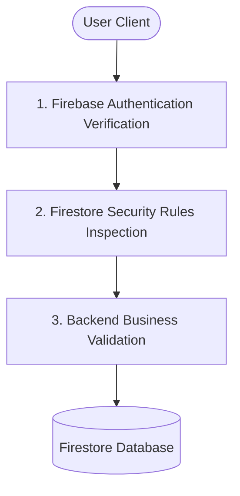

* **Read Access:** Restricted to authenticated users belonging to the active organization. No public or anonymous read requests are permitted.
* **Write Access:** Restricted exclusively to backend services via Admin SDK credentials. Client applications cannot write directly to database collections, preserving data integrity.

### 10.2 Collection Write Restrictions

| Collection | Read Privilege | Write Privilege |
| :--- | :--- | :--- |
| **users** | Authenticated User (Own Profile) | Backend Service Only |
| **assets** | Authenticated User | Backend Service Only |
| **timelineEvents** | Authenticated User | Backend Service Only |
| **maintenanceRecords** | Authenticated User | Backend Service Only |
| **inspectionReports** | Authenticated User | Backend Service Only |
| **engineeringChanges**| Authenticated User | Backend Service Only |
| **documents** | Authenticated User | Backend Service Only |
| **evidenceLinks** | Authenticated User | Backend Service Only |
| **aiSummaries** | Authenticated User | Backend Service Only |

---

## 11. Data Lifecycle Management

### 11.1 Asset Lifecycle
Assets are long-lived and exist as static entities. Write actions occur only when registering new physical equipment or updating status tags.

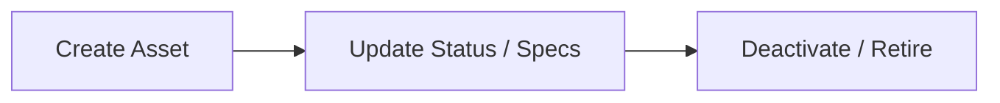

### 11.2 Timeline Lifecycle
Timeline documents are **append-only**. Operational history is never overwritten, preserving an immutable record of historical events.

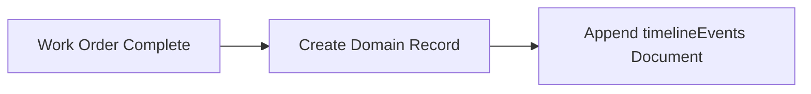

### 11.3 AI Summary Lifecycle
When operational databases register updates (e.g., a new maintenance event), the backend triggers summary regeneration, replacing the previous cached summary while preserving active evidence links.

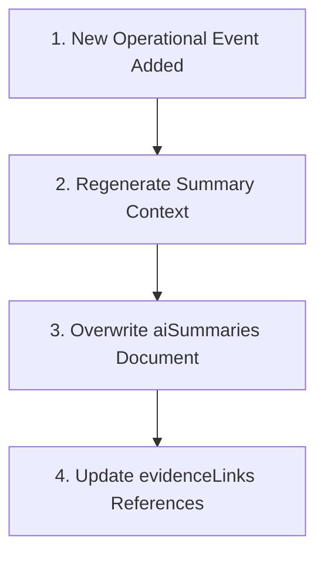

---

## 12. Batch Writes & Data Consistency

### 12.1 Atomic Batch Writes
To prevent database inconsistency, related documents must be created within single atomic batches. For example, when a technician completes a repair, the backend executes a batch write to ensure all required records are saved together:
```text
Start Batch
  ├─ Create document in 'maintenanceRecords'
  ├─ Create document in 'timelineEvents'
  └─ Create documents in 'evidenceLinks'
Commit Batch
```
If any document write fails, the entire transaction is rolled back.

### 12.2 Eventual Consistency
AssetDNA adopts eventual consistency for AI processing. High-frequency queries (like loading timeline views) retrieve data instantly, while LLM summaries are updated asynchronously.

---

## 13. End-to-End Investigation Data Flow

The database orchestrates several collections to serve a user investigation query.

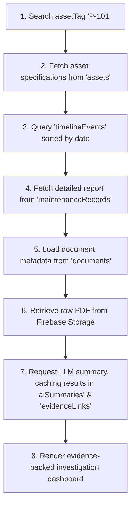

1. **Search:** The engineer searches equipment tag `P-101`, querying the `assets` collection.
2. **Metadata:** Retrieves the asset's active status, specifications, and location.
3. **Timeline:** Queries the `timelineEvents` collection using the composite index `assetId` + `eventDate` (newest first).
4. **Maintenance Details:** Selecting a timeline event retrieves the detailed notes from `maintenanceRecords`.
5. **Supporting Files:** Retrieves associated drawing/report file metadata from `documents`.
6. **Storage File:** Serves a temporary download link to retrieve the raw PDF from Firebase Storage.
7. **AI Summary:** Fetches the cached summary from `aiSummaries`. If stale, the backend queries the LLM and updates the cache.

---

## 14. Performance & Cost Optimization

* **Session Cache:** Caches retrieved asset lists and timeline configurations on the client to avoid duplicate Firestore read charges.
* **Denormalized Lookups:** By denormalizing tags and names, timeline rendering requires a query to only one collection instead of multiple database lookups.
* **Storage Separation:** PDF manual files reside in Firebase Storage, preventing large binary structures from increasing Firestore document sizes and read costs.
* **Gemini Caching:** Caching generated summaries reduces Gemini API usage, lowering costs and latency.

---

## 15. Operational Readiness Assessment

| Verification Area | Status | Notes |
| :--- | :--- | :--- |
| **Firestore Architecture** | ✅ Complete | Decoupled domain collections. |
| **Document Models** | ✅ Complete | Pydantic and JSON layouts defined. |
| **Relationships** | ✅ Complete | Reference matching (no deep nesting). |
| **Storage Folders** | ✅ Complete | Structured asset directory layout. |
| **Metadata Tagging** | ✅ Complete | Key-value indexing for PDF binaries. |
| **Index Configuration** | ✅ Complete | Composite indexes mapped. |
| **Data Lifecycles** | ✅ Complete | Append-only timeline rules. |
| **Security Architecture** | ✅ Complete | Read-only rules; backend-owned writes. |
| **Batch Operations** | ✅ Complete | Atomic transaction rules documented. |
| **Traceability Matrix** | ✅ Complete | mapped back to PRD features. |

---

## 16. Implementation Checklist

### Firestore Configuration
* [ ] Firebase Console project initialized.
* [ ] Top-level collections created (`assets`, `timelineEvents`, `maintenanceRecords`, `inspectionReports`, `engineeringChanges`, `documents`, `evidenceLinks`, `aiSummaries`).
* [ ] Composite indexes configured in `firestore.indexes.json`.

### Firebase Storage
* [ ] Storage bucket folders created (`documents/assets/P-101/`).
* [ ] Custom metadata rules documented.

### Backend Data Layer
* [ ] Repository modules implemented (`AssetRepository`, `TimelineRepository`).
* [ ] Atomic batch writes implemented.
* [ ] Input schemas validated using Pydantic.

### AI Integration
* [ ] AI summary cache checks implemented.
* [ ] Evidence link parsing configured.

---

## 17. Final Database Traceability Matrix

| PRD Feature Name | Firestore Collection(s) | Technical Purpose |
| :--- | :--- | :--- |
| **Asset Search** | `assets` | Locate target industrial equipment. |
| **Asset Profile** | `assets` | Master technical specs and location. |
| **Living Asset Timeline**| `timelineEvents` | Sorted chronological operational log. |
| **Maintenance History** | `maintenanceRecords` | Detailed corrective and preventive logs. |
| **Inspection History** | `inspectionReports` | Vibration, thermal, and visual log sheets. |
| **Engineering Changes**| `engineeringChanges` | Configuration modifications. |
| **Document Viewer** | `documents` + Firebase Storage | Access authoritative manuals and PDFs. |
| **Evidence Panel** | `evidenceLinks` | AI citation maps linking back to files. |
| **AI Summary** | `aiSummaries` | Cached evidence-backed summary narrative. |
