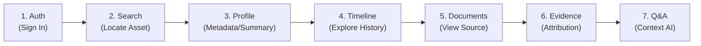
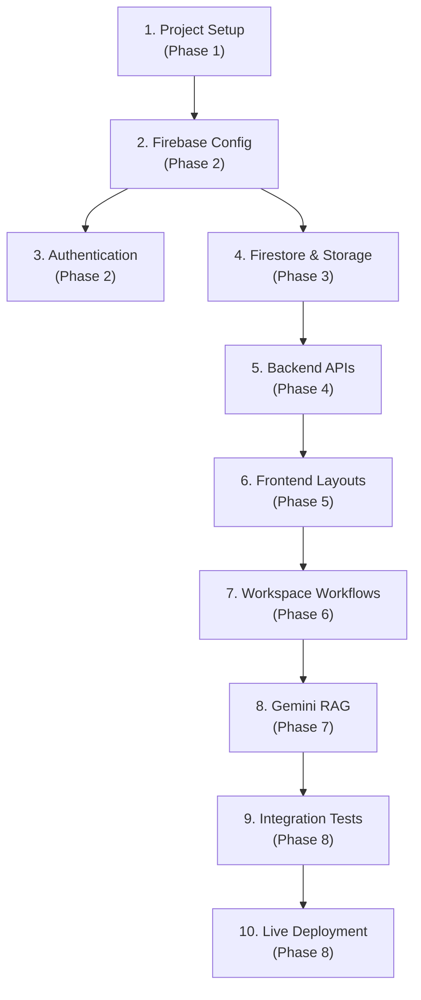
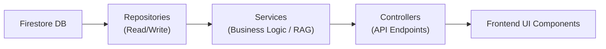
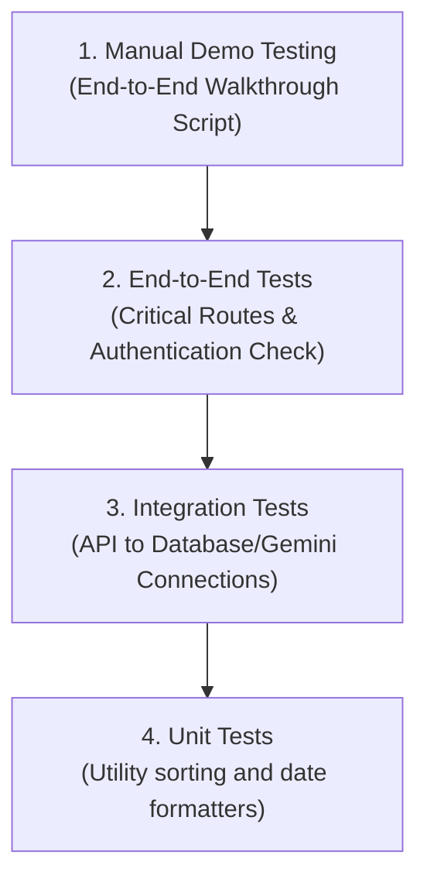
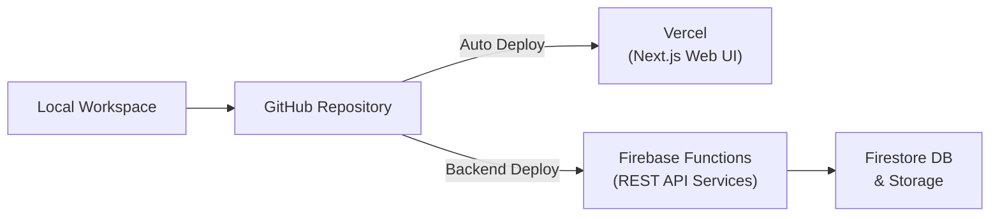
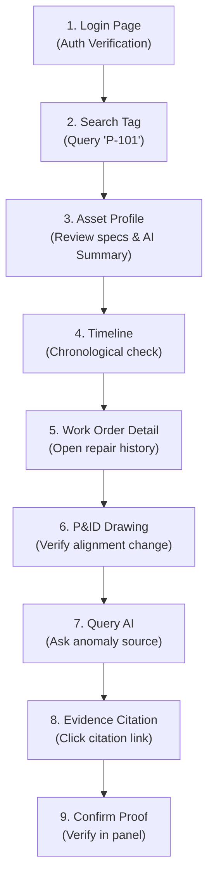

# Implementation Plan — AssetDNA

| Field | Value |
|---|---|
| **Product Name** | AssetDNA |
| **Document Version** | 1.0 |
| **Document Status** | Final |
| **Audience** | Engineering Team, Technical Lead, Product Team, Hackathon Team |

> This document translates the finalized Product Blueprint, PRD, TRD, DDS, API Specification, AI System Design, Web Application Flow, and UI/UX Design Specification into an execution roadmap. It is optimized for a hackathon while following professional software engineering practices.

---

## Table of Contents

1. [Project Overview](#1-project-overview)
2. [Development Roadmap](#2-development-roadmap)
3. [Engineering Task Breakdown](#3-engineering-task-breakdown)
4. [Dependency Graph](#4-dependency-graph)
5. [Project Folder Structure](#5-project-folder-structure)
6. [Development Standards](#6-development-standards)
7. [Testing Strategy](#7-testing-strategy)
8. [Deployment Strategy](#8-deployment-strategy)
9. [Risk Management](#9-risk-management)
10. [Demo Readiness Checklist](#10-demo-readiness-checklist)
11. [Final Engineering Summary](#11-final-engineering-summary)

---

## 1. Project Overview

### 1.1 Development Goals
The primary goal is to deliver a **fully functional, polished hackathon MVP** of AssetDNA that demonstrates the complete investigation workflow from asset search to AI-assisted, evidence-backed decision support.

The implementation prioritizes:
- **Stability** over feature count.
- **Complete user journeys** over isolated functionality.
- **Explainable AI** over sophisticated AI.
- **Maintainable code** over rapid but fragile development.
- **Demo reliability** over premature optimization.

### 1.2 Development Philosophy: Vertical Slice Approach
AssetDNA follows a **vertical slice approach**, where each major feature is completed end-to-end (database -> API -> UI) before moving to the next. This ensures that at any point during the hackathon, a working demo is available.



### 1.3 Engineering Priorities

| Priority | Focus | Description |
|---|---|---|
| **P0** | Global Architecture & Auth | Working serverless app shell + Firebase Auth |
| **P0** | Asset Investigation Workflow | Search, Profile, Timeline, Logs, Docs |
| **P0** | Explainable AI Integration | RAG backend + Gemini + Evidence citations |
| **P1** | Responsive UI | Laptop & Tablet fluid column grids |
| **P1** | Performance Optimization | Skeletons, index lookups, query caching |
| **P2** | Stretch Goals | UI polish, export tools, visual enhancements |

---

## 2. Development Roadmap

The roadmap is divided into **8 logical phases**, each yielding testable deliverables.

| Phase | Title | Objectives | Key Deliverables | Definition of Done |
|---|---|---|---|---|
| **Phase 1** | Project Foundation | Establish environment & repository | GitHub repository, Next.js, Tailwind, shadcn/ui, Firebase project, env variables | App runs locally; repositories configured |
| **Phase 2** | Auth & Infrastructure | User session & layout shell | Firebase Auth, protected routes, user context, layout wrapper, sidebar | User can log in; route guard blocks unauthenticated requests |
| **Phase 3** | Database & Storage | Configure database & storage | Firestore collections, Firebase Storage, curated seed dataset, documents | Curated dataset loaded; document PDF assets available in Storage |
| **Phase 4** | Backend APIs | Implement endpoints | Asset, Timeline, Maintenance, Inspections, Documents, Evidence, AI APIs | All API endpoints tested and returning mock/real responses |
| **Phase 5** | Frontend Foundation | Reusable components & layout | Design system styling, persistent header/sidebar, breadcrumbs, search UI | Layout matches UI/UX specs; sidebar responsive transitions ready |
| **Phase 6** | Workspace Flow | Core workspace execution | Search list, timeline viewer, maintenance table, document previewer | Complete manual search-to-document preview loop works |
| **Phase 7** | AI Integration | RAG & citation mapping | RAG retrieval, Gemini API, Evidence citations, AI Summary Cards | AI summarizes history & answers queries with verified citations |
| **Phase 8** | Testing & Deployment | Final validation & deploy | Local testing, bug fixes, Vercel deployment, final rehearsal | Production URL live; full demo script validated |

---

## 3. Engineering Task Breakdown

### 3.1 Frontend Tasks
- **High:** Project initialization, global layout template, routes, auth pages, dashboard, search cards, profile workspace, timeline, details drawer, PDF previewer, AI panel, evidence cards.
- **Medium:** Settings page, responsive layout configurations, accessibility focus rings, table wrappers.
- **Low:** Micro-animations, CSS theme adjustments.

### 3.2 Backend Tasks
- **High:** Firebase configurations, token verification middleware, Asset profile controller, Timeline lookup, Maintenance/Inspection logs endpoints, Document metadata parser, AI orchestrator.
- **Medium:** Global error handler, structured server logs, API cache.

### 3.3 Database & Storage Tasks
- **High:** Firestore collection schemas, seed data scripts, manual PDF uploads to Firebase Storage, compound query indexes.
- **Medium:** Access rules verification, verification of document-to-asset links.

### 3.4 AI Tasks
- **High:** Gemini API adapter, document parser, text chunking generator, Gemini embedding client, semantic index search, context builder payload, evidence mapping.
- **Medium:** Fallback queries, injection filtering.

### 3.5 DevOps & Infrastructure Tasks
- **High:** Firebase project configuration, Vercel pipeline configurations, environment variable deployments.
- **Medium:** Performance checks.

---

## 4. Dependency Graph

### 4.1 System-Level Integration Dependency



### 4.2 Code Layer Responsibilities



- **Frontend UI** never bypasses the Backend API layer. No direct database queries from client code are permitted.
- **AI Processing** is isolated inside a backend service wrapper, receiving only backend-sanitized inputs.

---

## 5. Project Folder Structure

```text
assetdna/
├── app/                        # Next.js App Router (Frontend)
│   ├── (auth)/                 # Login route
│   ├── dashboard/              # Workspace Entry
│   ├── assets/                 # Asset search and Profile dynamic workspace
│   ├── settings/               # Preferences
│   ├── api/                    # Optional local API routes
│   └── layout.tsx              # Global HTML shell wrapper
├── components/                 # Reusable UI Components
│   ├── common/                 # Buttons, Badges, Loaders
│   ├── layout/                 # Global Header & Navigation Sidebar
│   ├── assets/                 # Profile and Search cards
│   ├── timeline/               # Timeline list components
│   ├── maintenance/            # Maintenance tables
│   ├── documents/              # Preview components
│   ├── evidence/               # Citations panels
│   └── ui/                     # shadcn/ui components
├── lib/                        # Client-side configuration utilities
├── functions/                  # Cloud Functions Backend (API)
│   ├── src/
│   │   ├── controllers/        # Route Handlers
│   │   ├── services/           # Business and AI/RAG logic
│   │   ├── repositories/       # Firestore query layer
│   │   ├── routes/             # REST routing rules
│   │   └── index.ts            # Entry point functions
│   └── package.json
├── firestore/                  # Firestore security rules and index declarations
├── storage/                    # Storage assets & bucket configurations
├── tests/                      # Testing modules (Unit, E2E, AI)
├── scripts/                    # Database seeding and utility scripts
├── .env.local                  # Environment variables template
├── package.json
└── README.md
```

---

## 6. Development Standards

### 6.1 Coding Conventions

| Type | Format | Example |
|---|---|---|
| **Files & Folders** | kebab-case | `asset-card.tsx`, `timeline-item.tsx` |
| **React Components**| PascalCase | `AssetCard`, `TimelineItem` |
| **Functions** | camelCase | `searchAssets()`, `getTimeline()` |
| **Constants** | UPPER_SNAKE_CASE | `MAX_SEARCH_RESULTS`, `GEMINI_TIMEOUT_MS` |
| **Firestore Collections**| lowercase plural | `assets`, `timelineEvents`, `documents` |

### 6.2 Branching & Git Workflows
- **Core Branches:** `main` (production-ready) and `develop` (integration branch).
- **Feature Branches:** `feature/auth-setup`, `feature/timeline-ui`, `feature/rag-pipeline`.
- **Commit Messages:** Follow Conventional Commits convention:
  - `feat: implement asset tag lookup`
  - `fix: resolve timing discrepancy in timeline sorting`
  - `refactor: simplify Gemini context parsing`

### 6.3 Environment Configuration
Variables are stored in `.env.local` locally and set securely on Vercel/Firebase dashboard environments. Never commit credentials to source control.

Required variables:
- `NEXT_PUBLIC_FIREBASE_API_KEY`
- `NEXT_PUBLIC_FIREBASE_PROJECT_ID`
- `GEMINI_API_KEY`
- `FIREBASE_STORAGE_BUCKET`

---

## 7. Testing Strategy

### 7.1 Testing Pyramid



### 7.2 Testing Focus & Targets

| Target | Method | Target Latency | Coverage Goal |
|---|---|---|---|
| **Authentication** | E2E Session | N/A | Verification of user token block |
| **Asset Search** | API Request | < 1 second | Return matches |
| **Timeline Load** | API Request | < 2 seconds | Correct chronological ordering |
| **AI Q&A** | RAG Integration | < 5 seconds | Correct contextual answers with citations |
| **Doc Preview** | Blob Retrieval | < 3 seconds | Correct preview window render |

### 7.3 AI Validation Checklist
1. **Missing Context Test:** Submit queries on topics outside retrieved context. AI must gracefully reply with: *"The available operational records do not provide enough evidence..."*
2. **Citation Validation Test:** Verify bracket citations (e.g. `[EVD-10]`) match database document keys.
3. **Prompt Safety Test:** Submit injection attempts inside user question boxes to confirm they are ignored.

---

## 8. Deployment Strategy

### 8.1 Deployment Architecture



### 8.2 Production Checklists
- **Frontend (Vercel):** Responsive layout verified, environment variables mirrored, console clean of errors.
- **Backend (Cloud Functions):** Firebase SDK tokens verified, Gemini API key configured, REST API routes operational.
- **Database (Firestore):** Indexes deployed, seed dataset fully populated, rules deployed.

### 8.3 Rollback Strategy
If production errors occur:
1. Revert Vercel deployment to the previous stable build in the Vercel dashboard.
2. Deploy the previous stable release of Firebase Cloud Functions.
3. If database seeding errors occurred, run clean backup restore scripts.

---

## 9. Risk Management

| Risk Category | Risk Description | Impact | Mitigation |
|---|---|---|---|
| **AI Risk** | Gemini Hallucination | High | Ground answer exclusively in backend-sanitized context; reject statements without evidence citations |
| **Integration Risk**| API Contract Mismatch | High | Freeze the API Specification document before Phase 4; use shared TypeScript interfaces |
| **Database Risk** | Firestore Quota Limits | Medium | Curate a focused, representative demo dataset to keep reads/writes low |
| **Demo Risk** | Internet Interruption | High | Pre-cache critical AI responses on backend; prepare a mobile hotspot fallback |

---

## 10. Demo Readiness Checklist

The presentation target is a 7-minute live run of the complete investigation narrative (bearing failure on Pump P-101).



### Milestone Checklist

- [ ] Firebase Auth configured & protected routes verified.
- [ ] Asset Search Tag query matches returning results correctly.
- [ ] AI Summary Card loading and formatted via Markdown.
- [ ] Timeline filters working (Maintenance, Inspections, Incidents).
- [ ] PDF document previewer displaying drawings.
- [ ] Evidence Citations rendering clickable links.
- [ ] Backup user account credentials prepared.
- [ ] Production build verified on Vercel without warnings.

---

## 11. Final Engineering Summary

### 11.1 Critical Milestones

| Milestone | Target Outcome |
|---|---|
| **M1** | Foundations established; Next.js local environment active |
| **M2** | Auth session persistence verified |
| **M3** | Firestore populated with Pump P-101 dataset |
| **M4** | API endpoints fully operational |
| **M5** | Frontend layout matching design system specifications |
| **M6** | Timeline, document previewer, and details panel integrated |
| **M7** | RAG pipeline operational, returning evidence-backed responses |
| **M8** | Live production deployment active |
| **M9** | Mock dry run and timing rehearsal completed |

### 11.2 Must-Have Deliverables vs. Stretch Goals

| Scope Category | Deliverables |
|---|---|
| **Must-Have (MVP)** | Firebase Auth, Firestore Data Model, Storage documents, Next.js Layout (Header/Sidebar), Asset Search, Chronological Timeline, PDF previewer pane, Gemini RAG service, Evidence citation panels. |
| **Stretch Goals** | Saved investigations log, dark mode toggle, export investigation report (PDF summary download), custom P&ID drawing annotations, timeline search text box. |
| **Explicitly Deferred** | SCADA live telemetry, role-based RBAC permissions, notifications workspace, offline data storage. |

### 11.3 Success Criteria
- **User Success:** An engineer can search for P-101, explore its history, review drawings, ask Gemini questions, and identify the root cause using highlighted citations in under 5 minutes.
- **Hackathon Success:** Judges understand the industrial knowledge fragmentation problem, the value of explainable AI over black-box AI, and observe a reliable workspace demo.

### 11.4 Engineering Sign-Off

| Area | Status |
|---|---|
| Project Architecture | ✅ Defined |
| API Specifications Alignment | ✅ Verified |
| Database Seed Dataset | ✅ Curated |
| AI Integration Plan | ✅ Approved |
| Testing & QA Checklist | ✅ Established |
| Production Release Plan | ✅ Complete |

---

> This **Implementation Plan** is the execution roadmap for AssetDNA. It aligns with the **Product Blueprint**, **PRD**, **TRD**, **DDS**, **API Specification**, **AI System Design Specification**, **Web Application Flow**, and **Web UI/UX Design Specification**. Any dev deviations must preserve the vertical slice delivery model and the evidence-backed investigation workflow defined in these roadmap documents.
