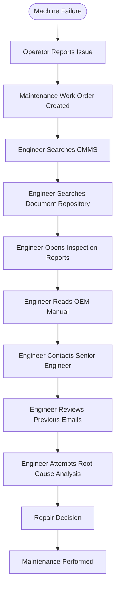
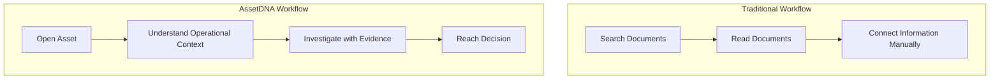
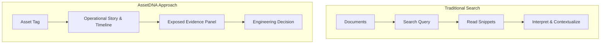
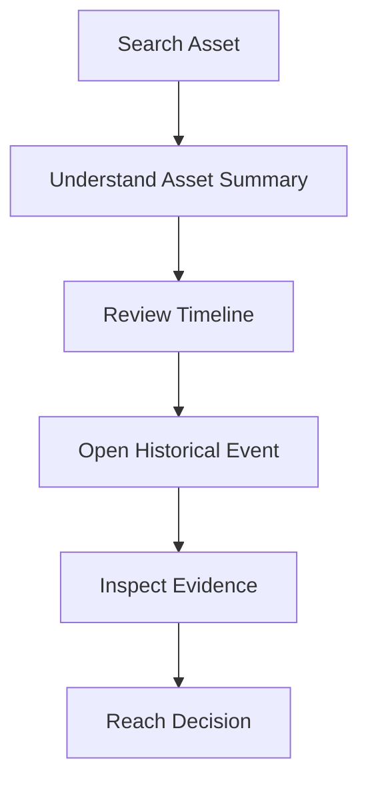
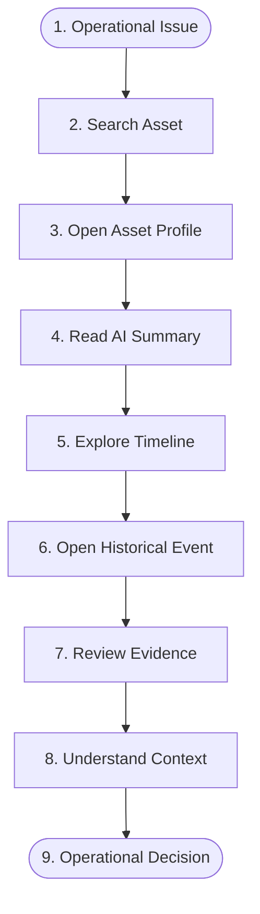
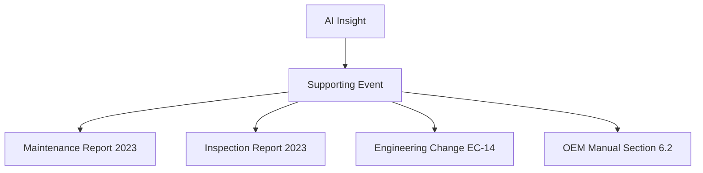
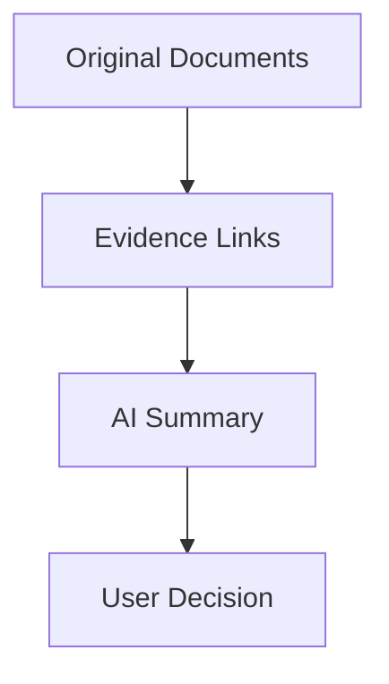
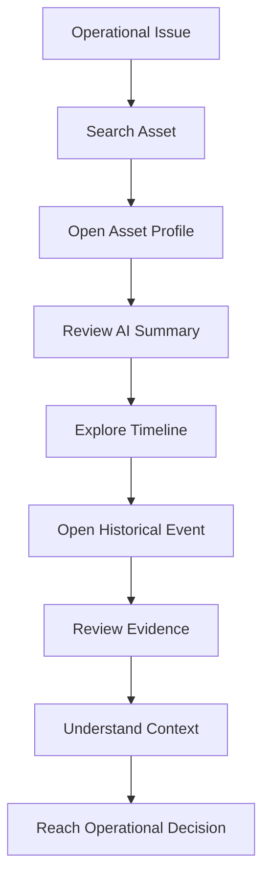

# Product Requirements Document (PRD)

## AssetDNA: The Living Memory of Every Industrial Asset
* **Document Version:** 1.0 (Final Baseline)
* **Document Status:** Draft – Product Definition Baseline
* **Audience:** Product Management, Engineering, UX Design, AI Team, QA, Technical Mentors, Hackathon Judges, Executive Stakeholders

---

## 1. Executive Summary

### 1.1 Product Name
**AssetDNA** – The Living Memory of Every Industrial Asset

### 1.2 Elevator Pitch
AssetDNA is an Asset Investigation Workspace that transforms fragmented industrial knowledge into a unified, evidence-backed operational memory for every physical asset. Instead of forcing engineers to search across disconnected documents, systems, and departments, AssetDNA reconstructs an asset's complete operational history—maintenance, inspections, engineering changes, incidents, manuals, and supporting evidence—into a single investigation experience that accelerates problem solving and improves operational decision-making.

### 1.3 Executive Overview
Industrial organizations have spent decades digitizing operations, yet operational knowledge remains fragmented. Information about a single machine is typically distributed across maintenance systems, engineering repositories, document management platforms, inspection reports, safety records, emails, spreadsheets, and institutional knowledge held by experienced personnel.

Although organizations possess vast quantities of information, they often lack usable operational context. When a production-critical asset experiences a failure, engineers are required to reconstruct the asset's history manually by consulting multiple systems and stakeholders. This investigative process consumes valuable time, delays corrective action, increases operational costs, and introduces avoidable business risk.

AssetDNA addresses this challenge by making the asset—not the document—the central organizing entity. Every relevant operational event associated with an asset is presented as a coherent, evidence-backed narrative, enabling engineers to understand what happened, why it happened, and what historical knowledge already exists before taking action.

The hackathon MVP focuses on demonstrating this capability through a representative manufacturing asset (Pump P-101) while preserving an enterprise architecture and product vision suitable for future expansion.

### 1.4 Business Context
Modern industrial organizations generate operational knowledge continuously through activities such as:
* Preventive maintenance
* Corrective maintenance
* Asset inspections
* Engineering modifications
* Quality investigations
* Safety incidents
* Regulatory audits
* Equipment commissioning
* Vendor documentation
* Production operations

Each activity creates valuable information, yet this information is rarely consolidated into a unified operational view. Typical enterprise environments include multiple specialized software platforms (ERP, CMMS, EAM, MES, SCADA, DMS, QMS). These systems perform their individual functions effectively but do not provide engineers with a unified understanding of an asset's operational history.

The result is an organizational environment where:
* Information exists but is difficult to locate.
* Historical lessons are repeatedly rediscovered.
* Investigations become unnecessarily expensive.
* Institutional knowledge is gradually lost.

### 1.5 Why This Product Exists
AssetDNA exists because industrial organizations do not suffer from a lack of information—they suffer from a lack of connected operational knowledge. Current workflows require engineers to assemble context manually before meaningful decisions can be made. This creates unnecessary delays in:
* Maintenance investigations
* Operational troubleshooting
* Engineering analysis
* Compliance activities
* Safety reviews

AssetDNA reduces this cognitive and operational burden by presenting an asset's complete operational story in one investigation workspace.

### 1.6 Value Proposition
* **Primary Value Proposition:** Transform fragmented industrial records into a trusted, evidence-backed operational memory for every asset.
* **User Value:** Engineers spend less time searching and more time solving operational problems.
* **Business Value:** Organizations preserve institutional knowledge, reduce investigation effort, improve operational efficiency, and strengthen decision quality.
* **Strategic Value:** AssetDNA establishes a scalable foundation for enterprise operational intelligence by organizing knowledge around physical assets rather than isolated documents.

### 1.7 Problem Summary
Industrial organizations maintain extensive historical information regarding their assets, yet that information is fragmented across systems, documents, departments, and individuals. 

When operational issues arise:
* Engineers search instead of investigate.
* Context must be manually reconstructed.
* Historical lessons are difficult to discover.
* Evidence is scattered.
* Previous failures are repeated.
* Organizational knowledge becomes increasingly inaccessible.

AssetDNA addresses this fundamental knowledge fragmentation problem through an asset-centric investigation experience.

---

## 2. Problem Statement

### 2.1 Existing Industrial Workflow
The current investigation workflow inside many industrial organizations involves a high degree of context switching and manual search:



Although each step is individually reasonable, the overall process is inefficient because critical operational knowledge is distributed across disconnected repositories.

### 2.2 Current Industrial Pain Points

* **Fragmented Information:** Knowledge related to one asset exists across multiple systems (maintenance logs, inspection reports, engineering drawings, SOPs, OEM manuals, incident reports, spreadsheets, emails) that were never designed to work as a unified investigation environment.
* **Loss of Historical Context:** Operational decisions depend on understanding previous failures, recurring issues, modifications, inspections, and maintenance patterns. Today, this context is rarely visible in one place.
* **Organizational Knowledge Silos:** Each department maintains its own information (Maintenance $\rightarrow$ CMMS; Engineering $\rightarrow$ CAD & Design; Quality $\rightarrow$ QMS; Safety $\rightarrow$ Incidents; Operations $\rightarrow$ Production Logs). As a result, no individual has immediate access to the complete operational picture.
* **Dependence on Tribal Knowledge:** Experienced engineers frequently become the primary source of operational history. Critical knowledge remains undocumented or difficult to retrieve. When these individuals leave, valuable institutional knowledge is lost.
* **Time-Consuming Investigations:** A significant portion of investigation effort is spent locating information rather than interpreting it, making the process administrative rather than analytical.

### 2.3 Why Current Solutions Are Insufficient

| System | Strength | Limitation |
| :--- | :--- | :--- |
| **CMMS** | Maintenance management | Limited operational context |
| **EAM** | Asset lifecycle tracking | Fragmented supporting knowledge |
| **DMS** | Document storage | Document-centric navigation |
| **ERP** | Enterprise operations | Not investigation-focused |
| **MES** | Production execution | Limited maintenance visibility |
| **SCADA** | Real-time monitoring | Limited historical reasoning |

While these platforms perform their intended functions effectively, none provides a unified investigation experience centered on an individual asset. Users remain responsible for manually assembling context.

### 2.4 Operational Impact
Knowledge fragmentation directly affects operational efficiency. This results in:
* Slower troubleshooting
* Repeated failure investigations
* Longer equipment downtime
* Inconsistent maintenance decisions
* Duplicated engineering effort
* Inefficient collaboration across departments

Operational investigations become progressively slower as organizational knowledge grows.

### 2.5 Business Impact
* **Increased Downtime:** Longer investigations delay equipment restoration.
* **Higher Maintenance Costs:** Repeated analysis increases engineering effort.
* **Reduced Productivity:** Engineers spend valuable time searching instead of solving problems.
* **Knowledge Loss:** Institutional expertise becomes difficult to preserve.
* **Compliance Risk:** Evidence required for audits may be difficult to retrieve.
* **Poor Decision Quality:** Incomplete operational context increases the likelihood of suboptimal maintenance and engineering decisions.

### 2.6 User Frustrations
Common frustrations experienced by industrial users include:
* *"I know this happened before, but I cannot find the report."*
* *"The maintenance history is in one system, while engineering changes are stored somewhere else."*
* *"The previous engineer handled this issue, but they are no longer with the company."*
* *"I spent more time searching than actually solving the problem."*
* *"I don't know which document contains the correct answer."*

These frustrations are symptoms of fragmented operational knowledge rather than inadequate technical expertise.

### 2.7 Opportunity for Innovation
The opportunity is not to create another enterprise search tool. The opportunity is to redefine how industrial knowledge is organized. Instead of asking engineers to search across disconnected information sources, AssetDNA organizes all relevant operational knowledge around the physical asset itself.

This transforms the investigation process from document-centric navigation to asset-centric investigation:



This shift represents the primary innovation of the product.

---

## 3. Product Vision

### 3.1 Mission
Enable industrial professionals to investigate operational problems through a trusted, evidence-backed understanding of every asset's complete operational history.

### 3.2 Vision
To become the operational memory layer for industrial organizations by transforming fragmented knowledge into connected, explainable, and actionable asset intelligence.

### 3.3 Long-Term Direction
In the long term, AssetDNA aims to serve as the primary interface through which engineers understand industrial assets throughout their lifecycle. Rather than replacing existing enterprise systems, AssetDNA complements them by connecting operational knowledge into a unified investigation experience. The product evolves from an investigation workspace for individual assets to an enterprise knowledge platform supporting organization-wide operational intelligence while maintaining traceability and trust.

### 3.4 Product Philosophy
> **Engineers investigate assets—not documents.**
> Every product decision should reinforce this philosophy. Users should never be required to know where information is stored. They should only need to know which asset they are investigating.

### 3.5 Core Principles
1. **Asset-first, never document-first:** The asset is the root node of all operational memory.
2. **Operational context is more valuable than isolated information:** Data must be presented in connection with related events.
3. **Every AI-generated insight must be traceable to source evidence:** No unsupported AI claims.
4. **Trust is more important than automation:** Focus on keeping the engineer in control.
5. **One polished investigation workflow is preferable to many incomplete features:** Prioritize polish over breadth.
6. **Historical knowledge should remain accessible regardless of organizational change:** Protect against tribal knowledge loss.
7. **Explainability takes precedence over sophistication:** Clear reasoning is required.

### 3.6 Market Positioning
AssetDNA is positioned as an **Asset Investigation Workspace** for industrial organizations. It is explicitly NOT a document management system, a maintenance management platform, an enterprise search engine, or a generic AI assistant. Instead, it occupies a distinct position by providing a unified operational investigation experience centered on physical assets.

### 3.7 Strategic Differentiation



The product does not begin with documents. It begins with the operational problem associated with a physical asset. Every document exists only as supporting evidence within that investigation.

---

## 4. Goals and Objectives

### 4.1 Business Goals
* Demonstrate the value of asset-centric operational intelligence.
* Reduce investigation effort associated with fragmented knowledge.
* Preserve institutional knowledge through connected operational history.
* Improve cross-functional collaboration across maintenance, engineering, safety, and quality.
* Establish a scalable foundation for future enterprise adoption.

### 4.2 User Goals
* Locate relevant asset information quickly.
* Understand complete operational history without manual searching.
* Investigate failures using evidence-backed information.
* Reduce time spent navigating multiple systems.
* Increase confidence in maintenance and engineering decisions.

### 4.3 Technical Goals
* Present unified operational context for a representative asset.
* Maintain traceability from insights to source evidence.
* Deliver an intuitive investigation workflow.
* Support explainable AI-generated summaries.
* Preserve a modular architecture suitable for future expansion (without expanding MVP scope).

### 4.4 Hackathon Goals
* Deliver one polished end-to-end investigation workflow.
* Demonstrate clear differentiation from document search tools.
* Showcase explainable, evidence-backed operational intelligence.
* Tell a compelling, realistic maintenance investigation story within a 5–7 minute demo.
* Build a high-confidence MVP rather than a broad prototype.

### 4.5 Success Objectives
The MVP will be considered successful if it enables a maintenance engineer to:
1. Locate a production asset.
2. Understand its operational history.
3. Identify relevant historical events.
4. Access supporting evidence.
5. Reach an informed operational conclusion without manually searching multiple disconnected repositories.

---

## 5. Target Users

The MVP is intentionally optimized for a small number of high-value personas. The Maintenance Engineer is the primary persona driving design decisions.

| Priority | Persona | Primary Focus |
| :--- | :--- | :--- |
| **1** | **Maintenance Engineer** | Operational investigation |
| **2** | **Reliability Engineer** | Failure analysis and trend identification |
| **3** | **Plant Manager** | Operational visibility and decision support |
| **4** | **Plant Operator** | Immediate operational context |
| **5** | **Safety Officer** | Incident investigation |
| **6** | **Quality Engineer** | Production impact analysis |

### 5.1 Maintenance Engineer (Primary Persona)
* **Responsibilities:** Diagnose equipment failures; perform corrective/preventive maintenance; review maintenance history; execute work orders; restore equipment availability.
* **Goals:** Resolve issues quickly; minimize downtime; understand historical failures; access accurate maintenance information.
* **Pain Points:** Information scattered across multiple systems; difficulty locating previous repairs; repeated troubleshooting of known issues; dependence on experienced colleagues.
* **Current Workflow:** Receive work order $\rightarrow$ Search CMMS $\rightarrow$ Search documents $\rightarrow$ Review manuals $\rightarrow$ Contact colleagues $\rightarrow$ Diagnose $\rightarrow$ Repair $\rightarrow$ Document work.
* **How AssetDNA Improves the Workflow:** AssetDNA provides a unified investigation workspace where maintenance history, inspections, engineering changes, manuals, and incidents are available in one contextual view, reducing search effort and accelerating diagnosis.

### 5.2 Reliability Engineer
* **Responsibilities:** Analyze recurring failures; improve asset reliability; conduct root cause analysis; recommend preventive actions.
* **Goals:** Identify patterns; reduce repeat failures; improve asset performance.
* **Pain Points:** Historical events are fragmented; pattern recognition requires manual effort; context is difficult to assemble.
* **Current Workflow:** Collect historical records from multiple sources $\rightarrow$ Analyze trends $\rightarrow$ Produce recommendations.
* **How AssetDNA Improves the Workflow:** The Living Asset Timeline presents historical events in chronological order, allowing engineers to identify recurring issues and understand operational context more efficiently.

### 5.3 Plant Manager
* **Responsibilities:** Monitor production performance; oversee maintenance activities; coordinate operational priorities.
* **Goals:** Maximize uptime; improve operational efficiency; make informed business decisions.
* **Pain Points:** Limited visibility into asset history; delayed investigations; difficulty understanding technical context.
* **Current Workflow:** Receive updates from engineering and maintenance teams before making operational decisions.
* **How AssetDNA Improves the Workflow:** Provides concise operational summaries and evidence-backed historical context that supports faster management decisions.

### 5.4 Plant Operator
* **Responsibilities:** Operate production equipment; monitor equipment condition; report abnormalities.
* **Goals:** Maintain stable production; escalate issues accurately.
* **Pain Points:** Limited access to historical asset information; difficulty understanding previous operational issues.
* **Current Workflow:** Observe abnormal behavior $\rightarrow$ Notify maintenance $\rightarrow$ Await investigation.
* **How AssetDNA Improves the Workflow:** Provides immediate access to asset status, recent events, and operational history to improve communication with maintenance teams.

### 5.5 Safety Officer
* **Responsibilities:** Investigate incidents; monitor safety compliance; review historical safety records.
* **Goals:** Prevent repeat incidents; improve workplace safety.
* **Pain Points:** Safety information exists separately from operational history.
* **Current Workflow:** Collect incident reports and supporting documentation from multiple repositories.
* **How AssetDNA Improves the Workflow:** Integrates incident history with the broader operational lifecycle of the asset, providing complete investigation context.

### 5.6 Quality Engineer
* **Responsibilities:** Investigate production quality issues; analyze equipment-related defects; support corrective actions.
* **Goals:** Improve product quality; understand equipment influence on defects.
* **Pain Points:** Difficulty correlating equipment history with quality events.
* **Current Workflow:** Review production records alongside maintenance and engineering documentation.
* **How AssetDNA Improves the Workflow:** Provides an integrated operational history that helps correlate asset events with quality outcomes.

---

## 6. Scope

### 6.1 MVP Scope (In Scope)
The MVP focuses on one complete investigation experience centered around a representative manufacturing asset (**Pump P-101**).

1. **Asset Search:** Users can search for an asset using Asset Tag or Asset Name.
2. **Asset Profile:** Contains current status, asset metadata, AI-generated operational summary, recent activity, and historical operational information.
3. **Living Asset Timeline:** Chronological visualization of maintenance events, inspections, incidents, engineering modifications, work orders, and document revisions.
4. **AI Lifecycle Summary:** Automatically generated summary explaining major failures, recurring issues, engineering changes, inspection highlights, and operational patterns (referencing supporting evidence).
5. **Document Viewer:** Inspection of original documents (maintenance reports, inspections, OEM manuals, SOPs, engineering drawings). Documents remain authoritative.
6. **Evidence Panel:** Exposes originating documents, events, timestamps, and related records for every insight.
7. **Asset Investigation Workflow:** Reconstructs the end-to-end investigation path:



### 6.2 Out of Scope
* **Enterprise Administration:** User/role management, permissions, organization settings.
* **Predictive Maintenance:** Remaining Useful Life (RUL) prediction, failure forecasting.
* **Asset Editing:** Asset creation, deletion, or metadata editing (AssetDNA consumes data).
* **Workflow Automation:** Maintenance approval, ticket routing, notifications.
* **Dashboards:** Plant-wide analytics, executive reporting, KPI dashboards.
* **Mobile Application:** Focus is on desktop-first experience.
* **Enterprise Integrations:** No live connection to SAP, IBM Maximo, SCADA, etc. (Mock data only).
* **Collaboration:** Comments, chat, shared workspaces.
* **Authentication:** IAM integration is excluded (Basic authentication mocked).

### 6.3 Future Roadmap (Outside MVP)
* **Phase 2:** Fleet investigation, multi-asset comparison, investigation report generation.
* **Phase 3:** Cross-site knowledge, reliability analytics, organizational insights.
* **Enterprise:** Enterprise integrations, Role-Based Access Control, data lineage.

---

## 7. Functional Requirements

### 7.1 Module Priority Table

| Module | Priority | Description |
| :--- | :--- | :--- |
| **Search** | P0 | Enable engineers to quickly locate an asset. |
| **Asset Profile** | P0 | Provide a single operational view of one asset. |
| **Living Asset Timeline** | P0 | Present operational history chronologically. |
| **AI Summary** | P0 | Provide concise operational understanding. |
| **Document Viewer** | P0 | Allow users to inspect original records. |
| **Evidence Panel** | P0 | Provide explainability and evidence-tracking. |
| **Investigation Flow** | P0 | Unify every module into one investigation experience. |

### 7.2 Functional Specifications

#### Module 1 — Search
* **Features:** Search bar, asset lookup, asset suggestions.
* **Expected Behavior:** User enters "P-101" $\rightarrow$ System returns Pump P-101 $\rightarrow$ User selects asset to open profile.
* **Dependencies:** Asset metadata.

#### Module 2 — Asset Profile
* **Features:** Header, Status indicators, Summary panel, Timeline widget, History, Documents tab.
* **Expected Behavior:** Opening an asset immediately answers: *"What do I need to know about this machine?"*
* **Dependencies:** Timeline, Documents, AI Summary, Evidence.

#### Module 3 — Living Asset Timeline
* **Features:** Timeline events, Category icons, Filter options, Search within timeline, Sorting.
* **Expected Behavior:** User should be able to reconstruct the sequence of events without reading every document.
* **Dependencies:** Asset Profile, Documents.

#### Module 4 — AI Summary
* **Features:** Summary highlighting recurring failures, trends, changes, and inspections.
* **Behavior:** Must never generate unsupported claims. Every statement requires evidence.
* **Dependencies:** Timeline, Documents, Evidence.

#### Module 5 — Document Viewer
* **Features:** Open documents, navigate evidence, document preview.
* **Behavior:** Documents remain the source of truth; AI summaries must not edit or hide source data.
* **Dependencies:** Evidence Panel.

#### Module 6 — Evidence Panel
* **Features:** Display document details, section references, timestamp, and linked events.
* **Behavior:** Every AI insight must expose its source evidence in this panel.
* **Dependencies:** AI Summary, Document Viewer.

#### Module 7 — Asset Investigation Workflow
* **Features:** Investigation path tracking, evidence navigation, historical reasoning.
* **Behavior:** Every click should answer the next investigative question:
  `Problem` $\rightarrow$ `Search` $\rightarrow$ `Summary` $\rightarrow$ `Timeline` $\rightarrow$ `Evidence` $\rightarrow$ `Decision`
* **Dependencies:** All modules.

---

## 8. User Stories

### US-001: Locate an Asset
* **As a** Maintenance Engineer,
* **I want to** search for an asset using its equipment tag,
* **So that I can** begin investigating its operational history immediately.
* **Acceptance Criteria:** Search returns correct asset; user opens asset profile.
* **Priority:** P0

### US-002: Understand Asset History
* **As a** Maintenance Engineer,
* **I want** an overview of the asset's operational history,
* **So I understand** previous issues before troubleshooting.
* **Acceptance Criteria:** Summary loads immediately; Timeline is available; recent events are visible.
* **Priority:** P0

### US-003: Review Historical Failures
* **As a** Reliability Engineer,
* **I want to** view previous failures chronologically,
* **So I can** identify recurring issues.
* **Acceptance Criteria:** Timeline displays failures, inspections, maintenance, and changes.
* **Priority:** P0

### US-004: Inspect Supporting Evidence
* **As a** Maintenance Engineer,
* **I want** every summary to reference source documents,
* **So I can** verify conclusions.
* **Acceptance Criteria:** Every AI-generated insight links directly to evidence.
* **Priority:** P0

### US-005: Review Original Documents
* **As a** Safety Officer,
* **I want to** inspect the original report,
* **So I can** validate operational decisions.
* **Acceptance Criteria:** Documents open correctly in viewer.
* **Priority:** P0

### US-006: Follow an Investigation Path
* **As a** Maintenance Engineer,
* **I want** the interface to naturally guide me from a reported issue to historical evidence,
* **So I spend** less time deciding where to search.
* **Acceptance Criteria:** Workflow progresses logically from search to evidence; no context loss when navigating back.
* **Priority:** P0

### US-007: Understand Recent Operational Changes
* **As a** Plant Manager,
* **I want to** quickly review recent significant events related to an asset,
* **So I can** understand operational status without reading detailed reports.
* **Acceptance Criteria:** Recent events are visible near the top of the Profile; events are ordered chronologically.
* **Priority:** P1

### 8.1 User Story Priority Summary

| Priority | Stories |
| :--- | :--- |
| **P0** | US-001 (Search), US-002 (Profile), US-003 (Timeline), US-004 (Evidence), US-005 (Documents), US-006 (Investigation Workflow) |
| **P1** | US-007 (Management-oriented recent activity summaries) |

---

## 9. User Journey

### Step-by-Step Scenario
1. **Operational Issue Occurs:** A pump exhibits abnormal vibration and is removed from service. The maintenance engineer receives a work order.
2. **Access AssetDNA:** The engineer opens the tool instead of navigating multiple enterprise systems.
3. **Search for Asset:** The engineer searches "Pump P-101". Search immediately returns status, location, and equipment type.
4. **Review Asset Profile:** The profile displays operational status, AI lifecycle summary, and recent significant events.
5. **Explore Timeline:** The engineer scrolls through timeline events (PMs, bearing replacement, vibration inspection, drawings, incidents).
6. **Investigate Historical Event:** The engineer opens a previous bearing failure event to view descriptions, related work orders, and root cause notes.
7. **Verify Evidence:** Through the Evidence Panel, the engineer opens the original maintenance report to confirm the analysis.
8. **Reach Operational Decision:** The engineer concludes the vibration matches a historical failure pattern. The investigation is complete.

### User Journey Diagram



---

## 10. Core Features

### Feature 1 — Asset Search
* **Purpose:** Provide the fastest entry point into an investigation.
* **Problem Solved:** Eliminates searching by repository or document name.
* **Expected Behavior:** Users search by tag and navigate directly to the profile.
* **Benefit:** Faster investigation start; reduced search effort.
* **Priority:** P0

### Feature 2 — Unified Asset Profile
* **Purpose:** Serve as the central investigation workspace.
* **Problem Solved:** Prevents users from switching between disconnected systems.
* **Expected Behavior:** Displays status, metadata, AI summary, recent activity, and timeline.
* **Benefit:** Immediate situational awareness.
* **Priority:** P0

### Feature 3 — Living Asset Timeline
* **Purpose:** Represent the chronological history of an asset.
* **Problem Solved:** Connects events historically across different systems.
* **Expected Behavior:** Events are grouped by time/category with filtering/sorting.
* **Benefit:** Simplified reconstruction of operational history.
* **Priority:** P0

### Feature 4 — AI Lifecycle Summary
* **Purpose:** Provide a concise overview of history.
* **Problem Solved:** Eliminates the need to manually read every report.
* **Expected Behavior:** Summarizes history while maintaining evidence attribution.
* **Benefit:** Rapid understanding of operational context.
* **Priority:** P0

### Feature 5 — Document Viewer
* **Purpose:** Expose original operational records.
* **Problem Solved:** AI summaries alone are insufficient for engineering decisions.
* **Expected Behavior:** Users can open source documents directly from the timeline.
* **Benefit:** Verification and confidence.
* **Priority:** P0

### Feature 6 — Evidence Panel
* **Purpose:** Provide transparent traceability for every AI insight.
* **Problem Solved:** Builds trust in AI outputs.
* **Expected Behavior:** Displays originating records, timestamps, and relations.
* **Benefit:** Trust and compliance.
* **Priority:** P0

---

## 11. AI Capabilities

### 11.1 AI Philosophy
AI in AssetDNA exists for **contextual understanding**, not autonomous decision-making. AI functions as an investigation accelerator, never replacing engineering expertise.

### 11.2 AI Responsibilities

| Capability | Purpose | Priority |
| :--- | :--- | :--- |
| **Lifecycle Summarization** | Summarize an asset's operational history. | P0 |
| **Event Summarization** | Summarize individual operational events. | P0 |
| **Cross-Document Synthesis** | Combine related records into a coherent explanation. | P0 |
| **Asset-Specific Q&A** | Answer questions about a selected asset only. | P0 |
| **Evidence Attribution** | Link every AI statement to supporting records. | P0 |

### 11.3 Asset Lifecycle Summary
Summarizes major events (failures, maintenance trends, changes, inspections) without requiring manual reading of every document.
> *Example:* "Pump P-101 has experienced three bearing failures over the past two years. Two failures occurred shortly after extended high-load operation. A shaft alignment modification was introduced following the second incident. No similar failures have been recorded since."

### 11.4 Event Summarization
Produces concise summaries for lengthy maintenance logs, inspection reports, engineering changes, and incidents to determine document relevance.

### 11.5 Cross-Document Context Synthesis
Explains relationships between related documents (e.g., matching a work order with a subsequent engineering modification and manual update).

### 11.6 Asset-Specific Question Answering
Answers targeted questions (e.g., *"When was the last bearing replacement?"*). Responses are strictly limited to the current asset dataset. No global web search.

### 11.7 Evidence Attribution
Every generated insight must follow a verifiable path to source documents:



### 11.8 What AI Does NOT Do
* Predict future failures or remaining useful life.
* Recommend maintenance actions.
* Replace engineering judgment.
* Modify enterprise data or create work orders.
* Perform organization-wide search.

### 11.9 Explainability Requirements
* **Traceability:** Users can identify where information originated.
* **Verifiability:** Users can inspect original documents.
* **Transparency:** Users understand why the AI reached a conclusion.
* **Consistency:** Repeated queries produce identical, stable responses.

### 11.10 Trust Model
The trust hierarchy prioritizes original records over AI interpretations:



AI never becomes the final authority. Original operational records remain the source of truth.

### 11.11 AI Limitations
* Relies on the curated demo dataset.
* Cannot reason beyond available evidence.
* Cannot automatically resolve conflicting documentation.
* Cannot infer missing operational history.

---

## 12. Success Metrics

### 12.1 Product KPIs

| KPI | Goal |
| :--- | :--- |
| **Asset Search Success Rate** | >95% |
| **Investigation Completion Rate** | >90% |
| **Evidence Accessibility** | 100% |
| **Timeline Coverage** | 100% of demo dataset |
| **AI Summary Availability** | 100% |

### 12.2 User Experience KPIs
* **Time to Locate Asset:** < 15 seconds.
* **Time to Understand Asset Context:** < 2 minutes.
* **Number of Screens Required:** $\le$ 5.
* **Navigation Simplicity:** Zero exits from the core workspace.

### 12.3 Explainability KPIs
* **Evidence Attached:** 100% of insights.
* **Source Accessible:** 100% of evidence.
* **Verifiability:** 100% independent verification rate.

### 12.4 Investigation KPIs
Accelerate failure discovery, evidence retrieval, and contextual reasoning compared to manually navigating standard enterprise repositories.

### 12.5 Demo Success Metrics
Judges should understand: the operational problem, current inefficiencies, the AssetDNA paradigm shift, the importance of evidence-backed AI, and asset-centric design.

---

## 13. Assumptions

* **Business:** Fragmented operational knowledge is standard; investigations are high-frequency; engineers value context over search.
* **User:** Users understand asset tags; users investigate one asset at a time; engineers trust evidence over AI summaries.
* **Data:** Assets have unique tags; records map correctly; consistent naming conventions exist in the demo dataset.
* **Product:** One polished journey has higher demo value; explainability is a core differentiator.
* **Technical:** AI summaries can be accurately generated from curated records; evidence links are stable.

---

## 14. Constraints

* **Technical:** Hackathon timeline; curated local dataset; no live enterprise integrations; desktop-first.
* **Dataset:** One representative asset (Pump P-101) containing maintenance, inspections, changes, manuals, and incidents.
* **Demo:** Must fit within 5–7 minutes; no administrative or filler screens.
* **Business:** AssetDNA complements, rather than replaces, CMMS, ERP, or EAM systems.

---

## 15. Risks

### 15.1 Summary of Project Risks

| Risk Category | Severity | Mitigation Priority |
| :--- | :--- | :--- |
| **Product Positioning** | High | Critical |
| **AI Trust** | High | Critical |
| **Data Quality** | High | High |
| **Demo Narrative** | High | High |
| **UX Complexity** | Medium | Medium |
| **Technical Performance** | Medium | Medium |

### 15.2 Detailed Risk Mitigation

* **Risk (Product Positioning):** Judges perceive AssetDNA as another document search tool.
  * *Mitigation:* Asset-first messaging. Every interaction starts with the asset, not documents.
* **Risk (AI Trust):** Judges question AI reliability.
  * *Mitigation:* Evidence Panel visible by default; every insight links to source records.
* **Risk (Data Quality):** Missing historical records.
  * *Mitigation:* Ensure Pump P-101 has a complete, closed operational loop in the dataset.
* **Risk (Demo Narrative):** Focuses too much on conversational AI rather than timeline investigation.
  * *Mitigation:* Follow the clear workflow:
  ```mermaid
  flowchart LR
      Investigate[Investigation] --> Context[Context] --> Evidence[Evidence] --> Decision[Decision]
  ```

---

## 16. Future Roadmap

### 16.1 Phase 2 — Investigation Expansion
* Multi-asset investigations and comparison.
* Session saving and investigation history.
* Saved investigation workspaces.
* Automatic investigation report generation.
* Cross-document relationship mapping.

### 16.2 Phase 3 — Organizational Intelligence
* Fleet-level operational insights.
* Reliability trend benchmarks.
* Cross-site operational knowledge transfers.
* Asset similarity modeling.

### 16.3 Enterprise Version
* **Integrations:** Live ERP, CMMS, QMS, DMS connections.
* **Security:** Role-Based Access Control, audit logs, SSO.
* **Governance:** Version control and data lineage.
* **Scale:** Multi-tenant scaling and workspace administration.

### Phase Summary

| Phase | Focus |
| :--- | :--- |
| **MVP** | Single Asset Investigation |
| **Phase 2** | Multi-Asset Investigation |
| **Phase 3** | Organizational Intelligence |
| **Enterprise** | Enterprise Platform |

---

## 17. Product Principles

> [!IMPORTANT]
> **Principle 1: Asset-First, Never Document-First**
> The primary object is always the industrial asset. Users investigate machines; documents only provide supporting evidence. Never reverse this relationship.

> [!IMPORTANT]
> **Principle 2: Investigations Over Search**
> The product exists to solve operational investigations. Search is only the entry point, not the product.

> [!IMPORTANT]
> **Principle 3: Evidence Before Intelligence**
> Every AI-generated statement must be backed by operational evidence. Unsupported insights are unacceptable.

> [!IMPORTANT]
> **Principle 4: Explainability Over Sophistication**
> Users must understand why, how, and where every conclusion originated. Simple explainable AI is preferred over complex, opaque AI.

> [!IMPORTANT]
> **Principle 5: Original Records Remain Authoritative**
> AI summarizes; documents prove; users decide. Original operational records always remain the source of truth.

> [!NOTE]
> **Principle 6: One Polished Workflow Beats Many Incomplete Features**
> The hackathon MVP prioritizes depth over breadth. One outstanding experience is better than many half-baked features.

> [!NOTE]
> **Principle 7: Reduce Cognitive Load**
> The interface should naturally guide the investigation so users never wonder where to search next.

> [!NOTE]
> **Principle 8: Preserve Institutional Knowledge**
> Operational knowledge must survive employee turnover, organizational change, and departmental silos.

> [!NOTE]
> **Principle 9: Context Before Detail**
> Users need "What happened?" first. Only then do they ask "Show me the evidence."

> [!NOTE]
> **Principle 10: Trust Is a Product Feature**
> Trust is a functional requirement, not a UX enhancement.

---

## 18. PRD Validation Review

### 18.1 Validation Summary
* **Completeness:** Covered vision, goals, personas, scope, functional specifications, stories, metrics, constraints, and risks.
* **Ambiguity:** Deferred detailed API, DB, ingestion, and security designs to the Technical Requirements Document (TRD).
* **Scope Creep:** Confirmed that dashboards, predictive maintenance, administrative UI, and collaboration are excluded.
* **Consistency:** Confirmed perfect alignment between vision, timeline feature, AI constraints, and success metrics.

### 18.2 Requirements Traceability Matrix

| Business Goal | MVP Feature(s) | Success Metric |
| :--- | :--- | :--- |
| Reduce investigation effort | Asset Search, Profile, Timeline | Investigation completion time |
| Preserve institutional knowledge | Living Asset Timeline, Doc Viewer | Evidence accessibility |
| Improve decision quality | AI Summary, Evidence Panel | Evidence traceability |
| Differentiate from search tools | Asset Investigation Workflow | Judge recognition of positioning |
| Build trust in AI | Evidence Panel, Doc Viewer | 100% evidence-backed insights |

---

## 19. Final PRD Summary

### 19.1 Core Concept
AssetDNA is an Asset Investigation Workspace that transforms fragmented industrial knowledge into a trusted, evidence-backed operational memory for every industrial asset.

### 19.2 Core Workflow
The entire MVP is designed to support the following investigation journey:



### 19.3 Final Readiness Assessment

| Area | Status |
| :--- | :--- |
| Product Vision | ✅ Complete |
| Business Definition | ✅ Complete |
| Personas | ✅ Complete |
| Functional Scope | ✅ Complete |
| User Stories | ✅ Complete |
| User Journey | ✅ Complete |
| Functional Requirements | ✅ Complete |
| AI Requirements | ✅ Complete |
| Success Metrics | ✅ Complete |
| Assumptions | ✅ Complete |
| Constraints | ✅ Complete |
| Risk Assessment | ✅ Complete |
| Product Principles | ✅ Complete |
| Future Roadmap | ✅ Complete |
| PRD Validation | ✅ Complete |
