# Technical Requirements Document (TRD)

## AssetDNA: Technical Architecture Baseline
* **Product Name:** AssetDNA
* **Document Version:** 1.0 (Final Baseline)
* **Document Status:** Draft – Technical Architecture Baseline
* **Audience:** Backend Engineers, Frontend Engineers, AI Engineers, DevOps Engineers, Security Engineers, QA Engineers, Technical Mentors

---

## 1. Technical Overview

### 1.1 Purpose of this Document
This Technical Requirements Document (TRD) translates the approved Product Requirements Document (PRD) into an engineering implementation plan. Where the PRD answers *"What are we building?"*, the TRD answers *"How should we build it?"*. This document intentionally focuses on engineering architecture and implementation decisions without changing the approved product scope.

### 1.2 System Purpose
AssetDNA is an **Asset Investigation Workspace** designed to help industrial engineers investigate operational issues by consolidating fragmented operational records into a unified, evidence-backed asset view. The system does not replace ERP, CMMS, EAM, DMS, or enterprise operational software. Instead, it acts as an intelligent investigation layer above industrial knowledge.

#### Primary Technical Responsibilities
The MVP system must:
* Store industrial asset metadata.
* Index operational documents.
* Connect related operational records.
* Retrieve relevant evidence.
* Generate explainable AI summaries.
* Present investigation history through an asset-centric interface.
* Preserve complete traceability from every AI insight to original evidence.

### 1.3 Technical Goals

| Goal | Description |
| :--- | :--- |
| **Reliability** | Demo should be deterministic and stable. |
| **Maintainability** | Clear modular architecture. |
| **Scalability** | Architecture should scale beyond MVP. |
| **Explainability** | Every AI response references evidence. |
| **Simplicity** | Hackathon implementation should remain achievable. |

### 1.4 Architectural Philosophy
AssetDNA follows an **Asset-Centric Layered Architecture**. Instead of organizing the system around documents or AI models, every technical component revolves around the **Asset** as the primary domain entity.

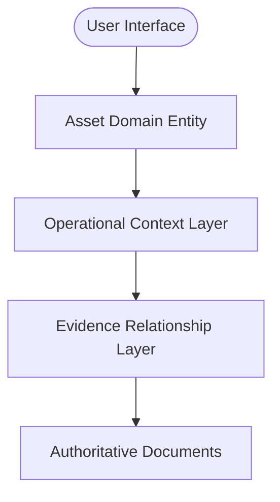

This mirrors the product philosophy established in the PRD.

### 1.5 Enterprise Design Principles
Although the MVP is hackathon-sized, the architecture should resemble an enterprise SaaS platform. Core architectural characteristics include:
* **Domain-Oriented:** Modules are organized around business domains rather than technology layers.
* **API-Driven:** The frontend communicates exclusively through backend APIs. No direct database access is allowed.
* **Stateless Services:** Application servers remain stateless; all business state resides in persistent storage.
* **Explainable AI:** AI services never return unsupported conclusions. Every response includes evidence references.
* **Layered Responsibilities:** Each component performs one responsibility:

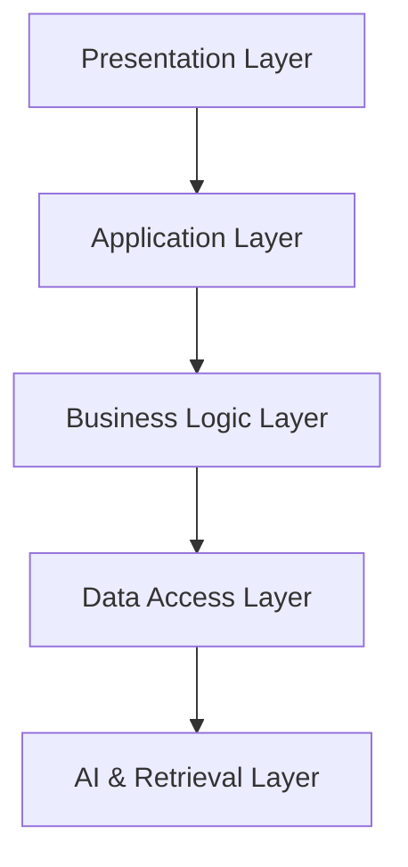

* **Extensible:** Future enterprise capabilities (e.g., multi-site support, IAM integration) should integrate without major backend redesigns.

### 1.6 Hackathon Adaptations
Several enterprise capabilities are intentionally simplified for the hackathon MVP:

| Enterprise Architecture | MVP Implementation |
| :--- | :--- |
| **Enterprise IAM** | Firebase Authentication |
| **Multi-tenancy** | Single organization |
| **Multiple plants** | One manufacturing site |
| **Thousands of assets** | One representative asset (Pump P-101) |
| **Millions of documents** | Curated dataset |
| **Distributed microservices** | Single modular backend service |
| **Horizontal scaling** | Single container deployment |

These adaptations reduce implementation effort while preserving architectural integrity.

---

## 2. Technology Stack

The technology stack is selected based on fast implementation, enterprise credibility, a generous free tier, and AI ecosystem compatibility.

### 2.1 Frontend
* **Technology:** React 19 + Next.js 15
* **Why:** Mature ecosystem, excellent server-side rendering (Server Components), native file routing, and strong developer experience.
* **Trade-offs:** Slightly larger learning curve than plain React (acceptable for Next.js benefits).
* **Alternatives Rejected:** Angular, Vue, Svelte (smaller ecosystems for hackathon speed).

### 2.2 Backend
* **Technology:** FastAPI (Python)
* **Why:** Automatic OpenAPI documentation generation, native async support, strict type hints, and excellent compatibility with Python document processing and AI packages.
* **Trade-offs:** Lower raw throughput than Go or Rust (irrelevant for MVP load).

### 2.3 Database
* **Technology:** Firestore
* **Why:** Managed serverless document model, zero configuration overhead, rapid schema iteration, and generous free tier. Relational joins are not required for MVP.
* **Trade-offs:** Complex relational queries are less natural than SQL.
* **Alternatives Rejected:** PostgreSQL, MongoDB, Supabase (Firestore chosen for managed speed).

### 2.4 Authentication
* **Technology:** Firebase Authentication
* **Why:** Supports Email/Google logins and secure JWT token generation out-of-the-box with minimal setup.
* **Trade-offs:** Vendor lock-in (acceptable for MVP speed).

### 2.5 Hosting & Storage
* **Frontend Hosting:** Vercel
* **Backend Hosting:** Google Cloud Run (containerized, pay-per-use, auto-scaling)
* **Document Storage:** Firebase Cloud Storage (stores PDFs, OEM manuals, SOPs, and reports; integrates natively with Firestore/Auth)

### 2.6 AI & Vector Search
* **AI Model:** OpenAI GPT-4o / GPT-3.5 (or equivalent enterprise LLM)
* **Embedding Model:** `text-embedding-3-small` (cost-effective, high quality)
* **Vector Database:** Pinecone (Starter Tier; manages semantic vectors and fast similarity search)
* **Search Engine:** Hybrid Search (combines Firestore metadata filtering with Pinecone semantic retrieval)

### 2.7 Utilities & Styling
* **Document Processing:** PyMuPDF & pdfplumber (Python libraries for text and table extraction)
* **State Management:** Zustand + React Context (simple, minimal boilerplate)
* **Styling:** Tailwind CSS (utility-first, fast design iterations)
* **Component Library:** shadcn/ui (modern, accessible, and customizable)
* **Charts:** Recharts (event counts and simple timeline metrics)
* **Testing:** Vitest & React Testing Library (frontend), Pytest (backend)
* **Logging:** Structured JSON logging (Python logging framework)

### 2.8 Dependency Managers
* **Frontend:** npm
* **Backend:** uv (fast dependency resolution and Python packaging tool)

---

## 3. High-Level System Architecture

### 3.1 Architecture Overview
AssetDNA follows a layered architecture where frontend interactions pass through a secure backend API, orchestrating database lookups, storage files, semantic searches, and LLM completions.

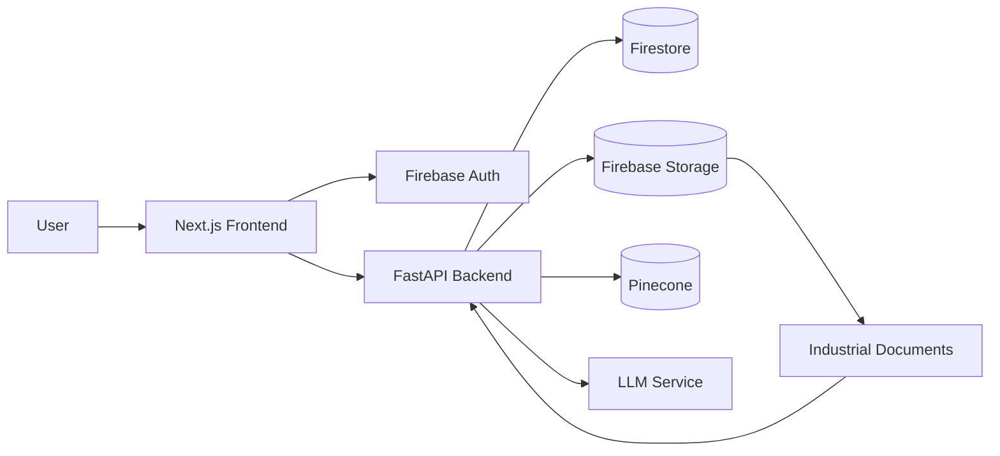

### 3.2 Architectural Components
* **Client/Frontend:** Renders UI, handles routing, stores session states, and manages timeline and workspace components.
* **Backend API:** Acts as the single gateway; orchestrates asset lookups, processes searches, coordinates LLM generation, and builds evidence packages.
* **Authentication:** Validates incoming JWTs to verify identities before data access.
* **Data Storage:** Firestore (metadata, structured timeline events, relationships), Firebase Storage (raw PDFs), and Pinecone (vector embeddings for document chunks).
* **AI Layer:** Summarizes asset lifecycle, generates events descriptions, and answers specific user questions using evidence retrieval.

### 3.3 Request Lifecycle
The frontend never communicates directly with storage, database, or AI services.

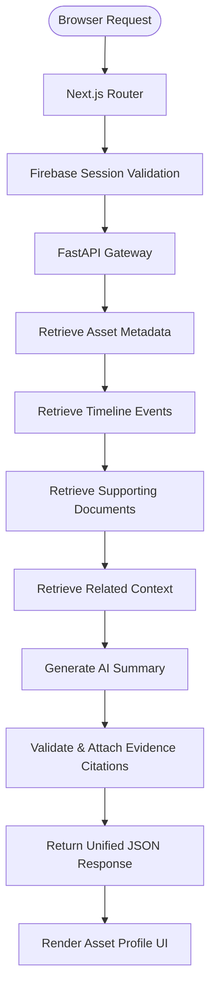

### 3.4 Sequence Data Flow

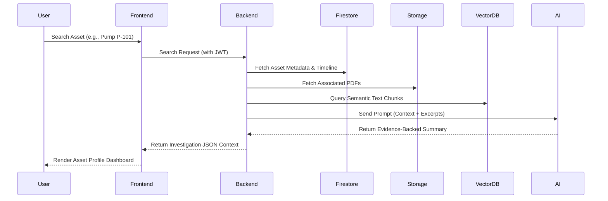

---

## 4. Development Standards

### 4.1 Recommended Folder Structure
```text
assetdna/
├── frontend/
│   ├── app/           # Next.js App Router
│   ├── components/    # Reusable UI components
│   ├── hooks/         # Custom React hooks
│   ├── lib/           # Styling & system configs
│   ├── services/      # Backend API connectors
│   ├── store/         # State management (Zustand)
│   └── types/         # TypeScript definitions
├── backend/
│   ├── api/           # Endpoint controllers & routes
│   ├── services/      # Core business services
│   ├── models/        # Pydantic schemas / Domain models
│   ├── repositories/  # Database access layers
│   ├── ai/            # Prompts and LLM integrations
│   ├── utils/         # Helper modules
│   ├── middleware/    # Auth and error handlers
│   └── tests/         # Pytest test cases
├── docs/              # PRD, TRD, and design docs
├── data/              # Curated mock documents
└── scripts/           # Ingestion and chunking utilities
```

### 4.2 Naming & Coding Conventions
* **Frontend:** PascalCase for components (`AssetProfile.tsx`), camelCase with `use` prefix for hooks (`useTimeline.ts`), and kebab-case for API routes (`/asset-profile`).
* **Backend:** snake_case for Python files (`asset_service.py`), PascalCase for classes (`AssetService`), and UPPER_SNAKE_CASE for constants (`MAX_RESULTS`).
* **Standards:** Adhere to TypeScript ESLint and Python Black/Ruff formatting guidelines. Keep functions small, isolated, and documented.

### 4.3 Git & Branching Strategy
AssetDNA utilizes **GitHub Flow**. All developers create descriptive feature branches from `main` and merge via Pull Requests:
```text
main
 ├── feature/asset-profile
 ├── feature/timeline
 ├── feature/ai-summary
 └── fix/search-bug
```

#### Commit Message Format
Follow **Conventional Commits** (e.g., `feat: add asset profile page`, `fix: resolve timeline sorting`, `test: add search tests`).

### 4.4 Secrets & Dependencies Configuration
* **No hardcoded secrets:** All API keys, database URLs, and credentials must reside in environment variables (managed via `.env` locally or secret manager in cloud).
* **Dependency Locking:** Lock packages using `package-lock.json` (frontend) and pinned dependencies (backend via `uv` or `requirements.txt`).

---

## 5. Technical Principles

> [!IMPORTANT]
> **Principle 1: Modular Architecture & Separation of Concerns**
> Each module has a clearly defined responsibility. Presentation, business logic, AI orchestration, and persistence are strictly decoupled so changes in one layer do not require changes in another.

> [!IMPORTANT]
> **Principle 2: Evidence-First AI & Explainability**
> AI must never produce unsupported operational conclusions. Every generated insight must link directly to verifiable, authoritative document chunks, ensuring industrial engineers have complete trust in the system's summaries.

> [!IMPORTANT]
> **Principle 3: API-First Development & Statelessness**
> The backend acts as a stateless API hosting all business logic. The frontend is a consumer, preparing the system for multi-client scaling (e.g., mobile apps, plant system integrations) without modifying core business services.

> [!NOTE]
> **Principle 4: Single Responsibility**
> Every function, class, and component performs one primary task, simplifying tests, code reviews, and debugging.

> [!NOTE]
> **Principle 5: Reusable UI & Security by Default**
> Renders interfaces from modular components. Enforces JWT validations, input sanitization, and secret management out-of-the-box.

---

## 6. Backend Architecture

### 6.1 Backend Layered Architecture

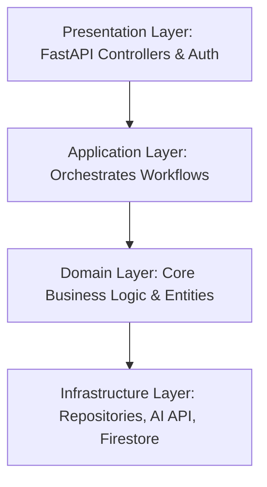

* **Presentation:** Manages routes, deserializes payloads, enforces authentication, and serializes responses. No business logic exists here.
* **Application:** Coordinates workflows (e.g., "Run Investigation" by calling Search, Timeline, and AI services).
* **Domain:** Evaluates business calculations, domain models, and timeline sorting rules independently of frameworks.
* **Infrastructure:** Interacts directly with database collections, Pinecone vectors, and raw file uploads.

### 6.2 Service Decomposition

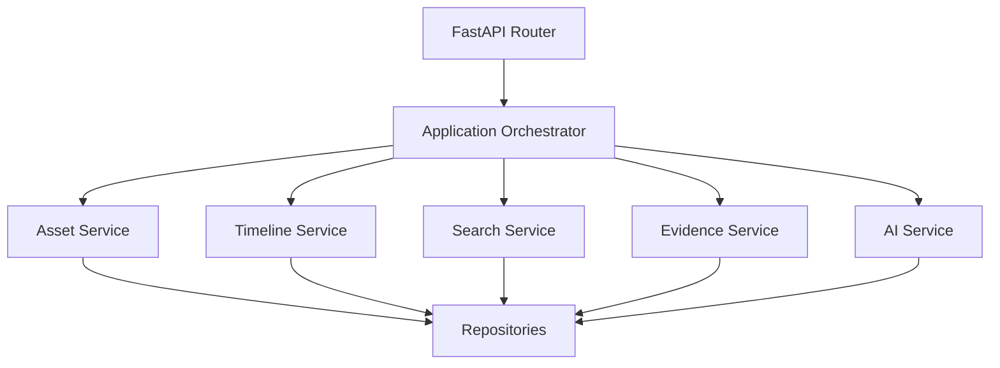

* **Asset Service:** Manages metadata lookup, profile construction, and technical specs.
* **Timeline Service:** Generates chronological event listings, performs sorting, and applies categories.
* **Document Service:** Serves source PDF streams, manages metadata, and controls access keys.
* **Evidence Service:** Extracts context references, links events, and maps AI claims to source files.
* **AI Service:** Formulates prompts, requests summaries from external APIs, and generates answers. *Never queries databases directly.*
* **Search Service:** Executes metadata filters and vectors database similarity lookups.

---

## 7. Conceptual Data Model

The database represents logical domain business entities. It intentionally avoids premature physical joins.

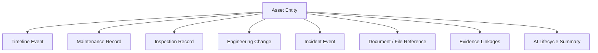

### Core Business Entities
1. **Asset:** The central domain object (ID, status, tag, specifications, manufacturer). All other entities associate with an Asset.
2. **Timeline Event:** A chronological operational snapshot (date, description, type) linking to an asset.
3. **Maintenance Record:** Work details (work orders, repairs, replacements, maintenance outcomes).
4. **Inspection Record:** Reports from visual inspections, vibration checks, and thermal imaging.
5. **Engineering Change:** Details of equipment modifications, upgrades, or alignment improvements.
6. **Incident:** Anomaly data, safety flags, and equipment failure reports.
7. **Document:** The physical evidence (PDFs, SOPs, vendor drawings, OEM manuals).
8. **Evidence:** Mapping relationships between AI insights, timeline events, and documents.
9. **AI Summary:** Machine-generated operational narrative (always references evidence).

---

## 8. Document Ingestion Pipeline

The document ingestion pipeline processes and formats raw files before they are exposed during investigations.

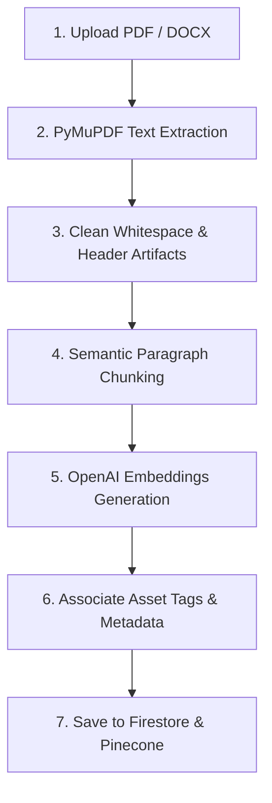

1. **Upload:** Raw PDFs, vendor manuals, and maintenance logs are loaded to Firebase Storage.
2. **Extract:** PyMuPDF extracts text, headings, and basic tables.
3. **Clean:** Normalizes formatting and removes redundant page metadata.
4. **Chunk:** Splits long texts into structured, context-preserving semantic paragraphs.
5. **Embed:** Generates embedding vectors for search indexing.
6. **Metadata:** Labels chunks with `asset_tag`, `doc_type`, and `timestamp` attributes.
7. **Store:** Saves metadata to Firestore and vector arrays to Pinecone.

---

## 9. Search Pipeline

AssetDNA utilizes a hybrid lookup to satisfy both deterministic engineering search and contextual investigations.

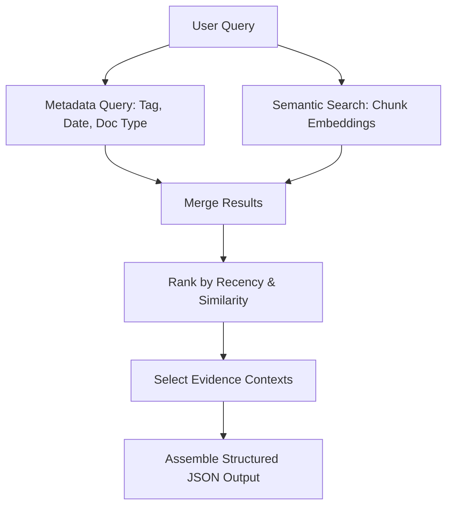

* **Stage 1 (Metadata):** Performs keyword matches against Firestore tags, category markers, and dates.
* **Stage 2 (Semantic):** Pinecone retrieves similar text segments using cosine similarity on embeddings.
* **Stage 3 (Merge & Rank):** Filters matches by asset target and ranks by relevancy score and recency.
* **Stage 4 (Context Assembly):** Packages structured event data and relevant document excerpts for the API request.

---

## 10. AI Orchestration Pipeline

AI summaries must remain grounded in verified operational data. The backend manages prompt assembly and validates responses to ensure evidence accuracy.

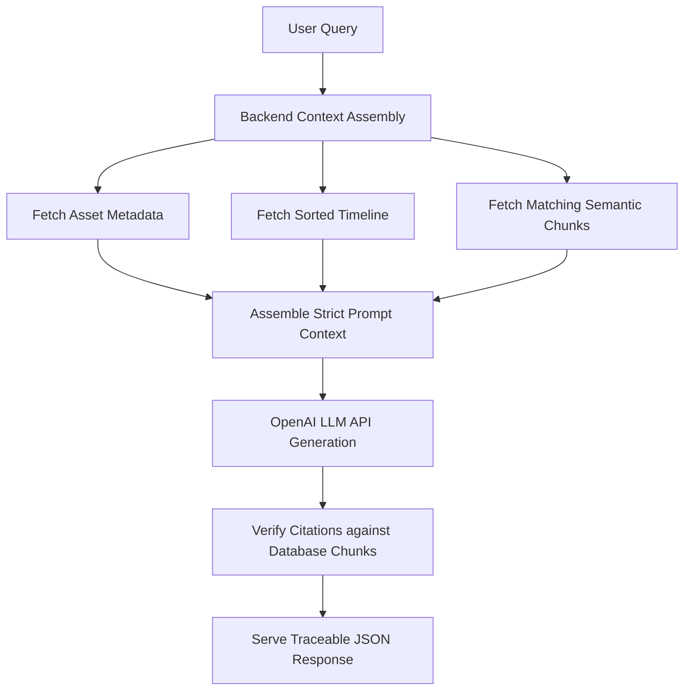

### Prompt Safety & Assembly
* The prompt injects asset metadata, historical events, and document extracts.
* Clear instructions limit LLM answers to the provided context, preventing hallucinations.

### Response Validation
* Checks that every document ID cited in the AI response exists in the retrieval context.
* Ensures references point to active files and formats citations before serving JSON.

---

## 11. Error Handling Strategy

Standardized, secure responses prevent raw stack traces from exposing infrastructure details.

* **User Errors (e.g., Asset Not Found):** Return custom validation warnings with corrective suggestions (e.g., HTTP 404).
* **AI Service Failures (e.g., Latency, Timeout):** Return HTTP 200 with structured data, appending a flag indicating AI summaries are temporarily offline. Renders the interactive timeline without the summary widget.
* **Storage Errors (e.g., PDF Missing):** Retain timeline events. Flag document links as unavailable rather than failing the workspace view.
* **Internal Server Errors:** Log traces internally with a unique Request ID. Serve a simple error message (e.g., HTTP 500) containing the tracking ID.

---

## 12. Security Architecture

* **Authentication:** Firebase Authentication validates client logins. The backend inspects and validates the JWT signature on every HTTP request.
* **Authorization:** Authenticated members of the organization have access. Advanced role permissions are deferred to Phase 2.
* **API Protection:** Limits request sizes, enforces rate limits, and uses CORS controls.
* **Input Sanitization:** Validates asset IDs, search queries, and document uploads against strict Pydantic schemas.
* **Secrets:** Decouples API keys, vector database passwords, and client credentials from code. Values reside in environment settings managed by hosting platforms.
* **Secure Logs:** Prevents access tokens, keys, and credentials from printing to stdout/logs.

---

## 13. Caching & Performance Strategy

### 13.1 Caching Tiers


* **Frontend Session Cache:** Caches core asset profiles, timeline JSON arrays, and document file URLs during a single browser session to reduce network requests.
* **Backend Server Cache:** Stores asset metadata and structural timeline profiles. Invalidates cached items upon record edits or pipeline uploads.
* **AI Summary Cache:** If the underlying timeline and metadata records of an asset remain unchanged, previous AI summaries are reused.

### 13.2 Optimization Rules
1. **Frontend:** Lazy-loads heavy PDF and drawing viewer modules; minimizes parent re-renders.
2. **Backend:** Reuses database connection pools; optimizes payload size by returning only requested pages.
3. **AI:** Limits LLM prompt size; sends only key semantic text fragments.
4. **Search:** Restricts vector database similarity queries by applying an asset tag filter first.

---

## 14. API Design Principles

The API serves as the single source of truth for the frontend client, abstracting all underlying database calls.

* **Resource-Oriented:** decants entities into REST collections (e.g., `/v1/assets/P-101/timeline`).
* **Stateless:** Every HTTP request includes authentication headers (JWT) and required parameters.
* **Unified Response Format:** Success payloads return structured JSON enclosing requested data, metadata, and evidence citation maps:

```json
{
  "status": "success",
  "data": {},
  "ai_summary": {
    "text": "Pump P-101 bearing replaced...",
    "citations": [
      { "doc_id": "doc_001", "page": 4, "text_excerpt": "..." }
    ]
  }
}
```

---

## 15. Backend Module Interaction

Modules communicate through structured service interfaces, isolating responsibilities.

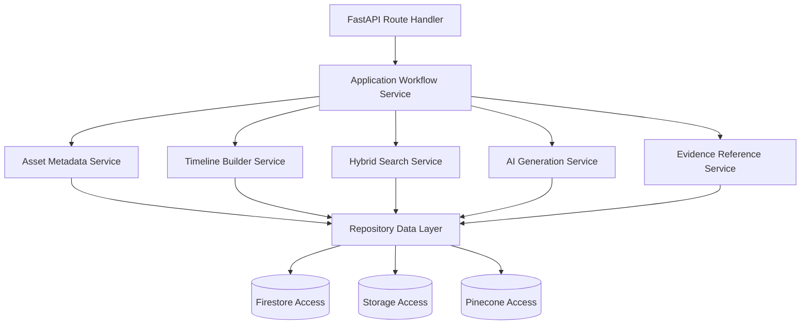

* **No direct database access:** Services query data layers through repository objects.
* **decoupled AI logic:** The AI Service accepts context arrays; it has no database connection.

---

## 16. Logical Data Organization

Data partitions match user perspectives, isolating operational history from documentation.

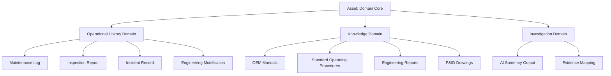

---

## 17. Retrieval Strategy

Retrieves data progressively to maintain page load speeds during investigations.

* **Stage 1 (Deterministic):** Identifies target asset by tag, rendering main profile layout (<1s).
* **Stage 2 (Structured History):** Loads sorted timeline, maintenance, and inspection records (<2s).
* **Stage 3 (Knowledge):** Fetches related drawings, OEM documentation links, and SOPs.
* **Stage 4 (Semantic Chunks):** Vector search returns document segments related to queries.
* **Stage 5 (Summary):** The LLM processes context and returns evidence-backed summaries (<5s).

---

## 18. Deployment Architecture & Strategy

### 18.1 Deployment Architecture

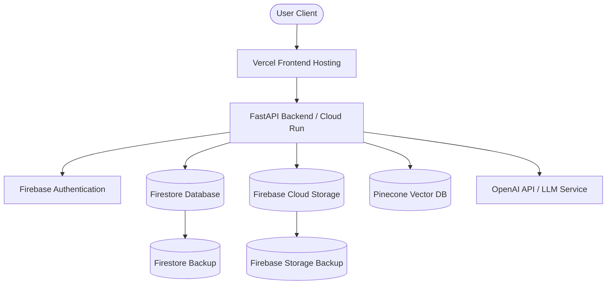

* **Vercel:** Hosts the Next.js static bundles and UI components.
* **Google Cloud Run:** Runs backend FastAPI containers; scales resource counts dynamically.
* **Firebase Storage:** Houses authoritative PDFs and engineering reports.
* **Firestore:** Stores metadata and timeline logs.
* **Pinecone:** Indexes vector embeddings.

### 18.2 Environment Configuration

| Environment | Purpose | Configuration Isolation |
| :--- | :--- | :--- |
| **Development** | Local development and unit tests. | Developer local environment settings. |
| **Staging** | Code integration and testing. | Staging database and storage instances. |
| **Production** | Live hackathon presentation. | Production databases and isolated APIs. |

---

## 19. CI/CD Strategy

All code merges automatically execute validation pipelines to ensure demo stability.

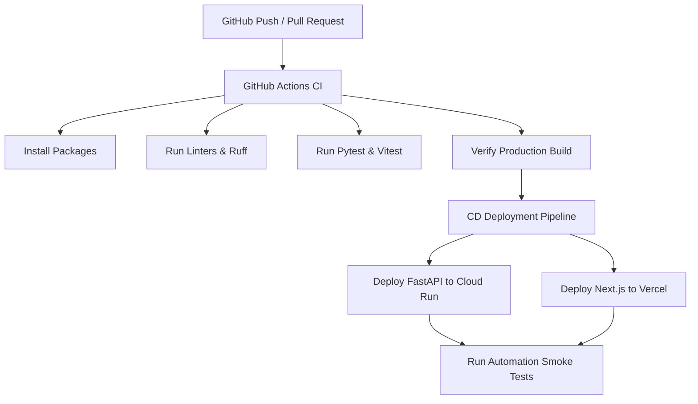

### Production Validation Rules
* CI/CD executes on all pull requests and merges to the `main` branch.
* Enforces format checks, type assertions, and unit tests before deployment.
* Health-check smoke tests confirm api connectivity post-deployment.

---

## 20. Testing Strategy

Decoupled unit, integration, and E2E suites validate the core search-to-decision workflow.

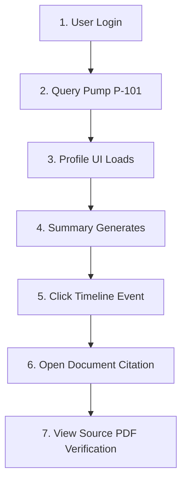

### 20.1 Test Categories
* **Unit Tests (Vitest / Pytest):** Validates UI rendering, state mutations (Zustand), API schemas (Pydantic), and prompt template compilation.
* **Integration Tests:** Tests backend connectivity with Firestore collections, Pinecone instances, and Firebase storage buckets.
* **End-to-End Tests:** Automates the complete user workflow from login to document inspection.
* **Pre-Demo Manual Checklist:** Validates search responses, chronological timeline sorting, document URL resolution, and AI fallback states.

---

## 21. Logging & Observability

### 21.1 Logging Principles
Logs must be **structured (JSON)**, consistent, searchable, and exclude credentials or customer data.

### 21.2 Observability Architecture
* **API Log:** Captures route endpoints, latency, and response status codes.
* **Search Log:** Captures queries, execution durations, and match counts.
* **AI Log:** Tracks prompt tokens, latency, and request status. *Never logs prompt body text.*
* **Error Log:** Tracks exceptions, request tracking IDs, and timestamps.
* **Metrics Dashboard:** Monitors response times, availability, error rates, and API failures.

---

## 22. Scalability Considerations

* **Horizontal Scale:** Backend nodes are stateless, enabling deployment behind load balancers.
* **Data Scale:** Firestore collection models support thousands of assets and millions of documents.
* **AI Scale:** Prepares for model abstraction and request queues to handle enterprise loads.

---

## 23. Disaster Recovery & Backup
* **Firestore:** Automated backups capture state configurations daily.
* **Firebase Storage:** Employs regional redundancy to prevent file loss.
* **GitHub:** Main branch acts as the single source of truth for deployment code.

---

## 24. Security Review

* **Authentication:** Secured by Firebase Auth JWT validation.
* **Authorization:** Decoupled routes require active organization membership.
* **Data Security:** Transport Layer Security (HTTPS) is enforced. Secrets are stored in environment variables.
* **AI Security:** Prompt construction uses validated context data; user input cannot inject raw parameters.
* **Storage Security:** Authoritative documents are retrieved via backend authorization tokens.

---

## 25. Technical Validation Review

* **Strengths:** Separation of concerns, stateless application design, asset-centric mapping, and explainable AI references.
* **Potential Risks:** External LLM API latency (mitigated by fallback UI states) and retrieval relevance (mitigated by hybrid search).
* **Stack Fit:** FastAPI, Next.js, and serverless databases support fast delivery while maintaining enterprise capabilities.
* **AI Grounding:** Decoupled prompts always verify source document citations, ensuring alignment with explainability goals.

---

## 26. Technical Readiness Assessment

| Deliverable Area | Status |
| :--- | :--- |
| **Architecture Decoupling** | ✅ Complete |
| **Technology Stack Fit** | ✅ Complete |
| **Backend Design Layers** | ✅ Complete |
| **Search Strategy (Hybrid)** | ✅ Complete |
| **AI Orchestration (Grounding)** | ✅ Complete |
| **Security Architecture** | ✅ Complete |
| **Deployment Model (Cloud Run)** | ✅ Complete |
| **CI/CD Automation** | ✅ Complete |
| **Testing Decoupling** | ✅ Complete |
| **Observability (JSON logging)** | ✅ Complete |
| **Performance (Caching)** | ✅ Complete |
| **Scalability Readiness** | ✅ Complete |

---

## 27. Final Technical Summary

### 27.1 System Design
AssetDNA is structured as a **layered, stateless web application** focused on facilitating asset investigations. The backend orchestrates database files, semantic indexes, and AI pipelines, while the frontend renders the interactive dashboard.

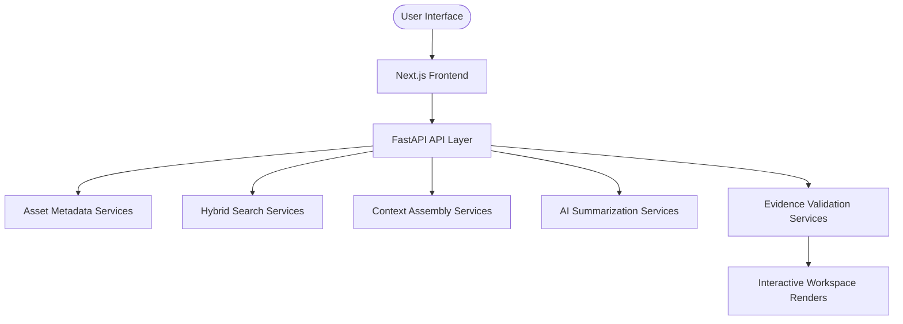

### 27.2 Production Technology Stack

| Architecture Layer | Production Technology |
| :--- | :--- |
| **Frontend Framework** | Next.js (React) |
| **Backend Service** | FastAPI (Python) |
| **Database** | Firestore |
| **Document Storage** | Firebase Storage |
| **Authentication** | Firebase Authentication |
| **Vector DB / Embeddings** | Pinecone / text-embedding-3-small |
| **AI Model** | GPT-4o / GPT-3.5 |
| **Hosting Platform** | Vercel (Frontend) + Cloud Run (Backend) |
| **Styling & UI** | Tailwind CSS + shadcn/ui |
| **State & Tests** | Zustand + Pytest / Vitest |

### 27.3 System Constraints
The current architecture prioritizes demo stability by focusing on:
* One manufacturing scenario.
* One representative asset (Pump P-101).
* Curated local test records.
* Desktop-first design.
* Decatur/mocked systems (no live SAP/Maximo interfaces).

These boundaries preserve construction quality during the hackathon development window.

### 27.4 Technical Readiness Assessment Matrix

| Architecture Area | Verification Status |
| :--- | :--- |
| Technical Overview | ✅ Complete |
| Technology Stack | ✅ Complete |
| High-Level Architecture | ✅ Complete |
| Development Standards | ✅ Complete |
| Engineering Principles | ✅ Complete |
| Backend Architecture | ✅ Complete |
| Conceptual Data Model | ✅ Complete |
| Document Processing Pipeline | ✅ Complete |
| Search Pipeline | ✅ Complete |
| AI Orchestration | ✅ Complete |
| Security Architecture | ✅ Complete |
| Non-Functional Requirements | ✅ Complete |
| Deployment Strategy | ✅ Complete |
| CI/CD Strategy | ✅ Complete |
| Testing Strategy | ✅ Complete |
| Performance Strategy | ✅ Complete |
| Logging & Observability | ✅ Complete |
| Scalability Considerations | ✅ Complete |
| Technical Validation | ✅ Complete |
