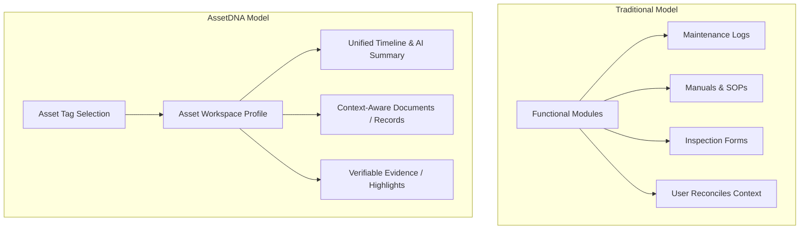
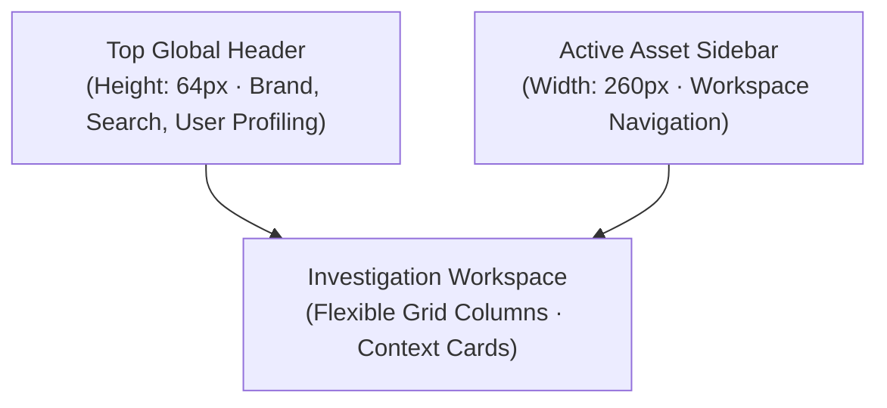
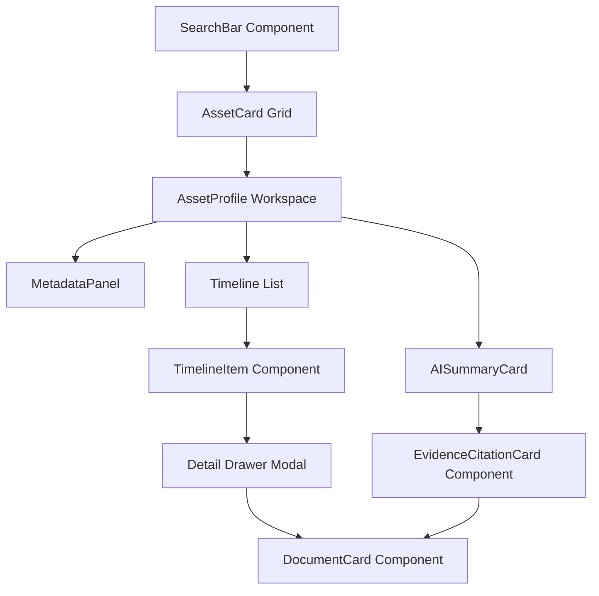
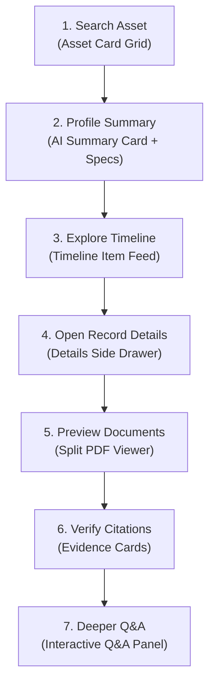
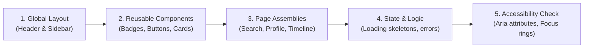

# Web UI/UX Design Specification — AssetDNA

| Field | Value |
|---|---|
| **Product Name** | AssetDNA |
| **Document Version** | 1.0 |
| **Document Status** | Final |
| **Audience** | UX Designers, Frontend Engineers, Product Managers, Design System Engineers |

> This document defines the visual language, design principles, layout foundations, and design system for AssetDNA. It translates the approved Product Blueprint, PRD, TRD, API Specification, AI System Design, and Web Application Flow Specification into an implementation-ready UI/UX specification. This document focuses on **desktop-first enterprise SaaS design** while ensuring responsive behavior across supported devices.

---

## Table of Contents

1. [Design Philosophy](#1-design-philosophy)
2. [Design System](#2-design-system)
3. [Color System](#3-color-system)
4. [Typography](#4-typography)
5. [Component Library](#5-component-library)
6. [Page Layout Specifications](#6-page-layout-specifications)
7. [Investigation Workspace Design](#7-investigation-workspace-design)
8. [Responsive Behavior](#8-responsive-behavior)
9. [Accessibility](#9-accessibility)
10. [Design Consistency Review](#10-design-consistency-review)

---

## 1. Design Philosophy

### 1.1 Design Vision

AssetDNA is an **Asset Investigation Workspace**, not a traditional enterprise dashboard. The UI makes engineers feel like they are investigating the complete operational story of an asset rather than navigating disconnected enterprise modules. 

The experience should be: **calm, structured, information-rich, evidence-driven, modern, and enterprise-grade.**

### 1.2 UX Goals

- **Immediate Asset Retrieval:** Find any asset within seconds via a dominant search box.
- **Progressive Context Disclosure:** Show lifecycle overview first, details on click, and raw evidence on demand.
- **Verifiable AI Insights:** Every AI-generated summary or response contains inline, clickable links to source records.
- **Context Preservation:** Navigating between modules (timeline, manuals, logs) retains the selected asset context.
- **Minimal Navigation Overhead:** Key operational actions take 3 clicks or fewer from the profile page.

### 1.3 System vs. Asset Navigation

Traditional enterprise software organizes navigation around modules, whereas AssetDNA centers the workspace on the asset itself:



### 1.4 Information Density Strategy

Industrial engineers require high data density. Layouts are content-rich but highly structured using:
- **Clean Grids:** Fixed layouts with explicit text boundaries.
- **Collapsible Cards:** Expandable sections for detailed logs.
- **Differentiated Metadata:** Subtle text weights separating keys and values.

---

## 2. Design System

### 2.1 Layout System

The workspace layout is structured around three main regions:



### 2.2 Grid & Container Layouts

The frontend uses a standard **12-column grid system** with responsive boundaries:

| Screen Class | Breakpoint | Grid Columns | Margin / Gutter | Max Width |
|---|---|---|---|---|
| **Desktop** | ≥ 1440px | 12 | 24px / 16px | 1440px |
| **Laptop** | 1024px - 1439px | 12 | 16px / 16px | 1280px |
| **Tablet** | 768px - 1023px | 8 | 16px / 12px | Fluid (100%) |
| **Mobile** | < 768px | 4 | 12px / 12px | Fluid (100%) |

### 2.3 Spacing Scale

An 8-point baseline scale ensures spacing rhythm and alignment:

| Token | Size | Primary Usage |
|---|---|---|
| **XS** | 4px | Padding inside badges, labels, micro-spacing |
| **SM** | 8px | Button padding, text line-height gaps |
| **MD** | 16px | Card padding, small grid gutters |
| **LG** | 24px | Page gutters, spacing between vertical sections |
| **XL** | 32px | Large header margin separation |
| **XXL**| 48px | Hero element layout margins |

### 2.4 Border Radius

| Element | Radius | Purpose |
|---|---|---|
| Buttons & Inputs | 8px | Clean utility styling |
| Cards & Badges | 12px | Distinct container definition |
| Modals & Preview Drawers | 16px | Overlay focus framing |

### 2.5 Shadows & Elevation

- **Level 0 (Flat):** Page background, tables.
- **Level 1 (Low Shadow):** Cards, interactive lists.
- **Level 2 (Medium Shadow):** Active filters, dropdown menus.
- **Level 3 (High Shadow):** Context dialogs, document preview modals.

---

## 3. Color System

The color system communicates trust, status, and system readability. Colors must meet **WCAG 2.1 AA** contrast targets (minimum 4.5:1 ratio for text).

### 3.1 Primary & Neutral Palette

| Token | HSL / Hex | Usage | Contrast Target |
|---|---|---|---|
| **Brand Primary** | `#003B46` (Deep Navy) | Headers, branding, primary buttons | WCAG AA White |
| **Brand Secondary**| `#07575B` (Slate Teal) | Active selectors, secondary buttons | WCAG AA White |
| **Accent / Focus** | `#66A5AD` (Cyan Accent) | Focus states, timeline lines | WCAG AA Dark Text |
| **Base Background**| `#F4F6F7` (Off-White) | Page backdrop background | N/A |
| **Card Background**| `#FFFFFF` (White) | Workspace panels, cards | N/A |
| **Text Primary** | `#1A202C` (Charcoal Black)| Titles, data table fields, main copy | ≥ 4.5:1 |
| **Text Secondary**| `#4A5568` (Muted Slate) | Labels, details, subtitles | ≥ 4.5:1 |
| **Border Neutral** | `#E2E8F0` (Light Gray) | Grid line borders, card edges | N/A |

### 3.2 Semantic Status Palette

Used in Status Badges, tables, and timeline indicators:

| Status | Color | RGB / Hex | Applied To |
|---|---|---|---|
| **Healthy** | Green | `#10B981` | Asset status active, healthy parameters, success toasts |
| **Warning** | Orange | `#F59E0B` | Pending updates, anomalous sensor measurements |
| **Critical** | Red | `#EF4444` | Incidents, critical errors, failure work orders |
| **Offline** | Gray | `#6B7280` | Unresponsive sensors, disabled components |
| **Information**| Blue | `#3B82F6` | Notes, specifications, helpful tooltips |

### 3.3 Timeline & Evidence Colors

- **Timeline category timeline markers:**
  - *Maintenance:* Blue (`#3B82F6`)
  - *Inspection:* Green (`#10B981`)
  - *Engineering Change:* Purple (`#8B5CF6`)
  - *Incident:* Red (`#EF4444`)
- **Evidence highlight backdrop:** Subtle yellow highlighting (`rgba(245, 158, 11, 0.15)`) for document snippets with dark yellow text.

---

## 4. Typography

Primary typography is defined using a highly legible sans-serif font family.

- **Primary Font:** **Inter** (fallback system sans-serif: Arial, Segoe UI).
- **Secondary Monospace Font:** **JetBrains Mono** (fallback: Fira Code, Consolas) - applied to tags, IDs, model numbers, and code metrics.

### 4.1 Typography Scale

| Token | Size (px) | Weight | Line Height | Applied To |
|---|---|---|---|---|
| **H1 (Page Title)** | 24px | Bold (700) | 32px | Document primary headers |
| **H2 (Section)** | 20px | Semibold (600)| 28px | Panel headers, card groups |
| **H3 (Card Header)**| 16px | Semibold (600)| 24px | Workspace modules, AI box titles |
| **Body (Base)** | 14px | Regular (400) | 20px | AI text responses, logs |
| **Body (Small)** | 12px | Regular (400) | 16px | Timestamps, labels, metadata keys |
| **Monospace ID** | 13px | Medium (500) | 18px | Tags, IDs (e.g. `P-101`, `MR-108`) |

---

## 5. Component Library

### 5.1 Reusable UI Component Specifications

#### Button Component
- **Purpose:** Primary interaction element.
- **Variants:** Primary (teal fill), Secondary (slate outline), Ghost (toolbar select), Destructive (red fill).
- **Interactions:** Subtle background opacity animation on hover. Shows loading state spinner when executing API calls.

#### Global Search Bar
- **Purpose:** Instant asset lookup.
- **UX Features:** Magnifying glass icon left, input text field, quick clear button `(x)` on right, and loading indicators during lookup. Debounced query input (200ms delay).

#### Asset Card
- **Purpose:** Represent assets in search list.
- **Visuals:** Clean bordered box, status badge upper right, tag name, type, location indicator, and "Open Workspace" action button.

#### Timeline Item Card
- **Purpose:** Chronological record element.
- **Visuals:** Left-side timeline connector line with colored event dot. Header text, execution timestamp, work order code, and summary snippet.

#### AI Summary Card
- **Purpose:** Render Gemini lifecycle summary.
- **UX Features:** Top position card. Markdown formatting capability, clickable bracket citations, and inline loader placeholder.

#### Evidence Citation Card
- **Purpose:** Highlight proof snippets.
- **Visuals:** Differentiated yellow background panel, document reference tag, exact line/page quote text, and "Open Source" link button.

#### Status Badge
- **Purpose:** Micro-status view.
- **Visuals:** Compact rounded tag containing status text and colored indicator bullet (Healthy, Critical, Warning).

#### Document Card
- **Purpose:** Display operational files.
- **Visuals:** File type icon (PDF, Drawing), title, revision code, page count, and download/preview actions.

#### Filter Bar
- **Purpose:** Drill-down filter workspace.
- **Components:** Category tag list, date range calendar picker, status checkboxes.

#### Data Table
- **Purpose:** List structured parameters.
- **UX Features:** Sticky table headers, alternating row striping, paginated controls, left-aligned alphanumeric keys.

#### Breadcrumbs
- **Purpose:** Contextual backtrack indicator.
- **Format:** Active path elements separated by secondary color arrows.

#### Modals & Drawers
- **Purpose:** Overlay detail inspection.
- **Interactions:** Drop shadow background blur backdrop, escape key exit, focus trapped inside overlay.

### 5.2 Component Layout Relationships



---

## 6. Page Layout Specifications

AssetDNA pages are built on the primary TopNav + Sidebar layout core.

### 6.1 Landing & Login Layout
- Center column grid. Marketing message top, dynamic auth form card centered. Form contains email input, password input, sign-in button, and validation alerts.

### 6.2 Application Dashboard
- Persistent header top. Center workspace containing primary asset search bar. Beneath the search bar is a three-column layout showing "Recently Accessed Assets", "System Statistics", and "Investigation Guidelines".

### 6.3 Asset Search Results Layout
- Fluid grid layout. Top nav displays active query. Search filter controls sidebar on left (260px wide). Search results grid on right displaying matching asset cards in a responsive 3-column deck.

### 6.4 Asset Profile (Workspace Hub)
- 12-column desktop layout. Persistent left sidebar (260px) and global header (64px).

```text
+-----------------------------------------------------------------------+
|  Top Navigation Logo | Search Assets Bar | Current Context | Profile |
+-----------------------------------------------------------------------+
| S |  Overview Dashboard (Asset Tag: P-101)                            |
| i |  +-------------------------------------+ +---------------------+  |
| d |  | AI Lifecycle Summary Card           | | Asset Metadata      |  |
| e |  | (Highlights, recurring bearing)     | | (Model, installation|  |
| b |  +-------------------------------------+ +---------------------+  |
| a |  +-------------------------------------------------------------+  |
| r |  | Navigation Modules Grid                                     |  |
|   |  | [Timeline] [Maintenance] [Inspections] [Docs] [AI Q&A]      |  |
|   |  +-------------------------------------------------------------+  |
+---+-------------------------------------------------------------------+
```

### 6.5 Timeline Layout
- Chronological list layout. Filter toolbar top (date picker, event selectors). Main timeline runs down center. Clicking an event slides out a 450px wide details drawer from the right screen edge.

### 6.6 Documents Page Layout
- Split-screen workspace. Left 4 columns display catalog folder structure and search box. Right 8 columns render the Document List table. Clicking a document splits the screen in half to load the PDF Previewer.

### 6.7 AI Investigation Q&A Layout
- Two-column workspace:
  - **Left Column (8 grid spans):** Scrollable conversational message pane. Message text supports markdown and inline citations. Text input box anchored bottom.
  - **Right Column (4 grid spans):** Dynamic context/evidence sidebar. Clicking a citation highlights the exact evidence card and source metadata here.

---

## 7. Investigation Workspace Design

The design system maps directly to the engineering investigation workflow, reinforcing progressive detail exploration:



---

## 8. Responsive Behavior

AssetDNA layout components adapt fluidly using media query breakpoints to preserve investigation capabilities:

| UI Component | Desktop (≥ 1440px) | Laptop (1024-1439px) | Tablet (768-1023px) | Mobile Browser (< 768px) |
|---|---|---|---|---|
| **Header Nav** | Persistent horizontal | Persistent horizontal | Persistent compact | Collapsed to mobile bar |
| **Sidebar Menu**| Persistent expanded | Persistent expanded | Collapsible slide pane | Hamburger slide drawer |
| **Dashboard Grid**| 3-column grid | 3-column grid | 2-column stack | 1-column layout |
| **Profile Workspace**| 2-column (AI Summary + Metadata side-by-side) | 2-column fluid | Stacked layout | Stacked layout |
| **Timeline Feed** | Left timeline line | Left timeline line | Left timeline line | Left timeline line |
| **Split Viewer** | Parallel side-by-side | Parallel side-by-side | Modal preview panel | Full-screen preview modal |
| **Q&A Panel** | Conversational chat + evidence panel sidebar | Chat + slide-drawer evidence | Stacked chat with toggle drawer | Full screen chat |

---

## 9. Accessibility

Accessibility compliance is a baseline design target. The application implements the following WCAG 2.1 AA standards:

### 9.1 Keyboard Access
- **Logical Tab Order:** Focus indicators move sequentially (Top Nav → Sidebar → Primary Actions → Main Grid → Footer).
- **Interactive Triggers:** `Enter` or `Space` executes action buttons, toggle controls, and select tabs.
- **Escape Key Exit:** Pressing `ESC` closes dialog drawers, details modals, and PDF preview windows.
- **Keyboard Traps:** Keyboard focus is trapped within active modals until dismissed.

### 9.2 Focus Indicators
- Active interactive elements display a clear, high-contrast focus ring (2px solid border, Cyan Accent tone). Default browser focus outlines are overridden.

### 9.3 Aria Labels & Landmarks
- Navigation landmarks use `role="navigation"`, search widgets use `role="search"`, and primary grid containers use `role="main"`.
- All icon-only buttons include explicit `aria-label` elements (e.g. `aria-label="Download document"`).
- Dynamic changes (loading AI answers) announce status updates to screen readers via `aria-live="polite"`.

---

## 10. Design Consistency Review

### 10.1 Key UI Strengths
- **Cohesive visual hierarchy** structured around a professional, clean industrial palette.
- **Predictable layout grid** that maintains context via split previewers and slide drawers, minimizing page jumps.
- **Seamless integration** of the Evidence Citation Cards directly alongside AI responses.

### 10.2 Potential Risks & Frontend Mitigations

| UI Risk | Impact | Mitigation |
|---|---|---|
| **Scroll Fatigue** | Timelines with hundreds of nodes cause long pages | Implement virtual scrolling, default date range filters (last 30 days) |
| **Overlay Clutter** | Multiple details modals and preview drawers stack up | Auto-close active drawers when a new route is selected |
| **Contrast Violations** | Muted secondary text tags fail AA contrast standards | Test text contrast ratios in build logs; apply dark gray backgrounds for badges |

### 10.3 Frontend Implementation Flow



---

> This **Web UI/UX Design Specification** is the authoritative reference for the visual layout, components, accessibility, and interaction patterns of AssetDNA. It aligns with the **Product Blueprint**, **PRD**, **TRD**, **DDS**, **API Specification**, **AI System Design Specification**, and **Web Application Flow Specification**. Any future design changes must preserve the clean layout, progressive-disclosure navigation, and AA contrast levels defined in this document.
